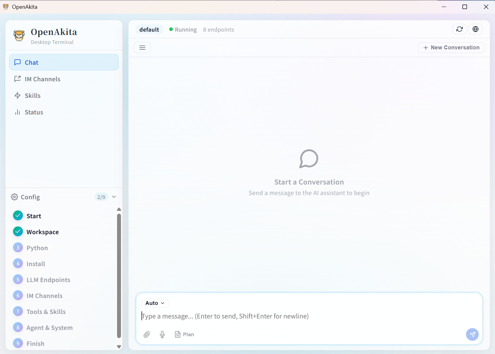

<p align="center">
  
</p>

<h1 align="center">OpenAkita</h1>

<p align="center">
  <strong>オープンソース マルチエージェント AI アシスタント — ただのチャットではない、仕事をこなす AI チーム</strong>
</p>

<p align="center">
  
  
  
  
  
</p>

<p align="center">
  マルチエージェント連携 · 30以上のLLM · 6つのIMプラットフォーム · 89以上のツール · デスクトップ / Web / モバイル
</p>

<p align="center">
  <a href="#クイックスタートガイド">クイックスタート</a> •
  <a href="#主要機能">主要機能</a> •
  <a href="#5分セットアップ">5分セットアップ</a> •
  <a href="#マルチプラットフォーム対応">マルチプラットフォーム</a> •
  <a href="#マルチエージェント連携">マルチエージェント</a> •
  <a href="#ドキュメント">ドキュメント</a>
</p>

<p align="center">
  <a href="README.md">English</a> | <a href="README_CN.md">中文</a> | <strong>日本語</strong>
</p>

---

## OpenAkita とは？

**他の AI はチャットするだけ。OpenAkita は仕事をこなす。**

OpenAkita はオープンソースのオールインワン AI アシスタントです。複数の AI エージェントが連携し、Web 検索、PC 操作、ファイル管理、スケジュールタスクの実行を行い、Telegram / Slack / DingTalk / Feishu / QQ で即座に応答します。あなたの好みを記憶し、新しいスキルを自ら学習し、タスクを諦めません。

**完全 GUI ベースのセットアップ。5分で準備完了。コマンドライン不要。**

> **ダウンロード**: [GitHub Releases](https://github.com/openakita/openakita/releases) — Windows / macOS / Linux

---

## クイックスタートガイド

### 🚀 初めてのユーザー向け（3分）

**インストール不要** — デスクトップアプリをダウンロードしてすぐにチャット開始：

1. **ダウンロード**: [GitHub Releases](https://github.com/openakita/openakita/releases) からインストーラーを取得
2. **インストール**: オンボーディングウィザードに従う
3. **API キーを入力**: [Anthropic](https://console.anthropic.com/) または [DeepSeek](https://platform.deepseek.com/) から取得
4. **最初のタスクを試す**: 「電卓を作って」と入力して動作を確認

### 💻 開発者向け（5分）

```bash
# インストール
pip install openakita[all]

# クイックセットアップ（対話式ウィザード）
openakita init

# 最初のタスクを実行
openakita run "天気スクレイパーを作って"
```

### ✨ すぐにできること

| カテゴリ | 例 |
|----------|------|
| **💬 チャット** | テキスト + 画像 + ファイル、音声メッセージ、スタンプ |
| **🤖 マルチエージェント** | 「競合分析を作成して」→ リサーチ + 分析 + ライティングの各エージェントが連携 |
| **🌐 Web** | ニュース検索、Web スクレイピング、ブラウザタスクの自動化 |
| **📁 ファイル** | ファイルの読み書き・編集、一括リネーム、コンテンツ検索 |
| **🖥️ デスクトップ** | ボタンクリック、テキスト入力、スクリーンショット、アプリの自動操作 |
| **⏰ スケジュール** | 「毎週月曜9時にリマインド」— cron ベースのリマインダー |

### ➡️ 次のステップ

- **LLM の設定**: 複数プロバイダーを追加して自動フェイルオーバーを構成
- **IM チャンネルの設定**: Telegram / Feishu / DingTalk を接続して即座にアクセス
- **スキルの探索**: マーケットプレイスからインストール、または独自に作成
- **コミュニティに参加**: [Discord](https://discord.gg/vFwxNVNH) | [WeChat グループ](docs/assets/wechat_group.jpg)

---

## 主要機能

<table>
<tr><td>

### 🤝 マルチエージェント連携
専門スキルを持つ複数の AI エージェントが並列で動作。
一言指示するだけで — コーディングエージェントがコードを書き、ライティングエージェントがドキュメントを作成し、テストエージェントが検証 — すべて同時に。

### 📋 プランモード
複雑なタスクを自動的にステップバイステップの計画に分解。リアルタイムの進捗追跡と、失敗時の自動ロールバック。

### 🧠 ReAct 推論エンジン
思考 → 行動 → 観察。明示的な3フェーズ推論とチェックポイント/ロールバック。失敗？別の戦略を試行。

### 🔧 89以上のツール — 実際に動作する
Web 検索 · デスクトップ自動化 · ファイル管理 · ブラウザ自動化 · スケジュールタスク · MCP 拡張 …

</td><td>

### 🚀 5分セットアップ — コマンドライン不要
ダウンロード → インストール → ウィザードに従う → API キーを入力 → チャット開始。完全 GUI ベース、ターミナル不要。

### 🌐 30以上の LLM プロバイダー
DeepSeek / Qwen / Kimi / Claude / GPT / Gemini … 1つがダウンしても、次が自動的に引き継ぎ。

### 💬 6つの IM プラットフォーム
Telegram / Feishu / WeCom / DingTalk / QQ / OneBot — 日常使いのチャットツール内で AI を利用。

### 💾 長期記憶
3層メモリシステム + AI 抽出。あなたの好み、習慣、タスク履歴を記憶。

</td></tr>
</table>

---

## 全機能一覧

| | 機能 | 説明 |
|:---:|---------|-------------|
| 🤝 | **マルチエージェント** | 専門エージェント、並列委譲、自動ハンドオフ、フェイルオーバー、リアルタイム可視化ダッシュボード |
| 📋 | **プランモード** | タスク自動分解、ステップ単位の追跡、UI のフローティング進捗バー |
| 🧠 | **ReAct 推論** | 明示的3フェーズループ、チェックポイント/ロールバック、ループ検知、戦略切り替え |
| 🚀 | **ゼロバリアセットアップ** | 完全 GUI 設定、オンボーディングウィザード、インストールからチャットまで5分、CLI 不要 |
| 🔧 | **89以上の組み込みツール** | 16カテゴリ: シェル / ファイル / ブラウザ / デスクトップ / 検索 / スケジューラー / MCP … |
| 🛒 | **スキルマーケットプレイス** | 検索＆ワンクリックインストール、GitHub 直接インストール、AI がその場でスキルを生成 |
| 🌐 | **30以上の LLM プロバイダー** | Anthropic / OpenAI / DeepSeek / Qwen / Kimi / MiniMax / Gemini … スマートフェイルオーバー |
| 💬 | **6つの IM プラットフォーム** | Telegram / Feishu / WeCom / DingTalk / QQ / OneBot、音声認識、スマートグループチャット |
| 💾 | **3層メモリ** | ワーキング + コア + 動的取得、7つのメモリタイプ、AI 駆動の抽出・レビュー |
| 🎭 | **8つのペルソナ** | デフォルト / テックエキスパート / 彼氏 / 彼女 / ジャービス / 執事 / ビジネス / ファミリー |
| 🤖 | **プロアクティブエンジン** | 挨拶、タスクフォローアップ、雑談、おやすみ — フィードバックに応じて頻度を調整 |
| 🧬 | **自己進化** | 毎日の自己チェック＆修復、障害の根本原因分析、スキル自動生成 |
| 🔍 | **ディープシンキング** | 制御可能な思考モード、リアルタイム思考チェーン表示、IM ストリーミング |
| 🛡️ | **ランタイム監視** | ツール乱用検知、リソースバジェット、ポリシーエンジン、決定論的バリデーター |
| 🔒 | **安全性とガバナンス** | POLICIES.yaml、危険な操作は確認が必要、データはローカル保存 |
| 🖥️ | **マルチプラットフォーム** | デスクトップ (Win/Mac/Linux) · Web (PC & モバイルブラウザ) · モバイルアプリ (Android/iOS)、11パネル、ダークテーマ |
| 📊 | **オブザーバビリティ** | 12種類のトレーススパン、フルチェーンのトークン統計パネル |
| 😄 | **スタンプ** | 5700以上のスタンプ、ムード認識、ペルソナ対応 |

---

## 5分セットアップ

### オプション 1: デスクトップアプリ（推奨）

**完全 GUI ベース、コマンドライン不要** — これが他のオープンソース AI アシスタントとの違い：

<p align="center">
  
</p>

| ステップ | 操作内容 | 所要時間 |
|:----:|-------------|:----:|
| 1 | インストーラーをダウンロードし、ダブルクリックでインストール | 1分 |
| 2 | オンボーディングウィザードに従い、API キーを入力 | 2分 |
| 3 | チャット開始 | すぐに |

- Python のインストール不要、git clone 不要、設定ファイルの編集不要
- 隔離されたランタイム — 既存のシステムに影響なし
- 中国ユーザー向けミラー自動切り替え
- モデル、IM チャンネル、スキル、スケジュール — すべて GUI で設定

> **ダウンロード**: [GitHub Releases](https://github.com/openakita/openakita/releases) — Windows (.exe) / macOS (.dmg) / Linux (.deb)

### オプション 2: pip インストール

```bash
pip install openakita[all]    # 全オプション機能付きでインストール
openakita init                # セットアップウィザードを実行
openakita                     # 対話式 CLI を起動
```

### オプション 3: ソースからインストール

```bash
git clone https://github.com/openakita/openakita.git
cd openakita
python -m venv venv && source venv/bin/activate
pip install -e ".[all]"
openakita init
```

### コマンド

```bash
openakita                              # 対話式チャット
openakita run "電卓を作って"            # 単一タスクの実行
openakita serve                        # サービスモード（IM チャンネル）
openakita serve --dev                  # ホットリロード付き開発モード
openakita daemon start                 # バックグラウンドデーモン
openakita status                       # ステータス確認
```

---

## マルチプラットフォーム対応

OpenAkita は **デスクトップ、Web、モバイル** に対応 — どこでも、どのデバイスでも利用可能：

| プラットフォーム | 詳細 |
|----------|---------|
| 🖥️ **デスクトップアプリ** | Windows / macOS / Linux — Tauri 2.x で構築されたネイティブアプリ |
| 🌐 **Web アクセス** | PC & モバイルブラウザ — リモートアクセスを有効化し、任意のブラウザで利用 |
| 📱 **モバイルアプリ** | Android (APK) / iOS (TestFlight) — Capacitor によるネイティブラッパー |

### デスクトップアプリ

<p align="center">
  
</p>

**Tauri 2.x + React + TypeScript** で構築されたクロスプラットフォームデスクトップアプリ：

| パネル | 機能 |
|-------|----------|
| **チャット** | AI チャット、ストリーミング出力、Thinking 表示、ドラッグ＆ドロップアップロード、画像ライトボックス |
| **エージェントダッシュボード** | ニューラルネットワーク可視化、リアルタイムのマルチエージェント状態追跡 |
| **エージェント管理** | 複数エージェントの作成、管理、設定 |
| **IM チャンネル** | 全6プラットフォームの一括セットアップ |
| **スキル** | マーケットプレイス検索、インストール、有効/無効切り替え |
| **MCP** | MCP サーバー管理 |
| **メモリ** | メモリ管理 + LLM によるレビュー |
| **スケジューラー** | スケジュールタスク管理 |
| **トークン統計** | トークン使用量の統計 |
| **設定** | LLM エンドポイント、システム設定、詳細オプション |
| **フィードバック** | バグ報告 + 機能リクエスト |

ダーク/ライトテーマ · オンボーディングウィザード · 自動アップデート · 多言語対応 (EN/CN) · 起動時自動開始

### モバイルアプリ

<p align="center">
  <a href="https://b23.tv/pWki3Vw">
    
  </a>
  <br/>
  <sub>▶ クリックしてモバイルアプリのデモを Bilibili で視聴</sub>
</p>

- ローカルネットワーク経由でスマートフォンをデスクトップバックエンドに接続
- フル機能: チャット、マルチエージェント連携、メモリ、スキル、MCP — すべてモバイルで利用可能
- リアルタイムストリーミングと Thinking チェーン表示に対応
- サーバー接続なしで利用できるプレビューモード

---

## マルチエージェント連携

<p align="center">
  <a href="https://www.bilibili.com/video/BV1psP5zTEE7">
    
  </a>
  <br/>
  <sub>▶ クリックしてマルチエージェント連携のデモを Bilibili で視聴</sub>
</p>

OpenAkita にはマルチエージェントオーケストレーションシステムが組み込まれています — 1つの AI ではなく、**AI チーム**：

```
あなた: 「競合分析レポートを作成して」
    │
    ▼
┌──────────────────────────────────────┐
│   AgentOrchestrator（ディレクター）    │
│   タスクを分解 → エージェントに割り当て  │
└───┬────────────┬──────────────┬──────┘
    ▼            ▼              ▼
 検索エージェント 分析エージェント ライティングエージェント
 (Web リサーチ)   (データ分析)    (レポート作成)
    │            │              │
    └────────────┴──────────────┘
                 ▼
         結果を統合し、あなたに提供
```

- **専門化**: 異なるドメイン向けの異なるエージェント、タスクに自動マッチング
- **並列処理**: 複数のエージェントが同時に動作
- **自動ハンドオフ**: エージェントが行き詰まった場合、より適切なエージェントに引き継ぎ
- **フェイルオーバー**: エージェントの障害時にバックアップへ自動切り替え
- **深度制御**: 最大5段階の委譲レベルで無限再帰を防止
- **視覚的追跡**: エージェントダッシュボードで全エージェントのリアルタイム状態を表示

---

## 30以上の LLM プロバイダー

**ベンダーロックインなし。自由に組み合わせ可能：**

| カテゴリ | プロバイダー |
|----------|-----------|
| **ローカル** | Ollama · LM Studio |
| **海外** | Anthropic · OpenAI · Google Gemini · xAI (Grok) · Mistral · OpenRouter · NVIDIA NIM · Groq · Together AI · Fireworks · Cohere |
| **中国** | Alibaba DashScope · Kimi (Moonshot) · MiniMax · DeepSeek · SiliconFlow · Volcengine · Zhipu AI · Baidu Qianfan · Tencent Hunyuan · Yunwu · Meituan LongCat · iFlow |

**7つの能力次元**: テキスト · 画像認識 · 動画 · ツール利用 · 思考 · 音声 · PDF

**スマートフェイルオーバー**: 1つのモデルがダウンしても、次がシームレスに引き継ぎ。

### 推奨モデル

| モデル | プロバイダー | 備考 |
|-------|----------|-------|
| `claude-sonnet-4-5-*` | Anthropic | デフォルト、バランス型 |
| `claude-opus-4-5-*` | Anthropic | 最高性能 |
| `qwen3-max` | Alibaba | 中国語サポートが強力 |
| `deepseek-v3` | DeepSeek | コスパ良好 |
| `kimi-k2.5` | Moonshot | ロングコンテキスト |
| `minimax-m2.1` | MiniMax | 対話に最適 |

> 複雑な推論には Thinking モードを有効化 — モデル名に `-thinking` サフィックスを追加。

---

## 6つの IM プラットフォーム

普段使いのチャットツール内で AI と会話：

| プラットフォーム | 接続方式 | 特徴 |
|----------|-----------|------------|
| **Telegram** | Webhook / Long Polling | ペアリング認証、Markdown、プロキシ対応 |
| **Feishu** | WebSocket / Webhook | カードメッセージ、イベントサブスクリプション |
| **WeCom** | スマートロボットコールバック | ストリーミング返信、プロアクティブプッシュ |
| **DingTalk** | Stream WebSocket | パブリック IP 不要 |
| **QQ 公式** | WebSocket / Webhook | グループ、DM、チャンネル |
| **OneBot** | WebSocket | NapCat / Lagrange / go-cqhttp 互換 |

- 📷 **画像認識**: スクリーンショット/写真を送信 — AI が内容を理解
- 🎤 **音声**: 音声メッセージを送信 — 自動で文字起こしして処理
- 📎 **ファイル配信**: AI が生成したファイルをチャットに直接プッシュ
- 👥 **グループチャット**: @メンションされた時に返信、それ以外は静か
- 💭 **思考チェーン**: リアルタイムの推論プロセスを IM にストリーミング

---

## メモリシステム

単なる「コンテキストウィンドウ」ではない — 真の長期記憶：

- **3層構造**: ワーキングメモリ（現在のタスク）+ コアメモリ（ユーザープロフィール）+ 動的取得（過去の経験）
- **7つのメモリタイプ**: 事実 / 好み / スキル / エラー / ルール / ペルソナ特性 / 経験
- **AI 駆動の抽出**: 各会話の後に自動的に有用な情報を蒸留
- **マルチパス検索**: セマンティック + 全文 + 時系列 + 添付ファイル検索
- **使うほど賢く**: 2ヶ月前に言及した好み？まだ覚えています。

---

## 自己進化

OpenAkita は使うほど強くなる：

```
毎日 04:00   →  自己チェック: エラーログ分析 → AI 診断 → 自動修復 → レポート送信
障害発生後   →  根本原因分析（コンテキスト消失 / ツール制限 / ループ / バジェット）→ 改善提案
スキル不足   →  GitHub からスキルを自動検索、または AI がその場で生成
依存関係不足 →  自動 pip install、中国向けミラー自動切り替え
毎回の会話   →  好みと経験を抽出 → 長期記憶に保存
```

---

## 安全性とガバナンス

- **ポリシーエンジン**: POLICIES.yaml でツール権限、シェルコマンドブロックリスト、パス制限を管理
- **確認**: 危険な操作（ファイル削除、システムコマンド）はユーザー承認が必要
- **リソースバジェット**: タスクごとのトークン / コスト / 時間 / イテレーション / ツール呼び出し制限
- **ランタイム監視**: ツール乱用、推論ループ、トークン異常の自動検知
- **ローカルデータ**: メモリ、設定、チャット履歴はすべてあなたのマシンにのみ保存
- **オープンソース**: Apache 2.0、完全に透明なコードベース

---

## アーキテクチャ

```
デスクトップアプリ (Tauri + React)
    │
アイデンティティ ─── SOUL.md · AGENT.md · POLICIES.yaml · 8つのペルソナプリセット
    │
コア         ─── ReasoningEngine(ReAct) · Brain(LLM) · ContextManager
    │            PromptAssembler · RuntimeSupervisor · ResourceBudget
    │
エージェント  ─── AgentOrchestrator(調整) · AgentInstancePool(プーリング)
    │            AgentFactory · FallbackResolver(フェイルオーバー)
    │
メモリ       ─── UnifiedStore(SQLite+Vector) · RetrievalEngine(マルチパス)
    │            MemoryExtractor · MemoryConsolidator
    │
ツール       ─── Shell · File · Browser · Desktop · Web · MCP · Skills
    │            Plan · Scheduler · Sticker · Persona · Agent Delegation
    │
進化         ─── SelfCheck · FailureAnalyzer · SkillGenerator · Installer
    │
チャンネル   ─── CLI · Telegram · Feishu · WeCom · DingTalk · QQ · OneBot
    │
トレーシング ─── AgentTracer(12 SpanTypes) · DecisionTrace · TokenStats
```

---

## ドキュメント

| ドキュメント | 内容 |
|----------|---------|
| [設定ガイド](docs/configuration-guide.md) | デスクトップクイックセットアップ & フルセットアップガイド |
| ⭐ [LLM プロバイダー設定](docs/llm-provider-setup-tutorial.md) | **API キー登録 + エンドポイント設定 + フェイルオーバー** |
| ⭐ [IM チャンネル設定](docs/im-channel-setup-tutorial.md) | **Telegram / Feishu / DingTalk / WeCom / QQ / OneBot チュートリアル** |
| [クイックスタート](docs/getting-started.md) | インストールと基本操作 |
| [アーキテクチャ](docs/architecture.md) | システム設計とコンポーネント |
| [設定](docs/configuration.md) | 全設定オプション |
| [デプロイ](docs/deploy.md) | 本番デプロイ |
| [MCP 統合](docs/mcp-integration.md) | 外部サービスとの接続 |
| [スキルシステム](docs/skills.md) | スキルの作成と使用 |

---

## コミュニティ

<table>
  <tr>
    <td align="center">
      <br/>
      <b>WeChat 公式</b><br/>
      <sub>フォローして最新情報を取得</sub>
    </td>
    <td align="center">
      <br/>
      <b>WeChat（個人）</b><br/>
      <sub>「OpenAkita」と記載してグループに参加</sub>
    </td>
    <td align="center">
      <br/>
      <b>WeChat グループ</b><br/>
      <sub>スキャンして参加（⚠️ 毎週更新）</sub>
    </td>
    <td align="center">
      <br/>
      <b>QQ グループ: 854429727</b><br/>
      <sub>スキャンまたは検索して参加</sub>
    </td>
  </tr>
</table>

<p align="center">
  <a href="https://discord.gg/vFwxNVNH">Discord</a> ·
  <a href="https://x.com/openakita">X (Twitter)</a> ·
  <a href="mailto:zacon365@gmail.com">メール</a>
</p>

[Issues](https://github.com/openakita/openakita/issues) · [Discussions](https://github.com/openakita/openakita/discussions) · [Star](https://github.com/openakita/openakita)

---

## 謝辞

- [Anthropic Claude](https://www.anthropic.com/claude) — コア LLM エンジン
- [Tauri](https://tauri.app/) — クロスプラットフォームデスクトップフレームワーク
- [ChineseBQB](https://github.com/zhaoolee/ChineseBQB) — AI に魂を与える 5700以上のスタンプ
- [browser-use](https://github.com/browser-use/browser-use) — AI ブラウザ自動化
- [AGENTS.md](https://agentsmd.io/) / [Agent Skills](https://agentskills.io/) — オープンスタンダード

## ライセンス

Apache License 2.0 — [LICENSE](LICENSE) を参照

サードパーティライセンス: [THIRD_PARTY_NOTICES.md](THIRD_PARTY_NOTICES.md)

## Star 履歴

<a href="https://star-history.com/#openakita/openakita&Date">
 <picture>
   <source media="(prefers-color-scheme: dark)" srcset="https://api.star-history.com/svg?repos=openakita/openakita&type=Date&theme=dark" />
   <source media="(prefers-color-scheme: light)" srcset="https://api.star-history.com/svg?repos=openakita/openakita&type=Date" />
   
 </picture>
</a>

---

<p align="center">
  <strong>OpenAkita — 仕事をこなすオープンソース マルチエージェント AI アシスタント</strong>
</p>
