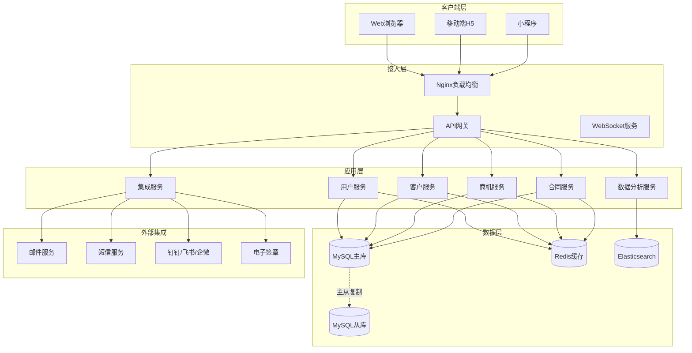
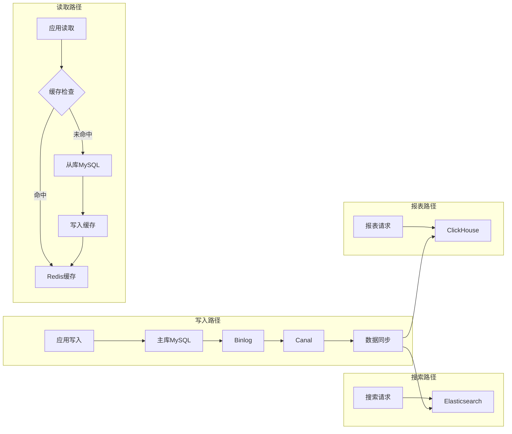
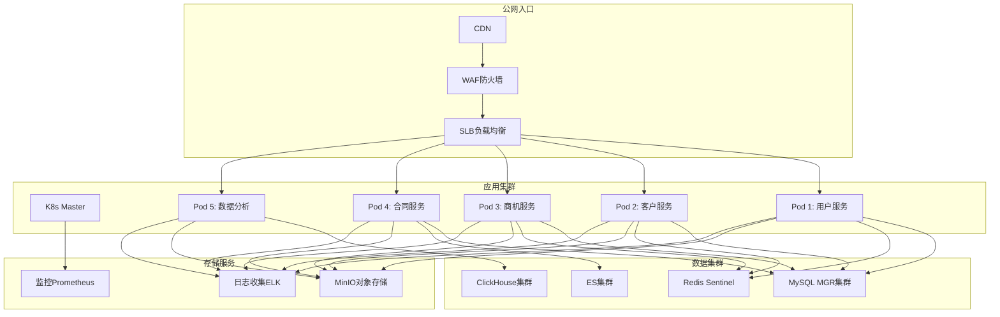
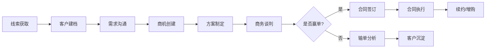
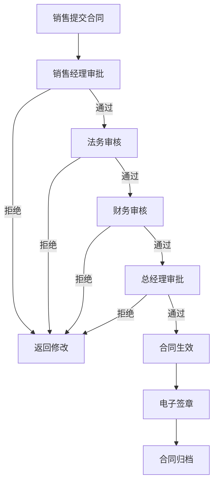
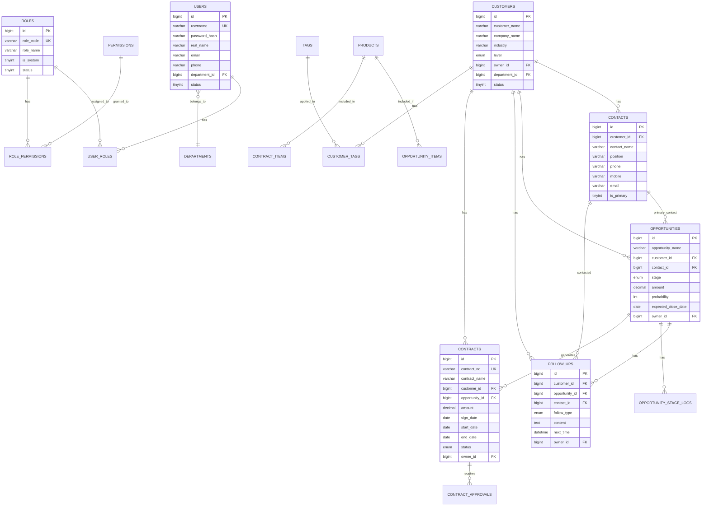
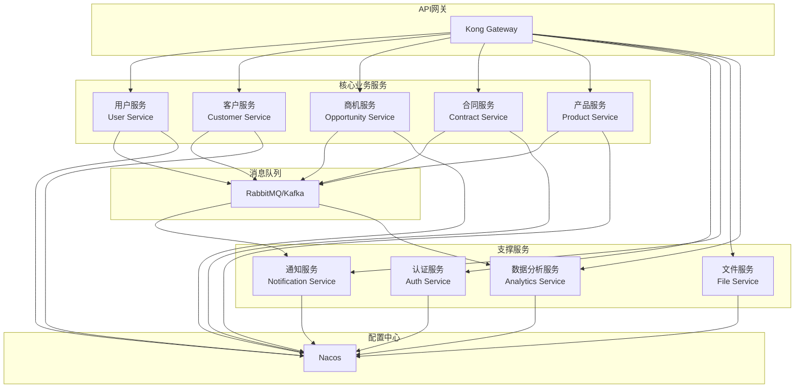
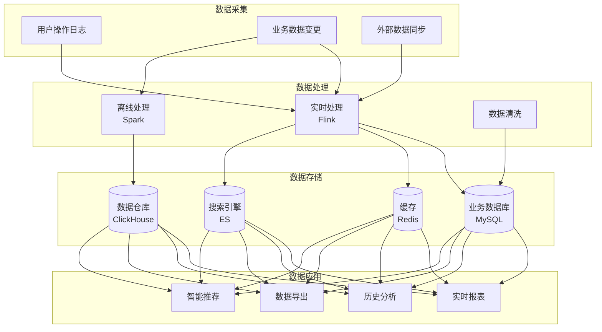

# CRM系统架构图与ER图

## 一、系统架构图

```mermaid
graph TB
    subgraph "客户端层"
        A1[Web浏览器]
        A2[移动端H5]
        A3[小程序]
    end
    
    subgraph "接入层"
        B1[Nginx负载均衡]
        B2[API网关]
        B3[WebSocket服务]
    end
    
    subgraph "应用层"
        C1[用户服务]
        C2[客户服务]
        C3[商机服务]
        C4[合同服务]
        C5[数据分析服务]
        C6[集成服务]
    end
    
    subgraph "数据层"
        D1[(MySQL主库)]
        D2[(MySQL从库)]
        D3[(Redis缓存)]
        D4[(Elasticsearch)]
    end
    
    subgraph "外部集成"
        E1[邮件服务]
        E2[短信服务]
        E3[钉钉/飞书/企微]
        E4[电子签章]
    end
    
    A1 & A2 & A3 --> B1
    B1 --> B2
    B2 --> C1 & C2 & C3 & C4 & C5 & C6
    C1 & C2 & C3 & C4 --> D1
    C5 --> D4
    C6 --> E1 & E2 & E3 & E4
    D1 -.->|主从复制| D2
    C1 & C2 & C3 & C4 --> D3
```

## 二、数据架构图

```mermaid
graph LR
    subgraph "写入路径"
        W1[应用写入] --> W2[主库MySQL]
        W2 --> W3[Binlog]
        W3 --> W4[Canal]
        W4 --> W5[数据同步]
    end
    
    subgraph "读取路径"
        R1[应用读取] --> R2{缓存检查}
        R2 -->|命中| R3[Redis缓存]
        R2 -->|未命中| R4[从库MySQL]
        R4 --> R5[写入缓存]
        R5 --> R3
    end
    
    subgraph "搜索路径"
        S1[搜索请求] --> S2[Elasticsearch]
        W5 --> S2
    end
    
    subgraph "报表路径"
        B1[报表请求] --> B2[ClickHouse]
        W5 --> B2
    end
```

## 三、部署架构图

```mermaid
graph TB
    subgraph "公网入口"
        F1[CDN]
        F2[WAF防火墙]
        F3[SLB负载均衡]
    end
    
    subgraph "应用集群"
        G1[K8s Master]
        G2[Pod 1: 用户服务]
        G3[Pod 2: 客户服务]
        G4[Pod 3: 商机服务]
        G5[Pod 4: 合同服务]
        G6[Pod 5: 数据分析]
    end
    
    subgraph "数据集群"
        H1[MySQL MGR集群]
        H2[Redis Sentinel]
        H3[ES集群]
        H4[ClickHouse集群]
    end
    
    subgraph "存储服务"
        I1[MinIO对象存储]
        I2[日志收集ELK]
        I3[监控Prometheus]
    end
    
    F1 --> F2 --> F3
    F3 --> G2 & G3 & G4 & G5 & G6
    G2 & G3 & G4 & G5 --> H1
    G2 & G3 & G4 --> H2
    G5 --> H3
    G6 --> H4
    G2 & G3 & G4 & G5 & G6 --> I1
    G2 & G3 & G4 & G5 & G6 --> I2
    G1 --> I3
```

## 四、业务流程图

### 客户转化流程

```mermaid
flowchart LR
    A[线索获取] --> B[客户建档]
    B --> C[需求沟通]
    C --> D[商机创建]
    D --> E[方案制定]
    E --> F[商务谈判]
    F --> G{是否赢单?}
    G -->|是| H[合同签订]
    G -->|否| I[输单分析]
    H --> J[合同执行]
    I --> K[客户沉淀]
    J --> L[续约/增购]
```

### 合同审批流程

```mermaid
flowchart TD
    A[销售提交合同] --> B[销售经理审批]
    B -->|通过| C[法务审核]
    B -->|拒绝| D[返回修改]
    C -->|通过| E[财务审核]
    C -->|拒绝| D
    E -->|通过| F[总经理审批]
    E -->|拒绝| D
    F -->|通过| G[合同生效]
    F -->|拒绝| D
    G --> H[电子签章]
    H --> I[合同归档]
```

## 五、实体关系图（ER图）

```mermaid
erDiagram
    USERS ||--o{ USER_ROLES : has
    ROLES ||--o{ USER_ROLES : assigned_to
    ROLES ||--o{ ROLE_PERMISSIONS : has
    PERMISSIONS ||--o{ ROLE_PERMISSIONS : granted_to
    USERS }o--|| DEPARTMENTS : belongs_to
    
    CUSTOMERS ||--o{ CONTACTS : has
    CUSTOMERS ||--o{ OPPORTUNITIES : has
    CUSTOMERS ||--o{ FOLLOW_UPS : has
    CUSTOMERS ||--o{ CONTRACTS : has
    CUSTOMERS ||--o{ CUSTOMER_TAGS : has
    
    CONTACTS ||--o{ OPPORTUNITIES : primary_contact
    CONTACTS ||--o{ FOLLOW_UPS : contacted
    
    OPPORTUNITIES ||--o{ FOLLOW_UPS : has
    OPPORTUNITIES ||--o{ OPPORTUNITY_STAGE_LOGS : has
    OPPORTUNITIES ||--o{ CONTRACTS : generates
    
    CONTRACTS ||--o{ CONTRACT_APPROVALS : requires
    
    TAGS ||--o{ CUSTOMER_TAGS : applied_to
    
    PRODUCTS ||--o{ OPPORTUNITY_ITEMS : included_in
    PRODUCTS ||--o{ CONTRACT_ITEMS : included_in
    
    USERS {
        bigint id PK
        varchar username UK
        varchar password_hash
        varchar real_name
        varchar email
        varchar phone
        bigint department_id FK
        tinyint status
    }
    
    ROLES {
        bigint id PK
        varchar role_code UK
        varchar role_name
        tinyint is_system
        tinyint status
    }
    
    CUSTOMERS {
        bigint id PK
        varchar customer_name
        varchar company_name
        varchar industry
        enum level
        bigint owner_id FK
        bigint department_id FK
        tinyint status
    }
    
    CONTACTS {
        bigint id PK
        bigint customer_id FK
        varchar contact_name
        varchar position
        varchar phone
        varchar mobile
        varchar email
        tinyint is_primary
    }
    
    OPPORTUNITIES {
        bigint id PK
        varchar opportunity_name
        bigint customer_id FK
        bigint contact_id FK
        enum stage
        decimal amount
        int probability
        date expected_close_date
        bigint owner_id FK
    }
    
    CONTRACTS {
        bigint id PK
        varchar contract_no UK
        varchar contract_name
        bigint customer_id FK
        bigint opportunity_id FK
        decimal amount
        date sign_date
        date start_date
        date end_date
        enum status
        bigint owner_id FK
    }
    
    FOLLOW_UPS {
        bigint id PK
        bigint customer_id FK
        bigint opportunity_id FK
        bigint contact_id FK
        enum follow_type
        text content
        datetime next_time
        bigint owner_id FK
    }
```

## 六、微服务架构图

```mermaid
graph TB
    subgraph "API网关"
        GW[Kong Gateway]
    end
    
    subgraph "核心业务服务"
        S1[用户服务<br/>User Service]
        S2[客户服务<br/>Customer Service]
        S3[商机服务<br/>Opportunity Service]
        S4[合同服务<br/>Contract Service]
        S5[产品服务<br/>Product Service]
    end
    
    subgraph "支撑服务"
        S6[认证服务<br/>Auth Service]
        S7[通知服务<br/>Notification Service]
        S8[文件服务<br/>File Service]
        S9[数据分析服务<br/>Analytics Service]
    end
    
    subgraph "消息队列"
        MQ[RabbitMQ/Kafka]
    end
    
    subgraph "配置中心"
        N[Nacos]
    end
    
    GW --> S1 & S2 & S3 & S4 & S5 & S6 & S7 & S8 & S9
    S1 & S2 & S3 & S4 & S5 --> MQ
    MQ --> S7 & S9
    S1 & S2 & S3 & S4 & S5 & S6 & S7 & S8 & S9 --> N
```

## 七、数据流向图

```mermaid
flowchart TB
    subgraph "数据采集"
        A1[用户操作日志]
        A2[业务数据变更]
        A3[外部数据同步]
    end
    
    subgraph "数据处理"
        B1[实时处理<br/>Flink]
        B2[离线处理<br/>Spark]
        B3[数据清洗]
    end
    
    subgraph "数据存储"
        C1[(业务数据库<br/>MySQL)]
        C2[(缓存<br/>Redis)]
        C3[(搜索引擎<br/>ES)]
        C4[(数据仓库<br/>ClickHouse)]
    end
    
    subgraph "数据应用"
        D1[实时报表]
        D2[历史分析]
        D3[数据导出]
        D4[智能推荐]
    end
    
    A1 & A2 & A3 --> B1
    A2 --> B2
    B1 --> C1 & C2 & C3
    B2 --> C4
    B3 --> C1
    C1 & C2 & C3 & C4 --> D1 & D2 & D3 & D4
```

---
*架构图完成时间: 2026-03-29*
*包含系统架构、部署架构、业务流程、ER关系等完整视图*