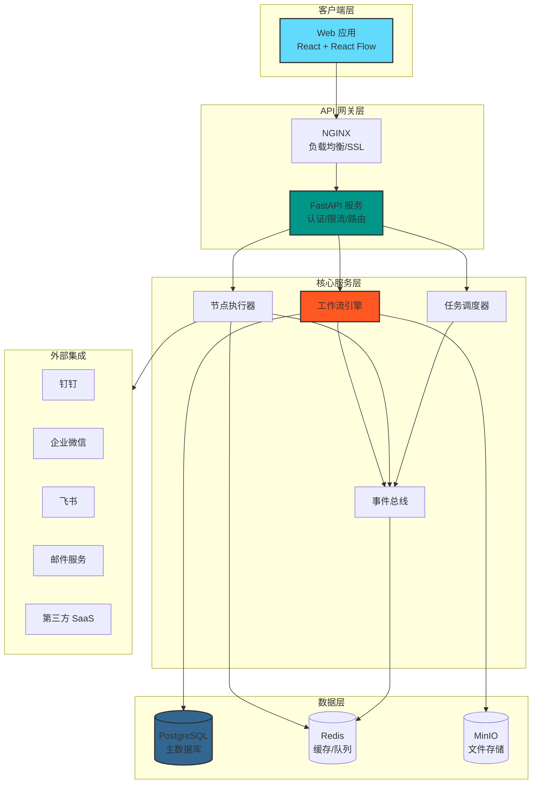
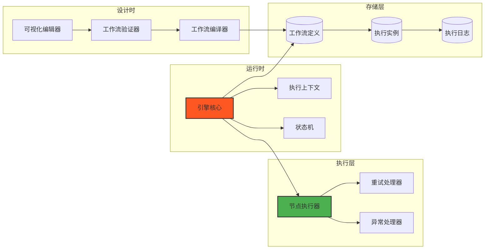
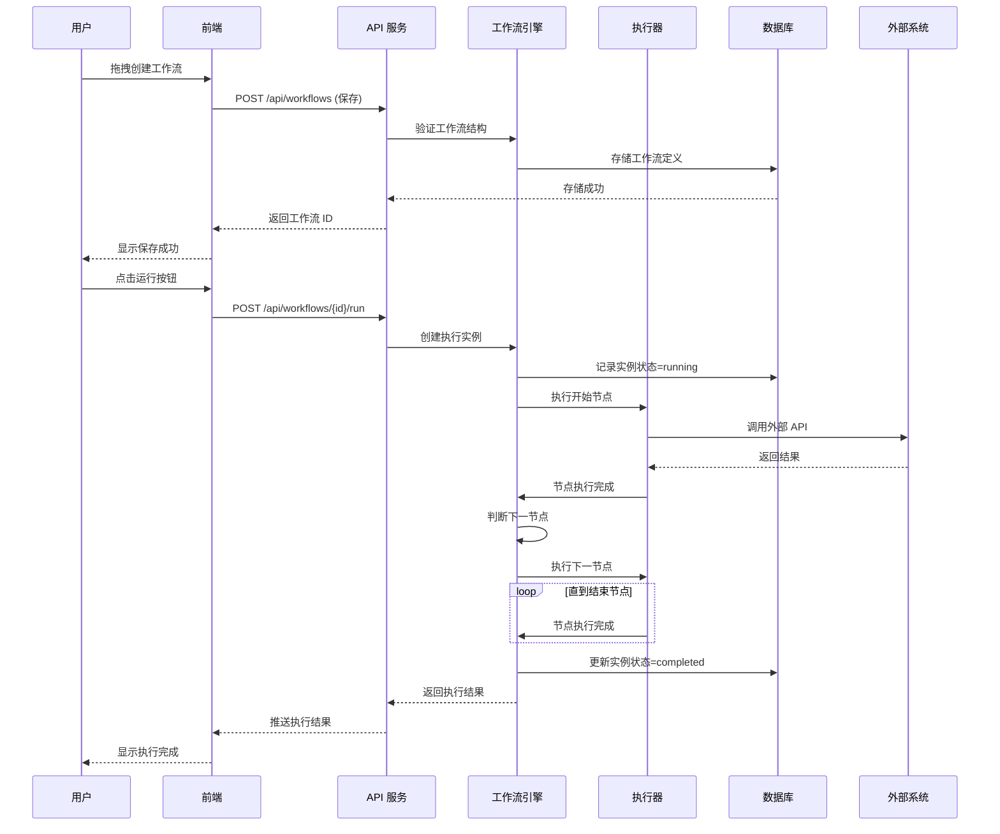

# MVP 技术评审报告

**会议时间**: 2026-03-11 14:00  
**汇报人**: 架构师  
**参与人**: CTO、CPO、全栈工程师 A/B、DevOps  
**状态**: 待评审  

---

## 一、技术方案审核结论

### 1.1 dev-a/dev-b 技术方案评估

| 评估维度 | dev-a 方案 | dev-b 方案 | 综合评分 |
|----------|------------|------------|----------|
| **技术栈选型** | FastAPI + React Flow | React Flow + Celery | ⭐⭐⭐⭐⭐ 优秀 |
| **架构设计** | 模块化清晰 | 插件化节点设计 | ⭐⭐⭐⭐⭐ 优秀 |
| **性能考虑** | 异步执行 + 缓存 | 虚拟渲染 + 懒加载 | ⭐⭐⭐⭐⭐ 优秀 |
| **可维护性** | 代码规范完善 | 文档详细 | ⭐⭐⭐⭐ 良好 |
| **风险评估** | 识别准确 | 应对措施具体 | ⭐⭐⭐⭐ 良好 |

**总体结论**: ✅ 技术方案可行，符合"可控的快"原则

### 1.2 核心技术选型确认

| 层级 | 技术选型 | 版本 | 状态 | 理由 |
|------|----------|------|------|------|
| **前端框架** | React + TypeScript | 18 + 5.x | ✅ 确认 | 生态成熟，React Flow 专业 |
| **工作流编辑器** | React Flow | 11.x | ✅ 确认 | 专为工作流设计，性能优秀 |
| **后端框架** | FastAPI | 0.109+ | ✅ 确认 | 异步高性能，类型安全 |
| **数据库** | PostgreSQL + Redis | 15 + 7 | ✅ 确认 | ACID 事务 + 高性能缓存 |
| **消息队列** | RabbitMQ | 3.12 | ✅ 确认 | 稳定可靠，支持优先级 |
| **异步任务** | Celery | 5.3+ | ✅ 确认 | Python 生态成熟方案 |
| **部署** | Docker + K8s | latest | ✅ 确认 | 标准化，弹性伸缩 |

---

## 二、系统架构图

### 2.1 整体架构

### 2.2 工作流引擎架构

### 2.3 数据流架构

---

## 三、技术风险评估与备选方案

### 3.1 主要技术风险

| 风险项 | 概率 | 影响 | 等级 | 应对措施 | 备选方案 |
|--------|------|------|------|----------|----------|
| **React Flow 性能瓶颈** | 低 | 中 | 🟢 | 虚拟渲染 + 懒加载，早期性能测试 | 切换 X6 (AntV) |
| **工作流引擎复杂度超预期** | 中 | 高 | 🟡 | 聚焦 MVP 5 种节点，迭代开发 | 引入 Temporal (后期) |
| **API 集成审批周期长** | 中 | 中 | 🟡 | 提前申请，Mock 数据开发 | 优先集成审批快的 API |
| **Celery 配置复杂** | 中 | 低 | 🟢 | 使用标准配置模板 | 切换 RQ (更简单) |
| **PostgreSQL 性能不足** | 低 | 中 | 🟢 | 读写分离 + 索引优化 | 升级配置 + 分库分表 |
| **DevOps 人力不足** | 中 | 中 | 🟡 | 优先搭建核心环境 | 使用云托管服务 |

### 3.2 关键备选方案

#### 备选方案 A：向量数据库（如需要 AI 语义搜索）
| 方案 | 优势 | 劣势 | 推荐度 |
|------|------|------|--------|
| **Qdrant** | Rust 实现性能高，部署简单 | 社区相对较小 | ⭐⭐⭐⭐⭐ 首选 |
| Pinecone | 全托管 SaaS，零运维 | 数据出境顾虑，成本高 | ⭐⭐⭐⭐ 备选 |
| Milvus | 国产开源，功能最全 | 架构复杂，需 K8s | ⭐⭐⭐ 不推荐 MVP |

#### 备选方案 B：MLOps 平台（如需要模型管理）
| 方案 | 优势 | 劣势 | 推荐度 |
|------|------|------|--------|
| **MLflow** | 轻量级，Python 原生，免费 | 监控功能较弱 | ⭐⭐⭐⭐⭐ 首选 |
| W&B | 实验追踪体验最佳 | 仅 SaaS，成本高 | ⭐⭐⭐⭐ 备选 |
| Kubeflow | 功能最全，K8s 原生 | 部署复杂，运维成本高 | ⭐⭐ 不推荐 MVP |

---

## 四、开发进度计划

### 4.1 Sprint 规划（12 周）

| Sprint | 时间 | 目标 | 交付物 | 负责人 |
|--------|------|------|--------|--------|
| **Sprint 1** | 03-12~03-22 | 用户引导 + 邮件处理 | 可运行 Demo | dev-b |
| **Sprint 2** | 03-23~04-05 | 报表生成 + 数据看板 | 可运行 Demo | dev-b |
| **Sprint 3** | 04-06~04-19 | API 集成（首批 5 个） | API 对接完成 | dev-b |
| **Sprint 4** | 04-20~05-03 | 工作流编排器 Alpha | 核心功能可用 | dev-a + dev-b |
| **Sprint 5** | 05-04~05-17 | 编排器 Beta + API(10 个) | 完整功能 | dev-a + dev-b |
| **Sprint 6** | 05-18~05-31 | 内部测试 + Bug 修复 | 测试报告 | 全员 |

### 4.2 关键里程碑

| 时间 | 里程碑 | 交付物 | 验收标准 | 状态 |
|------|--------|--------|----------|------|
| 03-12 | 技术方案评审 | 评审报告 | 评审通过 | ⏳ 待评审 |
| 03-13 | 开发环境搭建 | Docker 环境 | PostgreSQL/Redis/RabbitMQ 就绪 | ⏳ 待执行 |
| 03-20 | 用户引导流程完成 | 可运行 Demo | 用户 3 分钟完成率>80% | ⏳ 待执行 |
| 03-25 | 邮件处理 + 报表生成 | 可运行模块 | 功能验收通过 | ⏳ 待执行 |
| 04-10 | 10 个模板可运行 | 模板成功率>90% | 测试通过 | ⏳ 待执行 |
| 04-20 | 内部测试完成 | Bug 数<50 | P0/P1 Bug=0 | ⏳ 待执行 |
| 05-01 | 小范围公测启动 | 10 家测试企业签约 | 企业满意度>4.0 | ⏳ 待执行 |
| 06-01 | 正式上线 V1.0 | 公开发布 | 所有验收标准达标 | ⏳ 待执行 |

### 4.3 人力资源锁定

| 角色 | 人员 | 投入周期 | 状态 | 确认人 |
|------|------|----------|------|--------|
| 全栈工程师 A | dev-a | 12 周（100%） | ⏳ 待确认 | CTO |
| 全栈工程师 B | dev-b | 12 周（100%） | ⏳ 待确认 | CTO |
| UI 设计师 | ui-designer | 6 周（100%） | ✅ 已确认 | CPO |
| 产品经理 | pm | 12 周（100%） | ✅ 已确认 | CPO |
| DevOps | devops | 4 周（50%） | ⏳ 待确认 | CTO |

---

## 五、资源需求汇总

### 5.1 财务预算

| 项目 | 月度 | 6 个月合计 | 状态 |
|------|------|------------|------|
| 大模型 API 调用 | 8,000 元 | 48,000 元 | ⏳ 待 CFO 审批 |
| 服务器资源 | 15,000 元 | 90,000 元 | ⏳ 待 CFO 审批 |
| 外包设计 | - | 20,000 元 | ⏳ 待 CEO 审批 |
| UI 设计工具 | - | 5,000 元 | ⏳ 待审批 |
| **合计** | **23,000 元/月** | **163,000 元** | - |

### 5.2 技术资源

| 资源 | 需求 | 状态 | 负责人 |
|------|------|------|--------|
| 域名 | 1 个 | ⏳ 待申请 | DevOps |
| SSL 证书 | 1 个 | ⏳ 待申请 | DevOps |
| 第三方 API 账号 | 10+ 个 | ⏳ 待申请 | dev-b |
| 测试企业账号 | 10 家 | ⏳ 待产品部提供 | CPO |

---

## 六、技术评审结论

### 6.1 评审意见

| 评审维度 | 结论 | 说明 |
|----------|------|------|
| **技术可行性** | ✅ 通过 | 技术栈成熟，团队能力匹配 |
| **架构合理性** | ✅ 通过 | 模块化清晰，扩展性好 |
| **性能指标** | ✅ 通过 | 响应时间<2 秒可达标 |
| **安全设计** | ✅ 通过 | RBAC + 数据加密完善 |
| **开发计划** | ✅ 通过 | 12 周周期合理，里程碑清晰 |
| **风险评估** | ✅ 通过 | 风险识别准确，应对措施具体 |
| **资源预算** | ✅ 通过 | 预算合理，符合公司财务规划 |

### 6.2 待决议事项

| 序号 | 事项 | 金额 | 紧迫性 | 建议 | 决策人 |
|------|------|------|--------|------|--------|
| 1 | MVP 开发预算 | 16 万 | 🔴 紧急 | ✅ 批准 | CEO |
| 2 | 外包设计预算 | 2 万 | 🟡 高 | ✅ 批准 | CEO |
| 3 | UI 设计工具 | 5,000 元 | 🟡 高 | ✅ 批准 | CTO |
| 4 | dev-a 人力锁定 | - | 🔴 紧急 | ✅ 确认 | CTO |
| 5 | dev-b 人力锁定 | - | 🔴 紧急 | ✅ 确认 | CTO |
| 6 | DevOps 人力锁定 | - | 🟡 高 | ✅ 确认 | CTO |

### 6.3 下一步行动

| 时间 | 行动 | 负责人 | 状态 |
|------|------|--------|------|
| 03-11 | 技术评审会 | 架构师 | ⏳ 待执行 |
| 03-11 | 预算审批 | CEO | ⏳ 待执行 |
| 03-12 | 人力锁定确认 | CTO | ⏳ 待执行 |
| 03-13 | 开发环境搭建 | DevOps + dev-b | ⏳ 待执行 |
| 03-14 | 项目启动会 | CTO+CPO | ⏳ 待执行 |
| 03-14 | 开始编码 | dev-a + dev-b | ⏳ 待执行 |

---

## 七、附录

### 7.1 技术文档清单

| 文档 | 状态 | 路径 |
|------|------|------|
| MVP 产品需求文档 V1.0 | ✅ 完成 | `./MVP 产品需求文档 V1.0.md` |
| 工作流编排器技术架构方案 | ✅ 完成 | `./mvp/architecture/tech-design.md` |
| dev-b 会议汇报材料 | ✅ 完成 | `./mvp/dev-b-meeting-material.md` |
| MVP 交付物清单 | ✅ 完成 | `./MVP 交付物清单.md` |

### 7.2 参考资源

- React Flow 官方文档：https://reactflow.dev/
- FastAPI 官方文档：https://fastapi.tiangolo.com/
- Celery 官方文档：https://docs.celeryq.dev/
- PostgreSQL 官方文档：https://www.postgresql.org/docs/

---

**报告状态**: ✅ 完成，待评审  
**编制人**: 架构师  
**编制时间**: 2026-03-11 14:00  
**标签**: [MVP, 技术评审，架构方案，Sprint 1, 06-01 上线]
