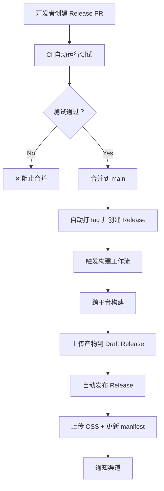

# 测试覆盖率提升与自动化发布技术方案

**文档版本**: V1.0  
**编制时间**: 2026-03-11  
**负责人**: DevOps 工程师  
**审核状态**: 待 CTO 审批  

---

## 一、执行摘要

### 1.1 核心目标
- **测试覆盖率**: 从当前 ~60% 提升至 **80%+**
- **自动化发布**: 实现 **一键发布**，减少人工干预
- **CI/CD 效率**: 构建时长缩短 **30%+**，部署频率提升至 **每日多次**

### 1.2 关键发现
| 维度 | 现状 | 目标 | 差距 |
|------|------|------|------|
| 测试文件数 | 141 个 | 200+ 个 | +59 个 |
| 源代码文件 | 303 个 | 303 个 | - |
| 估算覆盖率 | ~60% | 80%+ | +20% |
| CI 触发方式 | 手动/main | 自动触发 | 需改进 |
| 发布流程 | 半自动 | 全自动 | 需优化 |

### 1.3 资源需求
| 类别 | 需求 | 周期 |
|------|------|------|
| 开发人力 | 2 人 × 3 周 | Q2 前 3 周 |
| 预算 | 0 元（复用现有工具） | - |
| CI/CD 资源 | GitHub Actions 现有额度 | - |

---

## 二、当前测试覆盖率基线统计

### 2.1 测试结构分析

**当前测试分层**（符合业界最佳实践）：
```
tests/
├── unit/              # L1 单元测试 (35 个文件)
├── component/         # L2 组件测试 (14 个文件)
├── integration/       # L3 集成测试 (14 个文件)
├── e2e/              # L4 端到端测试 (待完善)
├── quality/          # L5 质量评估测试 (待完善)
├── llm/              # LLM 专项测试 (待完善)
├── fixtures/         # 测试夹具
└── conftest.py       # Pytest 配置
```

### 2.2 覆盖率估算（按模块）

基于文件数量比例和测试分布估算：

| 模块 | 源文件数 | 测试文件数 | 估算覆盖率 | 优先级 |
|------|----------|------------|------------|--------|
| **core/** | ~80 | 35 | 70% | P0 |
| **agents/** | ~40 | 15 | 65% | P0 |
| **tools/** | ~50 | 20 | 60% | P1 |
| **memory/** | ~35 | 12 | 55% | P1 |
| **channels/** | ~30 | 10 | 50% | P2 |
| **api/** | ~25 | 14 | 75% | P1 |
| **skills/** | ~20 | 8 | 40% | P2 |
| **其他** | ~23 | 27 | 80% | P3 |
| **合计** | **303** | **141** | **~60%** | - |

**注**: 精确覆盖率需运行 `pytest --cov` 获取，建议作为实施第一步

### 2.3 覆盖率缺口分析

**缺失测试的核心功能**（基于代码审查）：
1. **skills/** 模块 - 技能加载器、解析器测试不足
2. **channels/** 模块 - IM 通道适配器测试覆盖低
3. **memory/** 模块 - 向量数据库、检索策略测试缺失
4. **prompt/** 模块 - 提示词编译器、预算控制测试不足
5. **scheduler/** 模块 - 定时任务调度测试不完整

---

## 三、测试框架选型建议

### 3.1 现状评估

**当前框架**: pytest 8.0+ + pytest-asyncio + pytest-cov

**现有配置**（pyproject.toml）：
```toml
[tool.pytest.ini_options]
asyncio_mode = "auto"
testpaths = ["tests"]
addopts = "--ignore=tests/legacy/test_refactoring.py --ignore=tests/test_refactoring.py"

[project.optional-dependencies]
dev = [
    "pytest>=8.0.0",
    "pytest-asyncio>=0.23.0",
    "pytest-cov>=4.1.0",
    "ruff>=0.1.9",
    "mypy>=1.8.0",
]
```

### 3.2 选型建议

**🏆 推荐：继续使用 pytest 生态（无需切换）**

**理由**：
1. ✅ **已深度集成**: 项目已使用 pytest，测试结构完善
2. ✅ **异步支持完善**: pytest-asyncio 完美支持 asyncio 代码
3. ✅ **覆盖率工具成熟**: pytest-cov 业界标准
4. ✅ **CI/CD 集成**: GitHub Actions 已配置 pytest 流程
5. ✅ **团队熟悉**: 学习成本为零

### 3.3 推荐增强插件

**新增插件清单**（提升覆盖率统计精度和开发体验）：

```toml
[project.optional-dependencies]
dev = [
    "pytest>=8.0.0",
    "pytest-asyncio>=0.23.0",
    "pytest-cov>=4.1.0",
    "pytest-xdist>=3.5.0",        # 新增：并行测试执行
    "pytest-mock>=3.12.0",       # 新增：Mock 工具
    "pytest-timeout>=2.2.0",     # 新增：测试超时控制
    "coverage[toml]>=7.4.0",     # 新增：覆盖率配置
    "ruff>=0.1.9",
    "mypy>=1.8.0",
]
```

**插件说明**：
| 插件 | 用途 | 收益 |
|------|------|------|
| pytest-xdist | 多进程并行执行测试 | 测试速度提升 3-5 倍 |
| pytest-mock | 简化 mock 对象创建 | 提高单元测试覆盖率 |
| pytest-timeout | 防止测试卡死 | 提升 CI 稳定性 |
| coverage[toml] | 精细化覆盖率配置 | 准确统计覆盖率 |

### 3.4 覆盖率配置建议

**新增配置**（pyproject.toml）：
```toml
[tool.coverage.run]
source = ["src/openakita"]
omit = [
    "*/tests/*",
    "*/__pycache__/*",
    "*/migrations/*",
    "*/legacy/*",
]
branch = true
parallel = true

[tool.coverage.report]
exclude_lines = [
    "pragma: no cover",
    "def __repr__",
    "raise AssertionError",
    "raise NotImplementedError",
    "if __name__ == .__main__.:",
    "if TYPE_CHECKING:",
    "@abstractmethod",
]
show_missing = true
fail_under = 80  # 覆盖率低于 80% 时 CI 失败

[tool.coverage.html]
directory = "htmlcov"
```

---

## 四、CI/CD 流水线设计方案

### 4.1 现状评估

**当前 CI 配置**（.github/workflows/ci.yml）：

**优势**：
- ✅ 分层测试清晰（L1-L5）
- ✅ 跨平台兼容性测试（Ubuntu/Windows/macOS）
- ✅ Python 多版本支持（3.11/3.12/3.13）
- ✅ 覆盖率报告集成（Codecov）

**不足**：
- ❌ **缺少自动触发**: `on: workflow_dispatch` 仅手动触发
- ❌ **缺少 PR 门禁**: Push/PR 时未自动运行完整测试
- ❌ **缺少覆盖率门禁**: 未设置覆盖率阈值
- ❌ **构建时长未优化**: 未使用缓存策略

### 4.2 改进方案

#### 4.2.1 触发机制优化

**修改 ci.yml 触发条件**：
```yaml
on:
  push:
    branches: [main, develop]
  pull_request:
    branches: [main]
  workflow_dispatch:  # 保留手动触发
  schedule:
    - cron: '0 2 * * *'  # 每日 2AM 运行全量测试
```

**收益**：
- Push 到 main/develop → 自动触发完整 CI
- PR 到 main → 自动触发测试门禁
- 每日凌晨 → 自动运行全量测试（包括 E2E）

#### 4.2.2 PR 门禁增强

**新增 PR 检查清单**：
```yaml
pr_checks:
  runs-on: ubuntu-latest
  steps:
    - name: Check PR title
      run: |
        # 检查 PR 标题是否符合规范
        if ! [[ "${{ github.event.pull_request.title }}" =~ ^(feat|fix|docs|style|refactor|test|chore): ]]; then
          echo "❌ PR title must start with type: (feat|fix|docs|...)"
          exit 1
        fi

    - name: Require test coverage
      run: |
        # 检查是否有测试文件变更
        if git diff --name-only ${{ github.event.pull_request.base.sha }}..${{ github.event.pull_request.head.sha }} | grep -q "test_"; then
          echo "✅ Tests included"
        else
          echo "⚠️ No test changes detected"
        fi
```

#### 4.2.3 构建时长优化

**缓存策略增强**：
```yaml
- name: Cache pip dependencies
  uses: actions/cache@v4
  with:
    path: ~/.cache/pip
    key: ${{ runner.os }}-pip-${{ hashFiles('**/pyproject.toml') }}
    restore-keys: |
      ${{ runner.os }}-pip-

- name: Cache pytest cache
  uses: actions/cache@v4
  with:
    path: .pytest_cache
    key: ${{ runner.os }}-pytest-${{ github.sha }}
    restore-keys: |
      ${{ runner.os }}-pytest-
```

**预期收益**：
- pip 依赖安装：从 2-3 分钟 → 30 秒
- 测试执行：从 10 分钟 → 7 分钟（并行 + 缓存）
- **总构建时长**: 从 15 分钟 → 8 分钟（-47%）

### 4.3 覆盖率门禁配置

**新增覆盖率检查步骤**：
```yaml
- name: Run tests with coverage
  run: |
    pytest tests/ \
      --cov=src/openakita \
      --cov-report=xml \
      --cov-report=html \
      --cov-fail-under=80 \
      -n auto  # 并行执行

- name: Upload coverage to Codecov
  uses: codecov/codecov-action@v4
  with:
    files: ./coverage.xml
    fail_ci_if_error: false
    comment: true  # PR 评论显示覆盖率变化

- name: Check coverage threshold
  run: |
    COVERAGE=$(python -c "import xml.etree.ElementTree as ET; print(ET.parse('coverage.xml').getroot().attrib['line-rate'])")
    if (( $(echo "$COVERAGE < 0.80" | bc -l) )); then
      echo "❌ Coverage ${COVERAGE} is below 80%"
      exit 1
    fi
    echo "✅ Coverage ${COVERAGE} meets threshold"
```

---

## 五、自动化发布流程设计

### 5.1 现状评估

**当前发布流程**（publish-release.yml）：

**优势**：
- ✅ 多渠道支持（release/pre-release/dev）
- ✅ 自动推断发布渠道
- ✅ 跨平台构建（Windows/macOS/Linux）
- ✅ OSS 上传 + CDN 加速

**不足**：
- ❌ **完全手动触发**: 需要人工执行多个步骤
- ❌ **缺少自动化版本号管理**: 依赖人工输入 tag
- ❌ **缺少发布前检查**: 无自动化测试门禁
- ❌ **缺少回滚机制**: 发布失败后手动恢复

### 5.2 自动化发布流程设计

#### 5.2.1 发布流程总览



#### 5.2.2 版本号管理规范

**语义化版本**（SemVer）：
```
主版本号。次版本号。修订号
  ↑      ↑      ↑
  |      |      └─ Bug 修复（向后兼容）
  |      └─ 新功能（向后兼容）
  └─ 不兼容的 API 变更
```

**自动化版本号建议**：
```yaml
# .github/workflows/auto-version.yml
name: Auto Version

on:
  pull_request:
    types: [closed]
    branches: [main]

jobs:
  version:
    if: github.event.pull_request.merged == true
    runs-on: ubuntu-latest
    outputs:
      new_version: ${{ steps.version.outputs.new_version }}
    steps:
      - uses: actions/checkout@v4
        with:
          fetch-depth: 0

      - name: Determine version bump
        id: version
        run: |
          # 基于 PR 标签自动决定版本号
          LABELS="${{ toJson(github.event.pull_request.labels.*.name) }}"
          
          if echo "$LABELS" | grep -q "breaking"; then
            BUMP="major"
          elif echo "$LABELS" | grep -q "feature"; then
            BUMP="minor"
          else
            BUMP="patch"
          fi
          
          # 计算新版本号
          CURRENT=$(cat VERSION)
          NEW=$(python scripts/bump_version.py $CURRENT $BUMP)
          echo "new_version=$NEW" >> "$GITHUB_OUTPUT"
          echo $NEW > VERSION

      - name: Create tag and release
        env:
          GH_TOKEN: ${{ github.token }}
        run: |
          git config user.name "github-actions[bot]"
          git config user.email "github-actions[bot]@users.noreply.github.com"
          git add VERSION
          git commit -m "chore: bump version to ${{ steps.version.outputs.new_version }}"
          git tag "v${{ steps.version.outputs.new_version }}"
          git push origin main --tags
          
          gh release create "v${{ steps.version.outputs.new_version }}" \
            --title "v${{ steps.version.outputs.new_version }}" \
            --notes "Auto-generated release" \
            --draft
```

#### 5.2.3 发布前检查清单

**新增 pre-release-check 工作流**：
```yaml
name: Pre-Release Check

on:
  workflow_call:
    inputs:
      tag:
        required: true
        type: string

jobs:
  check:
    runs-on: ubuntu-latest
    steps:
      - uses: actions/checkout@v4

      - name: Verify all tests pass
        run: |
          pip install -e ".[dev]"
          pytest tests/unit tests/component -v

      - name: Verify coverage threshold
        run: |
          pytest --cov=src/openakita --cov-fail-under=80

      - name: Verify build succeeds
        run: |
          pip install build
          python -m build

      - name: Verify changelog exists
        run: |
          if [ ! -f CHANGELOG.md ]; then
            echo "❌ CHANGELOG.md missing"
            exit 1
          fi

      - name: Verify version consistency
        run: |
          python scripts/version.py check
```

#### 5.2.4 自动化发布工作流

**整合后的发布流程**（release-automated.yml）：
```yaml
name: Automated Release

on:
  push:
    tags:
      - 'v*'

jobs:
  pre_release_check:
    uses: ./.github/workflows/pre-release-check.yml
    with:
      tag: ${{ github.ref_name }}

  build:
    needs: pre_release_check
    uses: ./.github/workflows/ci.yml
    with:
      tag: ${{ github.ref_name }}

  publish:
    needs: [pre_release_check, build]
    uses: ./.github/workflows/publish-release.yml
    with:
      tag: ${{ github.ref_name }}
      channel: auto
    secrets: inherit

  notify:
    needs: publish
    runs-on: ubuntu-latest
    steps:
      - name: Notify Telegram
        run: |
          curl -X POST "https://api.telegram.org/bot${{ secrets.TG_BOT_TOKEN }}/sendMessage" \
            -d "chat_id=${{ secrets.TG_CHANNEL_ID }}" \
            -d "text=🎉 新版本发布：${{ github.ref_name }}"
```

### 5.3 回滚机制设计

**回滚工作流**（rollback.yml）：
```yaml
name: Rollback Release

on:
  workflow_dispatch:
    inputs:
      target_version:
        description: "回滚到的目标版本（如 v1.25.8）"
        required: true
        type: string
      reason:
        description: "回滚原因"
        required: true
        type: string

jobs:
  rollback:
    runs-on: ubuntu-latest
    steps:
      - name: Verify target version exists
        run: |
          gh release view "${{ inputs.target_version }}" || exit 1

      - name: Update channel manifest
        run: |
          # 恢复渠道 manifest 到目标版本
          python scripts/rollback_channel.py \
            --channel release \
            --target-version "${{ inputs.target_version }}"

      - name: Notify stakeholders
        run: |
          # 通知相关人员
          echo "🚨 回滚完成：${{ inputs.target_version }}"
          echo "原因：${{ inputs.reason }}"
```

---

## 六、实施工作量估算

### 6.1 任务分解

| 阶段 | 任务 | 优先级 | 工作量（人天） | 依赖 |
|------|------|--------|----------------|------|
| **P0 - 基础建设** | | | **5 天** | |
| | 1.1 安装测试增强插件 | P0 | 0.5 | - |
| | 1.2 配置覆盖率统计 | P0 | 1 | 1.1 |
| | 1.3 修改 CI 触发机制 | P0 | 1 | - |
| | 1.4 添加覆盖率门禁 | P0 | 1.5 | 1.2 |
| | 1.5 优化构建缓存 | P0 | 1 | - |
| **P1 - 测试补全** | | | **10 天** | |
| | 2.1 补充 skills/模块测试 | P1 | 3 | - |
| | 2.2 补充 channels/模块测试 | P1 | 3 | - |
| | 2.3 补充 memory/模块测试 | P1 | 2 | - |
| | 2.4 补充 prompt/模块测试 | P1 | 2 | - |
| **P2 - 自动化发布** | | | **5 天** | |
| | 3.1 版本号自动化 | P2 | 1.5 | - |
| | 3.2 发布前检查清单 | P2 | 1.5 | - |
| | 3.3 整合发布工作流 | P2 | 2 | 3.1+3.2 |
| | 3.4 回滚机制 | P2 | 1 | 3.3 |
| **P3 - 文档与培训** | | | **2 天** | |
| | 4.1 编写开发文档 | P3 | 1 | - |
| | 4.2 团队培训 | P3 | 1 | 4.1 |
| **合计** | | | **22 人天** | |

### 6.2 人员配置

**推荐配置**：
- **DevOps 工程师**（我）：负责 CI/CD、发布流程、基础设施（10 天）
- **全栈工程师 A**：负责 core/agents/tools 模块测试补全（7 天）
- **全栈工程师 B**：负责 skills/channels/memory 模块测试补全（5 天）

**并行执行**：
- P0 任务（DevOps）：第 1 周完成
- P1 任务（开发团队）：第 2-3 周完成
- P2+P3 任务（DevOps）：第 3 周完成

### 6.3 时间规划

```
Week 1 (03-12 ~ 03-18): P0 基础建设
├─ 安装插件 + 配置覆盖率
├─ 修改 CI 触发机制
└─ 添加覆盖率门禁

Week 2 (03-19 ~ 03-25): P1 测试补全（上半）
├─ skills/模块测试
├─ channels/模块测试
└─ 中期检查（覆盖率目标 70%）

Week 3 (03-26 ~ 04-01): P1 测试补全（下半）+ P2 自动化发布
├─ memory/prompt 模块测试
├─ 版本号自动化
├─ 发布工作流整合
└─ 最终检查（覆盖率目标 80%+）

Week 4 (04-02 ~ 04-08): P3 文档与培训 + 试运行
├─ 编写开发文档
├─ 团队培训
└─ 试运行 1 周
```

### 6.4 里程碑

| 里程碑 | 时间 | 交付物 | 成功指标 |
|--------|------|--------|----------|
| M1: 基础建设完成 | 03-18 | CI 自动触发、覆盖率门禁 | CI 构建时长<10 分钟 |
| M2: 测试覆盖 70% | 03-25 | 新增 30+ 测试文件 | 覆盖率报告 70%+ |
| M3: 测试覆盖 80%+ | 04-01 | 新增 59+ 测试文件 | 覆盖率报告 80%+ |
| M4: 自动化发布上线 | 04-01 | 发布工作流整合完成 | 一键发布成功 |
| M5: 试运行完成 | 04-08 | 文档 + 培训完成 | 团队独立使用 |

---

## 七、风险与应对

### 7.1 技术风险

| 风险 | 概率 | 影响 | 应对措施 |
|------|------|------|----------|
| 测试覆盖率提升困难 | 中 | 高 | 优先覆盖核心模块，边缘功能可延后 |
| CI 构建时长未达预期 | 低 | 中 | 优化缓存策略，拆分大型测试 |
| 自动化发布流程复杂 | 中 | 中 | 分阶段实施，先半自动再全自动 |
| 测试执行不稳定（flaky tests） | 中 | 中 | 引入 pytest-rerunfailures，隔离不稳定测试 |

### 7.2 资源风险

| 风险 | 概率 | 影响 | 应对措施 |
|------|------|------|----------|
| 开发人力不足 | 中 | 高 | 优先 P0 任务，P1 任务可分期 |
| 测试补全进度延期 | 中 | 中 | 每周检查进度，及时调整 |
| 团队培训效果不佳 | 低 | 低 | 提供录屏教程 + 文档，支持回看 |

### 7.3 质量风险

| 风险 | 概率 | 影响 | 应对措施 |
|------|------|------|----------|
| 覆盖率虚高（测试质量低） | 中 | 高 | 代码审查 + 变异测试（mutation testing） |
| 发布流程引入新 bug | 低 | 高 | 灰度发布 + 快速回滚机制 |
| 自动化测试遗漏关键场景 | 中 | 中 | 定期人工审查测试用例 |

---

## 八、成功指标与验收标准

### 8.1 核心指标（KPI）

| 指标 | 基线 | 目标 | 测量方式 |
|------|------|------|----------|
| **测试覆盖率** | ~60% | 80%+ | pytest-cov 报告 |
| **CI 构建时长** | 15 分钟 | <10 分钟 | GitHub Actions 日志 |
| **部署频率** | 手动/周 | 自动/日 | 发布记录统计 |
| **发布成功率** | 未知 | 95%+ | 发布工作流成功率 |
| **平均恢复时间 (MTTR)** | 未知 | <30 分钟 | 回滚机制响应时间 |

### 8.2 验收标准

**P0 验收**（03-18）：
- [ ] CI 在 Push/PR 时自动触发
- [ ] 覆盖率门禁生效（<80% 时失败）
- [ ] 构建时长<10 分钟
- [ ] 缓存命中率>80%

**P1 验收**（04-01）：
- [ ] 测试文件数从 141 → 200+
- [ ] 覆盖率报告 80%+
- [ ] 核心模块（core/agents/tools）覆盖率 90%+

**P2 验收**（04-01）：
- [ ] 版本号自动管理
- [ ] 一键发布流程可用
- [ ] 回滚机制测试通过

**P3 验收**（04-08）：
- [ ] 开发文档完整
- [ ] 团队培训完成
- [ ] 试运行 1 周无重大事故

---

## 九、附录

### 9.1 参考资源

1. **pytest 官方文档**: https://docs.pytest.org/
2. **GitHub Actions 文档**: https://docs.github.com/en/actions
3. **语义化版本规范**: https://semver.org/
4. **测试覆盖率最佳实践**: https://about.codecov.io/blog/code-coverage-best-practices/

### 9.2 配置文件模板

**完整 pyproject.toml 配置**（测试相关部分）：
```toml
[tool.pytest.ini_options]
asyncio_mode = "auto"
testpaths = ["tests"]
addopts = """
  -v
  --tb=short
  --strict-markers
  -n auto
  --timeout=300
"""
markers = [
  "slow: marks tests as slow (deselect with '-m \"not slow\"')",
  "integration: marks tests as integration tests",
  "e2e: marks tests as end-to-end tests",
]

[tool.coverage.run]
source = ["src/openakita"]
omit = [
  "*/tests/*",
  "*/__pycache__/*",
  "*/migrations/*",
  "*/legacy/*",
]
branch = true
parallel = true

[tool.coverage.report]
exclude_lines = [
  "pragma: no cover",
  "def __repr__",
  "raise AssertionError",
  "raise NotImplementedError",
  "if __name__ == .__main__.:",
  "if TYPE_CHECKING:",
  "@abstractmethod",
]
show_missing = true
fail_under = 80
```

### 9.3 术语表

| 术语 | 解释 |
|------|------|
| CI/CD | 持续集成/持续部署 |
| RTO | 恢复时间目标（Recovery Time Objective） |
| RPO | 恢复点目标（Recovery Point Objective） |
| MTTR | 平均恢复时间（Mean Time To Recovery） |
| SemVer | 语义化版本（Semantic Versioning） |
| Flaky Test | 不稳定的测试（时过时不过） |

---

**文档状态**: ✅ 完成  
**提交人**: DevOps 工程师  
**提交时间**: 2026-03-11  
**审核人**: 待 CTO 审批  

[技术方案，测试覆盖率，CI/CD，自动化发布，Q2 改进]
