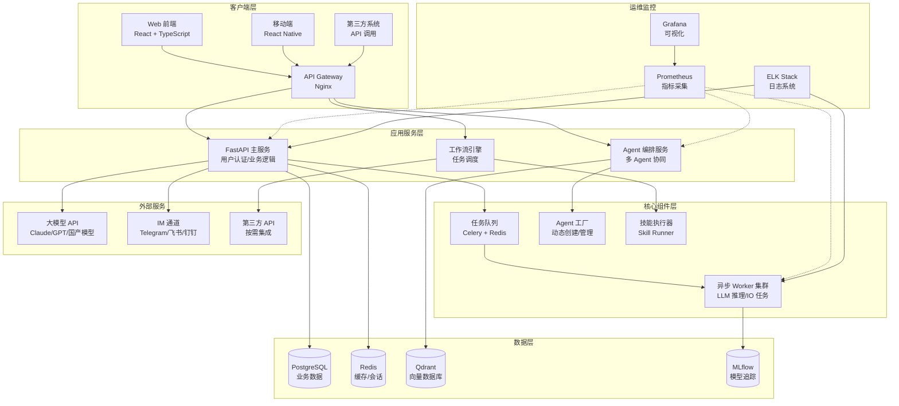
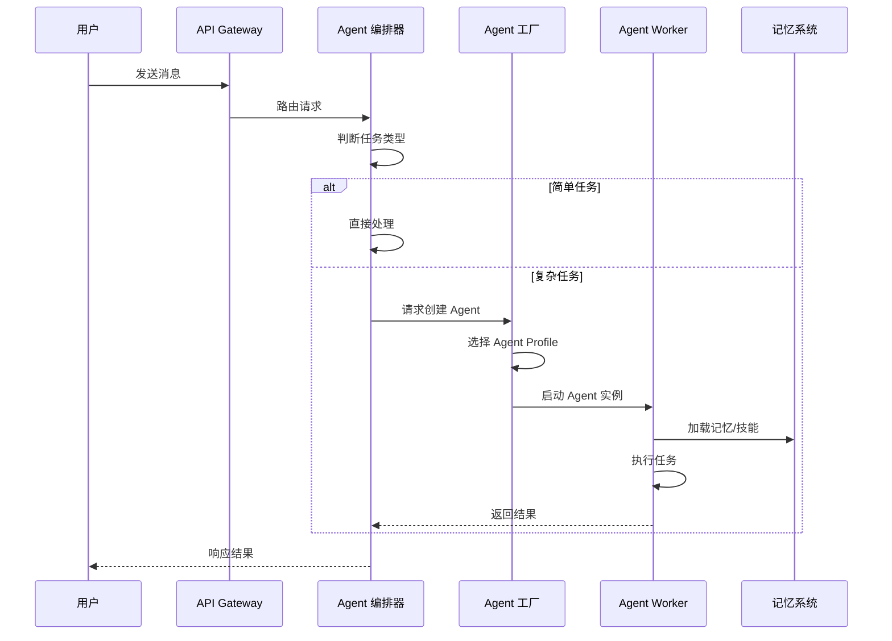
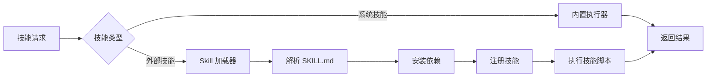
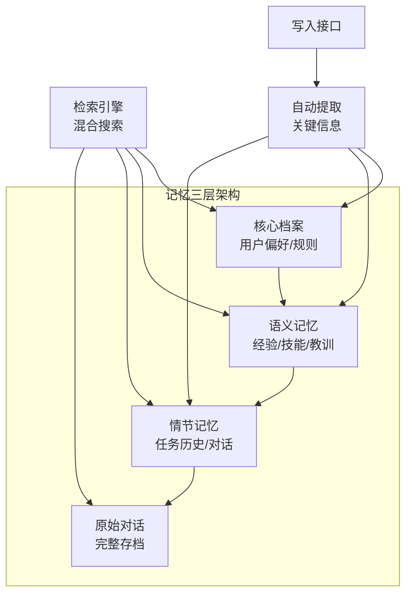
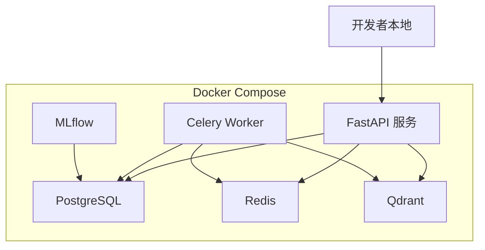
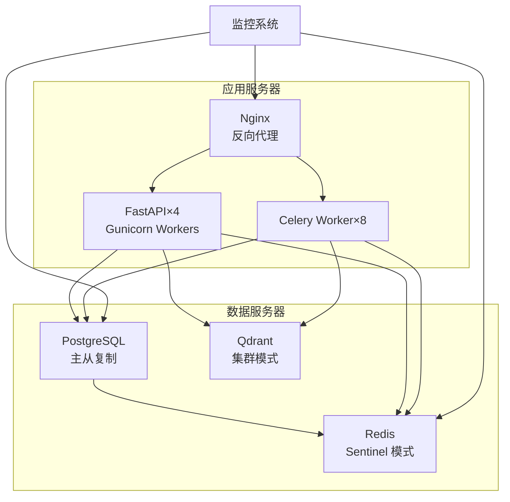
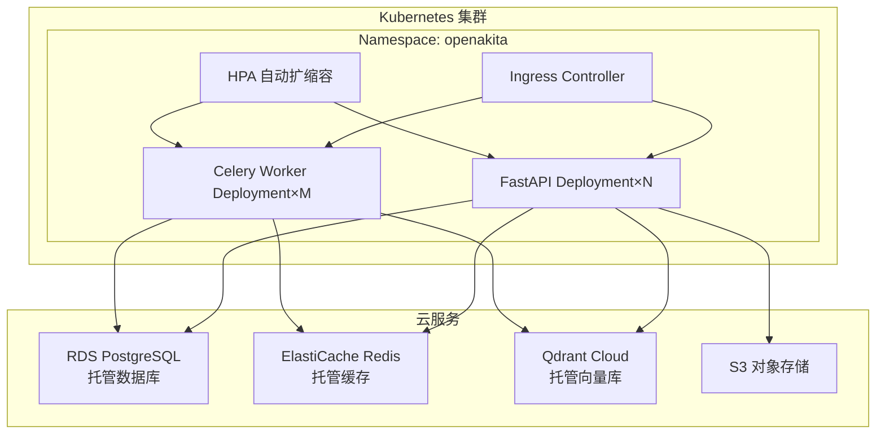
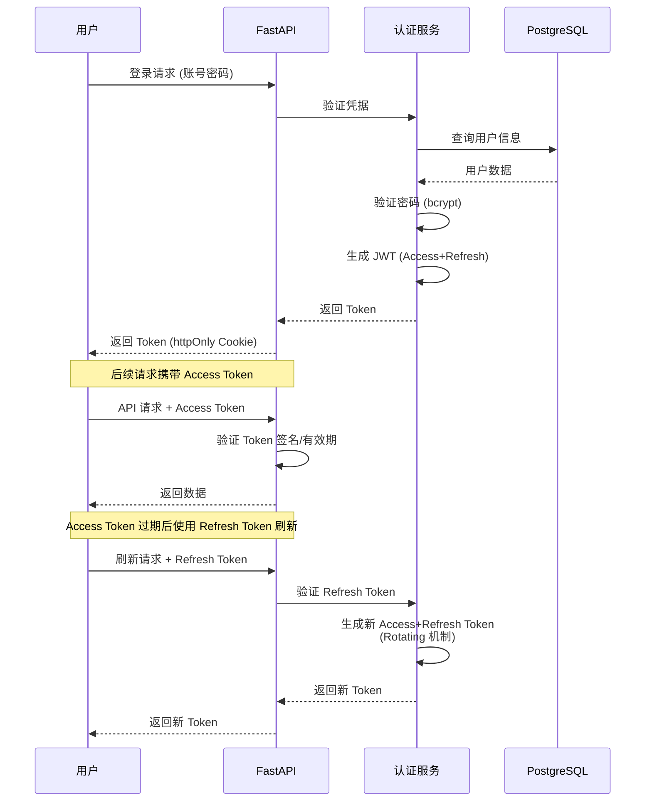
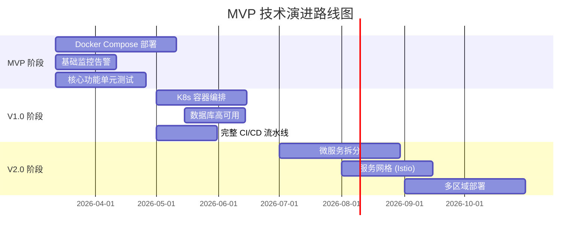

# MVP 技术架构设计

## 一、系统架构总览

### 1.1 整体架构图



### 1.2 架构分层说明

| 层级 | 组件 | 技术选型 | 职责 |
|------|------|----------|------|
| **客户端层** | Web 前端 | React 18 + TypeScript + Vite | 用户交互界面 |
| | 移动端 | React Native (二期) | 移动场景支持 |
| | API Gateway | Nginx | 负载均衡/SSL 终止/限流 |
| **应用服务层** | FastAPI 主服务 | FastAPI + Uvicorn | RESTful API/用户认证/业务逻辑 |
| | Agent 编排服务 | Python Asyncio | 多 Agent 协同/任务路由 |
| | 工作流引擎 | 自研 | 可视化工作流编排/执行 |
| **核心组件层** | 任务队列 | Celery + Redis | 异步任务调度 |
| | Agent 工厂 | Python | 动态 Agent 创建/生命周期管理 |
| | 技能执行器 | Python | Skill 加载/执行/沙箱隔离 |
| | Worker 集群 | Celery Workers | LLM 推理/IO 密集型任务 |
| **数据层** | 关系数据库 | PostgreSQL 15 | 用户/任务/会话数据 |
| | 缓存 | Redis 7 | 会话缓存/热点数据 |
| | 向量数据库 | Qdrant | 语义搜索/记忆检索 |
| | 模型追踪 | MLflow | 实验管理/模型版本 |
| **外部服务** | 大模型 API | 多 Provider | Claude/GPT/国产模型 |
| | IM 通道 | 自研 Adapter | Telegram/飞书/钉钉/企微 |
| **运维监控** | 指标监控 | Prometheus + Grafana | 性能监控/告警 |
| | 日志系统 | ELK Stack | 日志收集/分析 |

---

## 二、技术栈选型

### 2.1 后端技术栈

| 类别 | 技术 | 版本 | 选型理由 |
|------|------|------|----------|
| **核心框架** | FastAPI | 0.109+ | 异步高性能，自动 OpenAPI 文档，类型安全 |
| **异步运行时** | Asyncio | Python 3.11+ | 原生异步支持，高并发 IO |
| **任务队列** | Celery | 5.3+ | Python 生态成熟，功能完善，监控工具丰富 |
| **消息中间件** | Redis | 7.x | 高性能，支持多种数据结构，运维简单 |
| **ORM** | SQLAlchemy | 2.0+ | 异步支持，类型提示，迁移工具完善 |
| **数据迁移** | Alembic | 1.13+ | SQLAlchemy 官方迁移工具 |
| **认证授权** | JWT + OAuth2 | - | 无状态认证，支持第三方登录 |
| **配置管理** | Pydantic Settings | 2.0+ | 类型安全，环境变量自动加载 |

### 2.2 数据层技术栈

| 类别 | 技术 | 版本 | 选型理由 |
|------|------|------|----------|
| **主数据库** | PostgreSQL | 15.x | ACID 兼容，JSONB 支持，扩展性强 |
| **缓存** | Redis | 7.x | 高性能，支持 Pub/Sub，持久化可选 |
| **向量数据库** | Qdrant | 1.7+ | Rust 实现高性能，部署简单，API 友好 |
| **对象存储** | MinIO / AWS S3 | - | 兼容 S3 协议，支持自托管 |

### 2.3 前端技术栈

| 类别 | 技术 | 版本 | 选型理由 |
|------|------|------|----------|
| **核心框架** | React | 18.x | 生态成熟，组件丰富 |
| **开发语言** | TypeScript | 5.x | 类型安全，开发体验好 |
| **构建工具** | Vite | 5.x | 极速启动，热更新快 |
| **状态管理** | Zustand / Jotai | - | 轻量级，API 简单 |
| **UI 组件库** | Ant Design / MUI | - | 组件丰富，文档完善 |
| **图表库** | ECharts / Recharts | - | 可视化能力强 |
| **工作流编辑器** | React Flow | 11.x | 专为流程图设计，交互优秀 |

### 2.4 运维与监控

| 类别 | 技术 | 版本 | 选型理由 |
|------|------|------|----------|
| **容器化** | Docker | 24.x | 标准化部署，环境一致性 |
| **编排** | Docker Compose | 2.x | 本地开发/小規模部署足够 |
| **CI/CD** | GitHub Actions | - | 与代码仓库深度集成 |
| **指标监控** | Prometheus | 2.x | 云原生标准，查询语言强大 |
| **可视化** | Grafana | 10.x | 仪表盘丰富，告警完善 |
| **日志** | ELK Stack | 8.x | 成熟方案，全文搜索强大 |
| **链路追踪** | Jaeger | 1.x | 分布式追踪，性能分析 |

### 2.5 大模型集成

| 类别 | 技术 | 说明 |
|------|------|------|
| **Provider 管理** | 自研 Provider Registry | 支持 30+ 大模型服务商 |
| **Token 计费** | 自研计费模块 | 按 Provider/模型/Token 类型计费 |
| **降级策略** | 多 Provider 故障转移 | 主 Provider 失败自动切换备用 |
| **流式响应** | SSE / WebSocket | 实时输出，提升用户体验 |

---

## 三、核心模块设计

### 3.1 Agent 编排模块



**核心职责**:
- 消息路由：判断任务由 Master 处理还是分发 Worker
- Agent 生命周期管理：创建/销毁/健康检查
- 会话状态维护：多轮对话上下文
- 技能调度：根据任务类型选择合适技能

### 3.2 技能执行模块



**技能分类**:
- **系统技能**: 内置工具（文件/浏览器/搜索等）
- **外部技能**: SKILL.md 定义的可扩展能力
- **MCP 技能**: 通过 MCP 协议集成的外部服务

### 3.3 记忆系统模块



**检索策略**:
- 关键词搜索 + 向量语义搜索混合
- 时间衰减 + 相关性评分加权
- 分层检索：先核心档案，再语义记忆，最后原始对话

---

## 四、部署架构

### 4.1 开发环境（Docker Compose）



**配置文件**: `docker-compose.dev.yml`
- 所有服务容器化
- 数据卷持久化
- 一键启动/停止

### 4.2 生产环境（单机/小规模）



**部署策略**:
- 应用与数据分离
- 数据库主从复制
- Redis Sentinel 高可用
- Qdrant 集群模式

### 4.3 生产环境（大规模/云原生）



**扩展策略**:
- Kubernetes 容器编排
- HPA 基于 CPU/内存/自定义指标自动扩缩容
- 云服务托管减少运维负担

---

## 五、安全设计

### 5.1 认证与授权



**安全机制**:
- JWT Token 双令牌机制（Access + Refresh）
- Refresh Token 使用 httpOnly Cookie 存储
- Rotating Refresh Token：每次刷新后旧 Token 失效
- Token 黑名单：支持主动登出
- RBAC 权限控制：基于角色的访问控制

### 5.2 数据安全

| 风险 | 防护措施 |
|------|----------|
| SQL 注入 | SQLAlchemy ORM 参数化查询 |
| XSS 攻击 | 前端输入验证 + 输出转义 |
| CSRF 攻击 | CSRF Token + SameSite Cookie |
| 数据泄露 | 敏感数据加密存储（AES-256） |
| 未授权访问 | JWT 认证 + RBAC 权限校验 |
| API 滥用 | 限流（Redis 计数器）+ 配额管理 |

### 5.3 技能沙箱

**隔离机制**:
- 文件系统隔离：技能只能访问指定目录
- 网络访问控制：白名单域名
- 资源限制：CPU/内存/执行时间上限
- 依赖隔离：每个技能独立虚拟环境

---

## 六、性能优化

### 6.1 缓存策略

| 层级 | 缓存内容 | 过期策略 |
|------|----------|----------|
| **L1 - 内存缓存** | 热点配置/会话状态 | LRU 淘汰，5 分钟过期 |
| **L2 - Redis 缓存** | API 响应/用户数据 | 10-30 分钟过期 |
| **L3 - 数据库查询缓存** | 复杂查询结果 | 1 小时过期 |

### 6.2 数据库优化

- **索引策略**: 高频查询字段建立索引
- **读写分离**: 主库写，从库读
- **分库分表**: 单表超过 1000 万行时考虑
- **连接池**: SQLAlchemy 异步连接池（大小 20-50）

### 6.3 异步处理

**适用场景**:
- LLM API 调用（高延迟）
- 文件上传/下载
- 邮件/消息推送
- 批量数据处理

**实现方式**:
```python
# 提交异步任务
task = celery_task.delay(user_id, task_data)

# 轮询任务状态
GET /api/tasks/{task_id}/status

# WebSocket 推送结果
WebSocket /ws/tasks/{task_id}
```

---

## 七、技术债务管理

### 7.1 MVP 阶段妥协

| 领域 | 妥协方案 | 后续优化 |
|------|----------|----------|
| **部署** | Docker Compose 单机 | 迁移至 K8s |
| **数据库** | PostgreSQL 单实例 | 主从复制 + 读写分离 |
| **缓存** | Redis 单节点 | Redis Cluster |
| **监控** | 基础指标监控 | 完整 APM + 链路追踪 |
| **测试** | 核心功能单元测试 | 集成测试 + E2E 测试 |

### 7.2 技术演进路线



---

## 八、总结

### 8.1 架构优势

1. **高性能**: FastAPI 异步框架 + Celery 任务队列
2. **高可用**: 多层冗余设计，故障自动转移
3. **易扩展**: 模块化设计，支持水平扩展
4. **低成本**: 开源技术栈为主，云服务按需使用
5. **可维护**: 完善的监控/日志/追踪体系

### 8.2 风险控制

- **技术风险**: 选用成熟技术栈，避免过度创新
- **运维风险**: 容器化部署，自动化运维
- **安全风险**: 多层防护，定期安全审计
- **成本风险**: 按需使用云服务，避免过度配置

---

**文档版本**: V1.0  
**创建时间**: 2026-03-11  
**负责人**: 架构师  
**审核状态**: 待 CTO 审核
