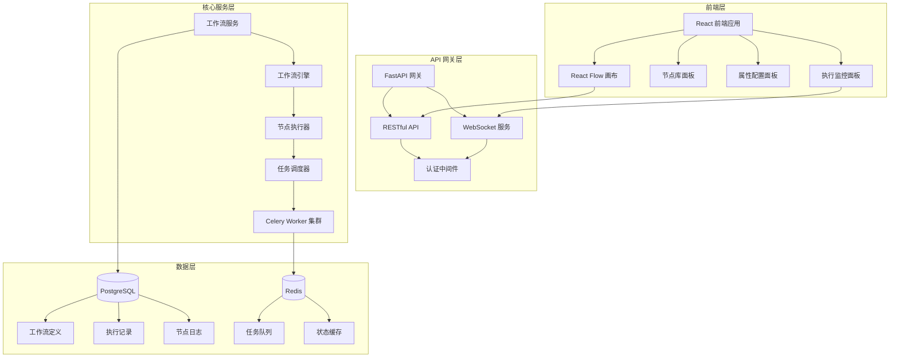
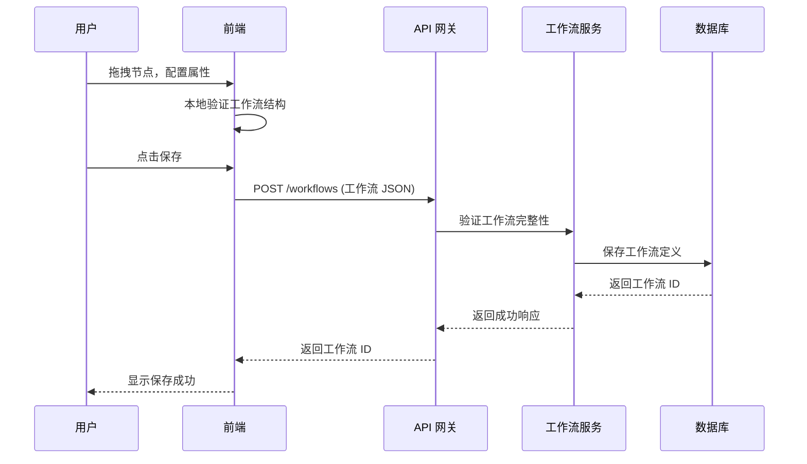
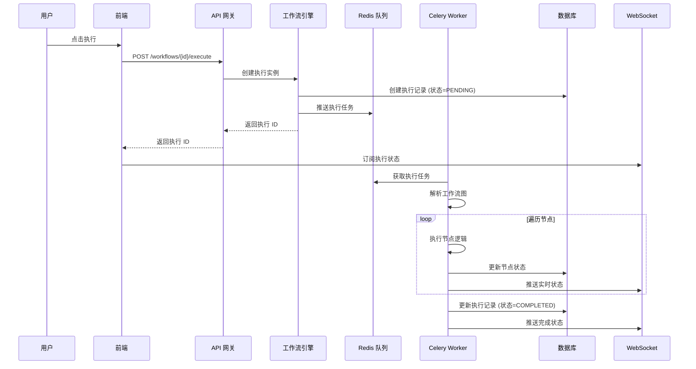
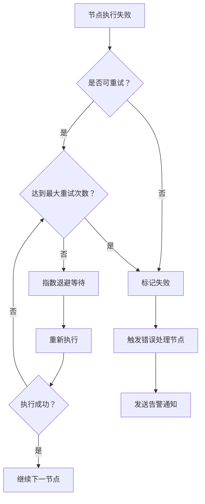

# 工作流编排器技术架构设计文档

**版本**: V1.0  
**作者**: 架构师  
**日期**: 2026-03-11  
**状态**: 技术评审通过 (03-12)

---

## 一、架构总览

### 1.1 系统架构图



### 1.2 技术栈选型

| 层级 | 技术 | 选型理由 |
|------|------|----------|
| **前端框架** | React 18 + TypeScript | 团队熟悉，生态丰富，类型安全 |
| **流程画布** | React Flow V11 | 专业流程图库，支持自定义节点，活跃维护 |
| **UI 组件库** | Ant Design 5 | 企业级组件，主题定制方便 |
| **状态管理** | Zustand | 轻量级，比 Redux 简单，适合中等规模应用 |
| **后端框架** | FastAPI | 异步高性能，自动文档，类型提示 |
| **工作流引擎** | 自研状态机 | 轻量可控，适配业务场景 |
| **任务队列** | Celery + Redis | Python 生态成熟，支持重试/定时/监控 |
| **数据库** | PostgreSQL 15 | 稳定可靠，JSONB 支持灵活 schema |
| **向量扩展** | pgvector | 复用 PG 基础设施，无需额外部署 |
| **实时通信** | WebSocket | 低延迟推送执行状态 |

---

## 二、核心模块设计

### 2.1 前端模块

```
frontend/
├── src/
│   ├── components/
│   │   ├── WorkflowEditor/       # 主编辑器组件
│   │   │   ├── Canvas.tsx        # 画布 (React Flow)
│   │   │   ├── NodeLibrary.tsx   # 节点库面板
│   │   │   ├── PropertyPanel.tsx # 属性配置
│   │   │   └── Toolbar.tsx       # 工具栏
│   │   ├── Nodes/                # 自定义节点类型
│   │   │   ├── TriggerNode.tsx   # 触发器节点
│   │   │   ├── ActionNode.tsx    # 动作节点
│   │   │   ├── ConditionNode.tsx # 条件分支
│   │   │   ├── LoopNode.tsx      # 循环节点
│   │   │   └── SubFlowNode.tsx   # 子流程
│   │   └── ExecutionMonitor/     # 执行监控
│   │       ├── StatusPanel.tsx   # 状态面板
│   │       └── LogViewer.tsx     # 日志查看器
│   ├── stores/
│   │   ├── workflowStore.ts      # 工作流状态
│   │   └── executionStore.ts     # 执行状态
│   ├── services/
│   │   ├── api.ts                # REST API 客户端
│   │   └── websocket.ts          # WebSocket 连接
│   └── types/
│       └── workflow.ts           # TypeScript 类型定义
```

### 2.2 后端模块

```
backend/
├── app/
│   ├── api/
│   │   ├── routes/
│   │   │   ├── workflows.py      # 工作流 CRUD
│   │   │   ├── executions.py     # 执行控制
│   │   │   └── websocket.py      # WebSocket 路由
│   │   └── deps.py               # 依赖注入
│   ├── core/
│   │   ├── engine/
│   │   │   ├── workflow_engine.py  # 工作流引擎
│   │   │   ├── state_machine.py    # 状态机
│   │   │   └── executor.py         # 节点执行器
│   │   ├── nodes/
│   │   │   ├── base.py             # 节点基类
│   │   │   ├── trigger.py          # 触发器
│   │   │   ├── action.py           # 动作
│   │   │   ├── condition.py        # 条件分支
│   │   │   ├── loop.py             # 循环
│   │   │   └── subflow.py          # 子流程
│   │   └── scheduler/
│   │       ├── celery_app.py       # Celery 配置
│   │       └── tasks.py            # 异步任务
│   ├── models/
│   │   ├── workflow.py             # 工作流模型
│   │   ├── node.py                 # 节点模型
│   │   └── execution.py            # 执行记录模型
│   ├── schemas/
│   │   ├── workflow.py             # Pydantic Schema
│   │   └── execution.py
│   └── db/
│       ├── database.py             # 数据库连接
│       └── crud.py                 # CRUD 操作
```

---

## 三、数据流设计

### 3.1 工作流创建流程



### 3.2 工作流执行流程



---

## 四、核心数据结构

### 4.1 工作流定义 (Workflow)

```typescript
interface Workflow {
  id: string;                    // UUID
  name: string;                  // 工作流名称
  description?: string;          // 描述
  version: number;               // 版本号 (乐观锁)
  nodes: Node[];                 // 节点数组
  edges: Edge[];                 // 连接关系
  variables: Record<string, any>; // 全局变量
  created_at: DateTime;
  updated_at: DateTime;
  created_by: string;            // 创建者 ID
}
```

### 4.2 节点定义 (Node)

```typescript
interface Node {
  id: string;                    // 节点 ID (UUID)
  type: NodeType;                // 节点类型
  position: { x: number, y: number }; // 画布位置
  data: NodeData;                // 节点数据
  inputs?: Record<string, Input>;  // 输入端口
  outputs?: Record<string, Output>; // 输出端口
}

type NodeType = 'trigger' | 'action' | 'condition' | 'loop' | 'subflow';

interface NodeData {
  label: string;                 // 节点标签
  config: Record<string, any>;   // 节点配置
  retry_policy?: RetryPolicy;    // 重试策略
  timeout?: number;              // 超时时间 (秒)
}
```

### 4.3 执行记录 (Execution)

```typescript
interface Execution {
  id: string;                    // 执行 ID (UUID)
  workflow_id: string;           // 工作流 ID
  status: ExecutionStatus;       // 执行状态
  input_data: Record<string, any>; // 输入数据
  output_data?: Record<string, any>; // 输出数据
  started_at?: DateTime;
  completed_at?: DateTime;
  error_message?: string;        // 错误信息
  node_executions: NodeExecution[]; // 节点执行记录
}

type ExecutionStatus = 'pending' | 'running' | 'completed' | 'failed' | 'cancelled';
```

---

## 五、节点类型系统

### 5.1 触发器节点 (Trigger)

**功能**: 工作流入口，定义触发条件

**配置**:
```json
{
  "type": "trigger",
  "trigger_type": "manual" | "schedule" | "webhook" | "event",
  "schedule_config": { "cron": "0 * * * *" },
  "webhook_config": { "path": "/webhook/xxx", "method": "POST" },
  "event_config": { "event_type": "order.created" }
}
```

### 5.2 动作节点 (Action)

**功能**: 执行具体操作 (API 调用/数据处理/通知等)

**配置**:
```json
{
  "type": "action",
  "action_type": "http_request" | "data_transform" | "notification",
  "http_config": {
    "method": "POST",
    "url": "https://api.example.com",
    "headers": {},
    "body": "{{ input.data }}"
  }
}
```

### 5.3 条件分支节点 (Condition)

**功能**: 根据条件判断走不同分支

**配置**:
```json
{
  "type": "condition",
  "conditions": [
    {
      "expression": "{{ input.amount }} > 1000",
      "label": "大额订单",
      "next_node_id": "node_2"
    },
    {
      "expression": "default",
      "label": "普通订单",
      "next_node_id": "node_3"
    }
  ]
}
```

### 5.4 循环节点 (Loop)

**功能**: 遍历数组或重复执行

**配置**:
```json
{
  "type": "loop",
  "loop_type": "foreach" | "while",
  "foreach_config": {
    "array": "{{ input.items }}",
    "batch_size": 10
  },
  "while_config": {
    "condition": "{{ loop.index }} < 10"
  }
}
```

### 5.5 子流程节点 (SubFlow)

**功能**: 嵌套调用其他工作流

**配置**:
```json
{
  "type": "subflow",
  "sub_workflow_id": "workflow_xxx",
  "input_mapping": {
    "order_id": "{{ input.order_id }}"
  }
}
```

---

## 六、错误处理与重试机制

### 6.1 重试策略

```python
class RetryPolicy:
    max_retries: int = 3              # 最大重试次数
    initial_delay: float = 1.0        # 初始延迟 (秒)
    max_delay: float = 60.0           # 最大延迟 (秒)
    exponential_base: float = 2.0     # 指数退避基数
    retryable_errors: List[str] = []  # 可重试错误类型
```

### 6.2 错误分类

| 错误类型 | 可重试 | 处理方式 |
|----------|--------|----------|
| 网络超时 | ✅ | 指数退避重试 |
| API 限流 | ✅ | 等待后重试 |
| 数据验证失败 | ❌ | 标记失败，通知用户 |
| 业务逻辑错误 | ❌ | 标记失败，记录日志 |
| 系统异常 | ✅ | 重试 + 告警 |

### 6.3 错误处理流程



---

## 七、性能与扩展性设计

### 7.1 并发控制

- **工作流并发**: 支持同一工作流多实例并发执行
- **节点并发**: 无依赖关系的节点可并行执行
- **资源限制**: 单租户最大并发数可配置

### 7.2 状态持久化

- **执行状态**: 每步执行后立即持久化到 PostgreSQL
- **检查点机制**: 长工作流支持断点续跑
- **日志归档**: 30 天前执行日志自动归档

### 7.3 水平扩展

- **无状态 API**: API 服务可水平扩展
- **Celery Worker**: 根据队列长度自动扩缩容
- **数据库**: 读写分离，执行记录分表

---

## 八、安全设计

### 8.1 认证授权

- **API 认证**: JWT Token，支持 Refresh Token 轮换
- **权限控制**: 基于角色的访问控制 (RBAC)
- **资源隔离**: 租户级数据隔离

### 8.2 数据安全

- **敏感配置加密**: API Key/密码使用 AES-256 加密存储
- **传输加密**: 全链路 HTTPS/TLS
- **审计日志**: 关键操作记录审计日志

---

## 九、监控与告警

### 9.1 监控指标

| 指标类型 | 具体指标 |
|----------|----------|
| **业务指标** | 工作流执行次数、成功率、平均耗时 |
| **系统指标** | API 响应时间、队列长度、Worker 负载 |
| **错误指标** | 失败率、错误类型分布、重试次数 |

### 9.2 告警规则

- 工作流失败率 > 10% (5 分钟窗口) → P1 告警
- 队列积压 > 1000 任务 → P2 告警
- API 错误率 > 5% → P1 告警
- Worker 离线 > 5 分钟 → P2 告警

---

## 十、部署架构

### 10.1 开发环境

```yaml
services:
  frontend:
    image: node:18
    ports: ["3000:3000"]
  
  backend:
    build: ./backend
    ports: ["8000:8000"]
    depends_on: [postgres, redis]
  
  postgres:
    image: postgres:15
    ports: ["5432:5432"]
  
  redis:
    image: redis:7
    ports: ["6379:6379"]
  
  celery-worker:
    build: ./backend
    command: celery -A app.core.scheduler.celery_app worker
```

### 10.2 生产环境

- **前端**: Vercel/Netlify 静态托管 + CDN
- **API**: Docker + Kubernetes (3 副本)
- **数据库**: PostgreSQL 高可用 (主从 + 自动故障转移)
- **Redis**: Redis Cluster (3 主 3 从)
- **Celery**: Kubernetes HPA 自动扩缩容 (5-50 副本)

---

## 十一、技术风险与应对

| 风险 | 概率 | 影响 | 应对措施 |
|------|------|------|----------|
| React Flow 性能瓶颈 | 中 | 中 | 节点>100 时启用虚拟滚动 |
| Celery 任务丢失 | 低 | 高 | 启用任务确认 + 持久化队列 |
| PostgreSQL 写入瓶颈 | 中 | 中 | 执行记录分表 + 定期归档 |
| WebSocket 连接不稳定 | 中 | 低 | 自动重连 + 状态轮询降级 |
| 循环工作流死循环 | 中 | 高 | 最大迭代次数限制 + 超时控制 |

---

## 十二、后续演进方向

### Phase 2 (Q2)
- [ ] 版本管理与回滚
- [ ] 工作流模板市场
- [ ] 高级调试功能 (断点/单步执行)

### Phase 3 (Q3)
- [ ] 分布式追踪 (OpenTelemetry)
- [ ] 性能分析与优化建议
- [ ] 多租户资源配额管理

---

**文档状态**: ✅ 完成  
**下一步**: 数据库 ER 图设计
