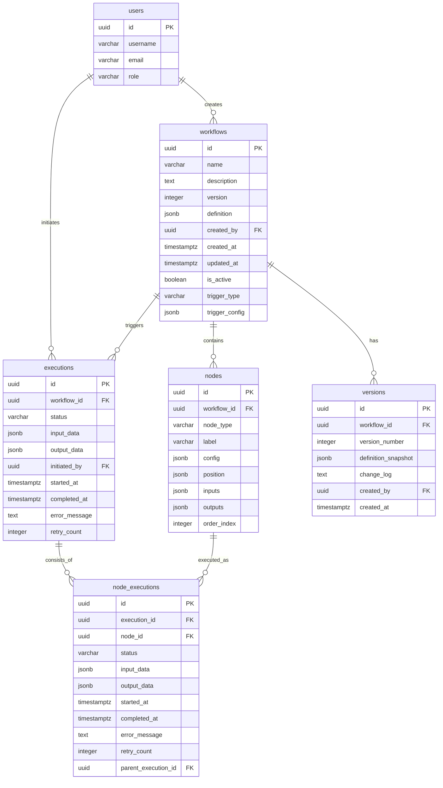

# 工作流编排器数据库设计

**版本**: V1.0  
**日期**: 2026-03-11  
**数据库**: PostgreSQL 15 + pgvector

---

## 一、ER 图



---

## 二、表结构详细设计

### 2.1 workflows (工作流定义表)

**用途**: 存储工作流主定义

```sql
CREATE TABLE workflows (
    id UUID PRIMARY KEY DEFAULT gen_random_uuid(),
    name VARCHAR(255) NOT NULL,
    description TEXT,
    version INTEGER NOT NULL DEFAULT 1,
    definition JSONB NOT NULL,  -- 完整工作流定义 (包含 nodes 和 edges)
    created_by UUID NOT NULL REFERENCES users(id),
    created_at TIMESTAMPTZ NOT NULL DEFAULT NOW(),
    updated_at TIMESTAMPTZ NOT NULL DEFAULT NOW(),
    is_active BOOLEAN NOT NULL DEFAULT true,
    trigger_type VARCHAR(50) NOT NULL DEFAULT 'manual',
    trigger_config JSONB,
    
    -- 索引
    CONSTRAINT chk_trigger_type CHECK (trigger_type IN ('manual', 'schedule', 'webhook', 'event'))
);

CREATE INDEX idx_workflows_created_by ON workflows(created_by);
CREATE INDEX idx_workflows_is_active ON workflows(is_active);
CREATE INDEX idx_workflows_trigger_type ON workflows(trigger_type);
CREATE INDEX idx_workflows_created_at ON workflows(created_at);

-- 注释
COMMENT ON TABLE workflows IS '工作流定义表';
COMMENT ON COLUMN workflows.definition IS '完整工作流 JSON 定义，包含 nodes、edges、variables';
COMMENT ON COLUMN workflows.trigger_config IS '触发器配置，根据 trigger_type 不同结构不同';
```

### 2.2 nodes (节点表)

**用途**: 存储工作流中的节点定义（冗余存储，便于查询）

```sql
CREATE TABLE nodes (
    id UUID PRIMARY KEY DEFAULT gen_random_uuid(),
    workflow_id UUID NOT NULL REFERENCES workflows(id) ON DELETE CASCADE,
    node_type VARCHAR(50) NOT NULL,
    label VARCHAR(255) NOT NULL,
    config JSONB NOT NULL,
    position JSONB NOT NULL,  -- {x: number, y: number}
    inputs JSONB,
    outputs JSONB,
    order_index INTEGER NOT NULL,
    
    -- 约束
    CONSTRAINT chk_node_type CHECK (node_type IN ('trigger', 'action', 'condition', 'loop', 'subflow'))
);

CREATE INDEX idx_nodes_workflow_id ON nodes(workflow_id);
CREATE INDEX idx_nodes_type ON nodes(node_type);
CREATE INDEX idx_nodes_order ON nodes(workflow_id, order_index);

-- 注释
COMMENT ON TABLE nodes IS '工作流节点定义表';
COMMENT ON COLUMN nodes.config IS '节点配置，根据 node_type 不同结构不同';
COMMENT ON COLUMN nodes.inputs IS '输入端口定义 {port_name: {type, required, description}}';
COMMENT ON COLUMN nodes.outputs IS '输出端口定义';
```

### 2.3 executions (执行记录表)

**用途**: 存储工作流执行实例

```sql
CREATE TABLE executions (
    id UUID PRIMARY KEY DEFAULT gen_random_uuid(),
    workflow_id UUID NOT NULL REFERENCES workflows(id),
    status VARCHAR(50) NOT NULL DEFAULT 'pending',
    input_data JSONB,
    output_data JSONB,
    initiated_by UUID REFERENCES users(id),
    started_at TIMESTAMPTZ,
    completed_at TIMESTAMPTZ,
    error_message TEXT,
    retry_count INTEGER NOT NULL DEFAULT 0,
    parent_execution_id UUID REFERENCES executions(id),  -- 子流程执行
    
    -- 约束
    CONSTRAINT chk_execution_status CHECK (status IN ('pending', 'running', 'completed', 'failed', 'cancelled'))
);

CREATE INDEX idx_executions_workflow_id ON executions(workflow_id);
CREATE INDEX idx_executions_status ON executions(status);
CREATE INDEX idx_executions_initiated_by ON executions(initiated_by);
CREATE INDEX idx_executions_started_at ON executions(started_at);
CREATE INDEX idx_executions_parent ON executions(parent_execution_id);

-- 分区表 (按月分区，管理大量执行记录)
-- CREATE TABLE executions_y2026m03 PARTITION OF executions
--     FOR VALUES FROM ('2026-03-01') TO ('2026-04-01');

-- 注释
COMMENT ON TABLE executions IS '工作流执行记录表';
COMMENT ON COLUMN executions.parent_execution_id IS '父执行 ID，用于子流程嵌套';
```

### 2.4 node_executions (节点执行记录表)

**用途**: 存储每个节点的执行详情

```sql
CREATE TABLE node_executions (
    id UUID PRIMARY KEY DEFAULT gen_random_uuid(),
    execution_id UUID NOT NULL REFERENCES executions(id) ON DELETE CASCADE,
    node_id UUID NOT NULL REFERENCES nodes(id),
    status VARCHAR(50) NOT NULL DEFAULT 'pending',
    input_data JSONB,
    output_data JSONB,
    started_at TIMESTAMPTZ,
    completed_at TIMESTAMPTZ,
    error_message TEXT,
    retry_count INTEGER NOT NULL DEFAULT 0,
    duration_ms INTEGER,  -- 执行耗时 (毫秒)
    worker_id VARCHAR(100),  -- 执行 Worker ID
    parent_node_execution_id UUID REFERENCES node_executions(id),  -- 循环节点子执行
    
    -- 约束
    CONSTRAINT chk_node_execution_status CHECK (status IN ('pending', 'running', 'completed', 'failed', 'skipped'))
);

CREATE INDEX idx_node_executions_execution_id ON node_executions(execution_id);
CREATE INDEX idx_node_executions_node_id ON node_executions(node_id);
CREATE INDEX idx_node_executions_status ON node_executions(status);
CREATE INDEX idx_node_executions_parent ON node_executions(parent_node_execution_id);

-- 注释
COMMENT ON TABLE node_executions IS '节点执行记录表';
COMMENT ON COLUMN node_executions.parent_node_execution_id IS '父节点执行 ID，用于循环节点的迭代';
COMMENT ON COLUMN node_executions.duration_ms IS '执行耗时，用于性能分析';
```

### 2.5 workflow_versions (工作流版本表)

**用途**: 存储工作流历史版本，支持回滚

```sql
CREATE TABLE workflow_versions (
    id UUID PRIMARY KEY DEFAULT gen_random_uuid(),
    workflow_id UUID NOT NULL REFERENCES workflows(id) ON DELETE CASCADE,
    version_number INTEGER NOT NULL,
    definition_snapshot JSONB NOT NULL,
    change_log TEXT,
    created_by UUID NOT NULL REFERENCES users(id),
    created_at TIMESTAMPTZ NOT NULL DEFAULT NOW(),
    
    -- 约束
    UNIQUE(workflow_id, version_number)
);

CREATE INDEX idx_versions_workflow_id ON workflow_versions(workflow_id);
CREATE INDEX idx_versions_created_at ON workflow_versions(created_at);

-- 注释
COMMENT ON TABLE workflow_versions IS '工作流版本历史表';
COMMENT ON COLUMN workflow_versions.definition_snapshot IS '该版本的工作流定义快照';
```

### 2.6 execution_logs (执行日志表)

**用途**: 存储详细的执行日志，支持调试

```sql
CREATE TABLE execution_logs (
    id UUID PRIMARY KEY DEFAULT gen_random_uuid(),
    execution_id UUID NOT NULL REFERENCES executions(id) ON DELETE CASCADE,
    node_execution_id UUID REFERENCES node_executions(id) ON DELETE SET NULL,
    log_level VARCHAR(20) NOT NULL,
    message TEXT NOT NULL,
    metadata JSONB,
    created_at TIMESTAMPTZ NOT NULL DEFAULT NOW()
);

CREATE INDEX idx_logs_execution_id ON execution_logs(execution_id);
CREATE INDEX idx_logs_node_execution_id ON execution_logs(node_execution_id);
CREATE INDEX idx_logs_level ON execution_logs(log_level);
CREATE INDEX idx_logs_created_at ON execution_logs(created_at);

-- 注释
COMMENT ON TABLE execution_logs IS '执行日志表';
COMMENT ON COLUMN execution_logs.log_level IS '日志级别：DEBUG, INFO, WARNING, ERROR';
```

---

## 三、典型查询示例

### 3.1 获取工作流详情（含节点）

```sql
SELECT 
    w.id,
    w.name,
    w.description,
    w.version,
    w.definition,
    w.trigger_type,
    w.trigger_config,
    json_agg(
        json_build_object(
            'id', n.id,
            'type', n.node_type,
            'label', n.label,
            'config', n.config,
            'position', n.position,
            'inputs', n.inputs,
            'outputs', n.outputs,
            'order_index', n.order_index
        ) ORDER BY n.order_index
    ) as nodes
FROM workflows w
LEFT JOIN nodes n ON w.id = n.workflow_id
WHERE w.id = $1 AND w.is_active = true
GROUP BY w.id;
```

### 3.2 获取执行详情（含节点执行）

```sql
SELECT 
    e.id,
    e.workflow_id,
    e.status,
    e.input_data,
    e.output_data,
    e.started_at,
    e.completed_at,
    e.error_message,
    json_agg(
        json_build_object(
            'id', ne.id,
            'node_id', ne.node_id,
            'status', ne.status,
            'input_data', ne.input_data,
            'output_data', ne.output_data,
            'started_at', ne.started_at,
            'completed_at', ne.completed_at,
            'error_message', ne.error_message,
            'duration_ms', ne.duration_ms
        ) ORDER BY ne.started_at
    ) as node_executions
FROM executions e
LEFT JOIN node_executions ne ON e.id = ne.execution_id
WHERE e.id = $1
GROUP BY e.id;
```

### 3.3 统计工作流执行指标

```sql
SELECT 
    workflow_id,
    COUNT(*) as total_executions,
    COUNT(*) FILTER (WHERE status = 'completed') as successful,
    COUNT(*) FILTER (WHERE status = 'failed') as failed,
    ROUND(
        COUNT(*) FILTER (WHERE status = 'completed') * 100.0 / COUNT(*), 
        2
    ) as success_rate,
    AVG(EXTRACT(EPOCH FROM (completed_at - started_at))) as avg_duration_seconds
FROM executions
WHERE started_at >= NOW() - INTERVAL '7 days'
GROUP BY workflow_id
ORDER BY total_executions DESC;
```

### 3.4 获取节点执行日志

```sql
SELECT 
    el.log_level,
    el.message,
    el.metadata,
    el.created_at,
    n.label as node_label,
    n.node_type
FROM execution_logs el
LEFT JOIN node_executions ne ON el.node_execution_id = ne.id
LEFT JOIN nodes n ON ne.node_id = n.id
WHERE el.execution_id = $1
ORDER BY el.created_at ASC;
```

---

## 四、数据迁移脚本

### 4.1 初始化 Schema

```sql
-- 启用 pgvector 扩展
CREATE EXTENSION IF NOT EXISTS pgvector;

-- 创建用户表 (简化版，实际使用现有用户系统)
CREATE TABLE IF NOT EXISTS users (
    id UUID PRIMARY KEY DEFAULT gen_random_uuid(),
    username VARCHAR(100) NOT NULL UNIQUE,
    email VARCHAR(255) NOT NULL UNIQUE,
    role VARCHAR(50) NOT NULL DEFAULT 'user',
    created_at TIMESTAMPTZ DEFAULT NOW()
);

-- 创建工作流相关表
-- (执行上述 CREATE TABLE 语句)
```

### 4.2 初始数据

```sql
-- 插入测试用户
INSERT INTO users (username, email, role) VALUES 
    ('admin', 'admin@example.com', 'admin'),
    ('developer', 'dev@example.com', 'developer');

-- 插入示例工作流
INSERT INTO workflows (name, description, definition, created_by, trigger_type) 
VALUES (
    '示例工作流',
    '这是一个测试工作流',
    '{"nodes": [], "edges": [], "variables": {}}'::jsonb,
    (SELECT id FROM users WHERE username = 'admin'),
    'manual'
);
```

---

## 五、性能优化建议

### 5.1 索引策略

- **主键索引**: 所有表的主键自动创建
- **外键索引**: 所有外键字段手动创建索引
- **查询索引**: 根据常用查询条件创建复合索引
- **部分索引**: 对 `is_active = true` 等条件创建部分索引

### 5.2 分区策略

**executions 表按月分区**:
```sql
CREATE TABLE executions (
    -- 定义同上
) PARTITION BY RANGE (started_at);

-- 创建分区
CREATE TABLE executions_y2026m03 PARTITION OF executions
    FOR VALUES FROM ('2026-03-01') TO ('2026-04-01');
```

### 5.3 归档策略

- **执行日志**: 保留 90 天，之后归档到冷存储
- **执行记录**: 保留 1 年，之后删除或归档
- **工作流定义**: 永久保留（含历史版本）

---

## 六、数据字典

### 6.1 节点类型枚举

| 值 | 说明 |
|----|------|
| trigger | 触发器节点 |
| action | 动作节点 |
| condition | 条件分支节点 |
| loop | 循环节点 |
| subflow | 子流程节点 |

### 6.2 执行状态枚举

| 值 | 说明 |
|----|------|
| pending | 等待执行 |
| running | 执行中 |
| completed | 执行完成 |
| failed | 执行失败 |
| cancelled | 已取消 |

### 6.3 触发器类型枚举

| 值 | 说明 |
|----|------|
| manual | 手动触发 |
| schedule | 定时触发 |
| webhook | Webhook 触发 |
| event | 事件触发 |

---

**文档状态**: ✅ 完成  
**下一步**: 后端工作流引擎核心实现
