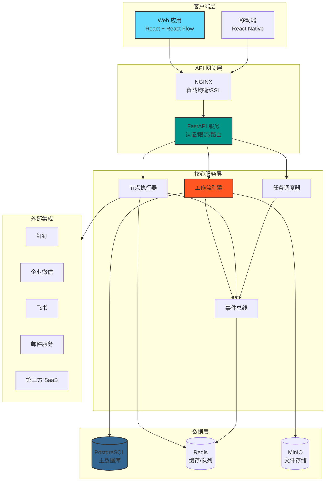
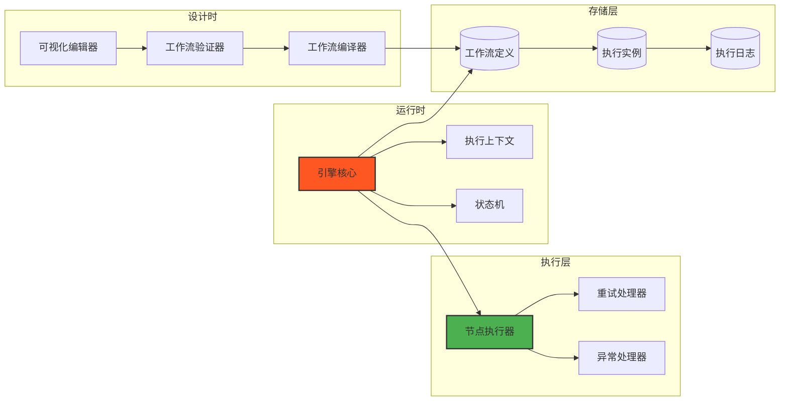
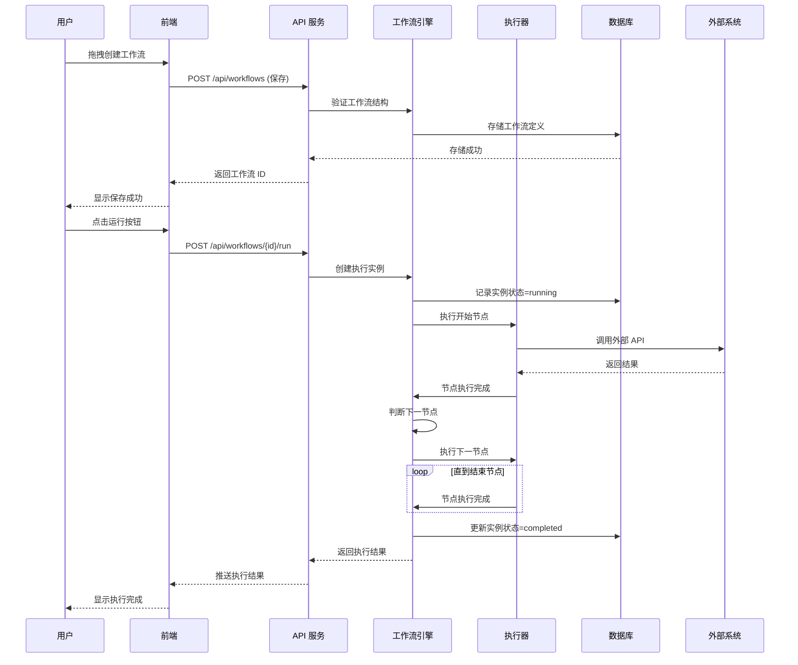
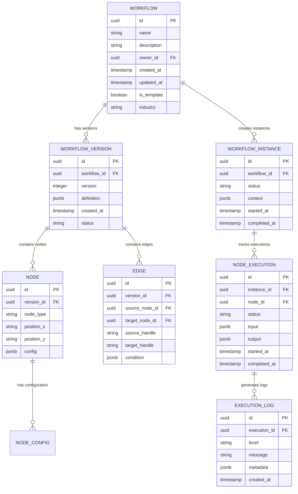
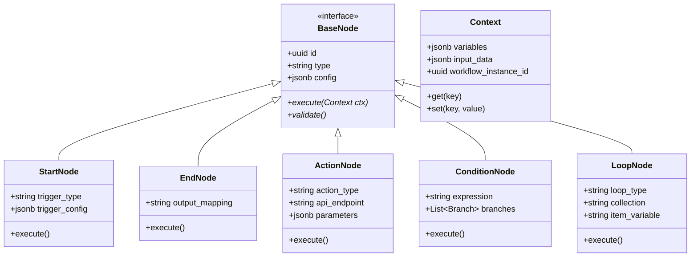
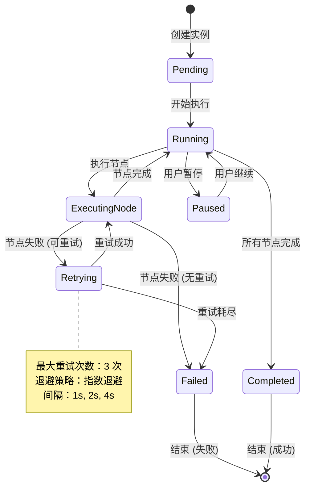
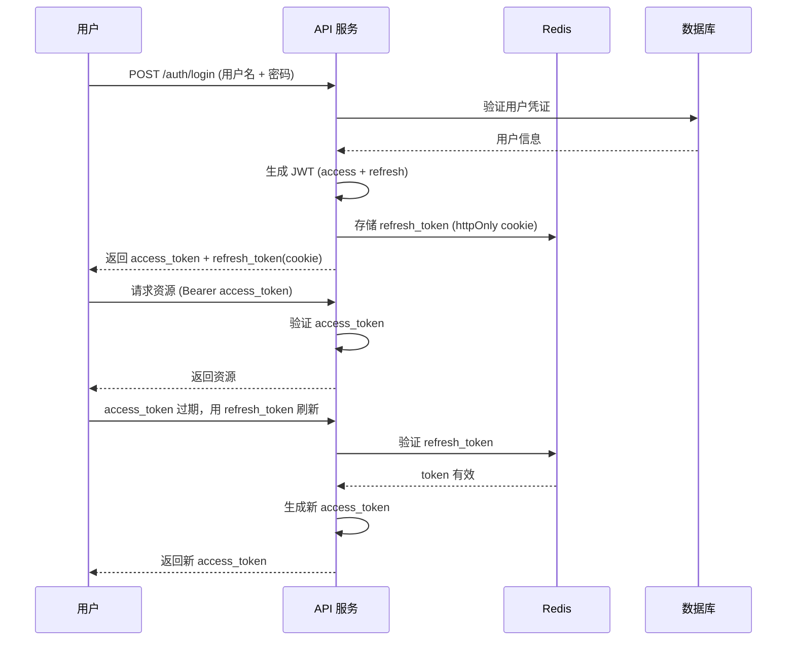

# 工作流编排器技术架构方案

**项目名称**: Project-Phoenix MVP - 可视化工作流编排器  
**版本**: V1.0  
**编制日期**: 2026-03-11  
**负责人**: 架构师  
**状态**: 待评审  

---

## 一、架构设计概述

### 1.1 设计原则

| 原则 | 说明 | 实现策略 |
|------|------|----------|
| **高性能** | 画布响应<2 秒 | 前端虚拟渲染 + 后端异步执行 |
| **易扩展** | 支持新节点类型 | 插件化节点架构 + 标准化接口 |
| **高可用** | 99.9% 可用性 | 集群部署 + 故障转移 |
| **易维护** | 代码可读可维护 | 模块化设计 + 完善文档 |
| **安全性** | 数据隔离与权限控制 | RBAC 模型 + 数据加密 |

### 1.2 技术栈总览

```
┌─────────────────────────────────────────────────────────────┐
│                      用户界面层                              │
│  React 18 + TypeScript + Vite 6 + TailwindCSS              │
│  React Flow (画布) + Ant Design (UI 组件)                    │
└─────────────────────────────────────────────────────────────┘
                              ↓
┌─────────────────────────────────────────────────────────────┐
│                      API 网关层                               │
│  FastAPI (Python) + JWT 认证 + 限流 + CORS                  │
└─────────────────────────────────────────────────────────────┘
                              ↓
┌─────────────────────────────────────────────────────────────┐
│                      业务逻辑层                              │
│  工作流引擎 + 节点执行器 + 调度器 + 事件总线                │
└─────────────────────────────────────────────────────────────┘
                              ↓
┌─────────────────────────────────────────────────────────────┐
│                      数据持久层                              │
│  PostgreSQL (主数据) + Redis (缓存) + MinIO (文件)          │
└─────────────────────────────────────────────────────────────┘
```

### 1.3 核心架构决策

| 决策点 | 选型 | 理由 |
|--------|------|------|
| 前端框架 | React 18 | 生态成熟，React Flow 专业画布库 |
| 后端框架 | FastAPI (Python) | 高性能异步，类型安全，开发效率 |
| 工作流引擎 | 自研轻量引擎 | 满足 MVP 需求，可控可扩展 |
| 数据库 | PostgreSQL | ACID 事务，JSONB 灵活存储 |
| 缓存 | Redis | 高性能，支持发布订阅 |
| 部署 | Docker + K8s | 标准化，弹性伸缩 |

---

## 二、系统架构图

### 2.1 整体架构



### 2.2 工作流引擎架构



### 2.3 数据流架构



---

## 三、技术选型详细分析

### 3.1 前端技术选型

#### 3.1.1 框架对比

| 框架 | 优势 | 劣势 | 适用场景 | 评分 |
|------|------|------|----------|------|
| **React 18** | 生态成熟，组件丰富，React Flow 支持好 | JSX 学习曲线，状态管理复杂 | 大型复杂应用 | ⭐⭐⭐⭐⭐ |
| Vue 3 | 上手简单，文档友好，性能优秀 | 企业级组件较少 | 中小型项目 | ⭐⭐⭐⭐ |
| Svelte | 编译时优化，代码量少 | 生态较小，企业采用少 | 创新项目 | ⭐⭐⭐ |

**决策**: React 18 + TypeScript
- React Flow 是最成熟的流程图/工作流画布库
- 团队已有 React 经验
- 企业级组件生态完善

#### 3.1.2 画布库对比

| 库名 | 特点 | 性能 | 学习曲线 | 评分 |
|------|------|------|----------|------|
| **React Flow** | 专为 React 设计，文档完善，活跃维护 | 100 节点<1 秒 | 中等 | ⭐⭐⭐⭐⭐ |
| X6 (AntV) | 功能强大，支持复杂交互 | 100 节点<2 秒 | 陡峭 | ⭐⭐⭐⭐ |
| GoJS | 商业库，功能最全 | 优秀 | 陡峭 | ⭐⭐⭐ |
| JointJS | 开源，文档一般 | 良好 | 中等 | ⭐⭐⭐ |

**决策**: React Flow
- 与 React 无缝集成
- 满足 MVP 所有需求（拖拽/连线/缩放/自定义节点）
- 社区活跃，问题易解决

#### 3.1.3 UI 组件库

| 库名 | 特点 | 主题定制 | 评分 |
|------|------|----------|------|
| **Ant Design** | 企业级，组件全，文档好 | 优秀 | ⭐⭐⭐⭐⭐ |
| Material UI | 设计精美，遵循 Material | 良好 | ⭐⭐⭐⭐ |
| Chakra UI | 开发效率高，易用 | 良好 | ⭐⭐⭐⭐ |

**决策**: Ant Design + TailwindCSS
- Ant Design 提供企业级组件
- TailwindCSS 用于自定义样式

### 3.2 后端技术选型

#### 3.2.1 框架对比

| 框架 | 语言 | 性能 | 开发效率 | 类型安全 | 评分 |
|------|------|------|----------|----------|------|
| **FastAPI** | Python | 高 (异步) | 优秀 | 优秀 (Pydantic) | ⭐⭐⭐⭐⭐ |
| Express | Node.js | 高 | 优秀 | 一般 (TS) | ⭐⭐⭐⭐ |
| Django | Python | 中 | 良好 | 一般 | ⭐⭐⭐⭐ |
| Spring Boot | Java | 高 | 一般 | 优秀 | ⭐⭐⭐ |

**决策**: FastAPI (Python)
- 异步性能优秀（支持高并发）
- Pydantic 提供类型验证
- 开发效率高，适合快速迭代
- 与 AI/数据处理库生态兼容

#### 3.2.2 工作流引擎选型

| 方案 | 优势 | 劣势 | 适用场景 | 决策 |
|------|------|------|----------|------|
| **自研轻量引擎** | 完全可控，满足 MVP 需求 | 需要开发时间 | MVP 阶段 | ✅ 选择 |
| Temporal | 功能强大，分布式支持 | 学习曲线陡，重 | 大型系统 | ❌ 过重 |
| Airflow | 适合数据管道 | 不适合交互式工作流 | 数据工程 | ❌ 不匹配 |
| Camunda | BPMN 标准，企业级 | 复杂，重 | 传统 BPM | ❌ 过重 |

**决策**: 自研轻量引擎
- MVP 需求相对简单（5 种节点类型）
- 完全可控，便于后续扩展
- 避免过度工程化

### 3.3 数据库选型

#### 3.3.1 关系型数据库对比

| 数据库 | 优势 | 劣势 | 适用场景 | 评分 |
|--------|------|------|----------|------|
| **PostgreSQL** | ACID，JSONB 灵活，扩展性强 | 配置稍复杂 | 主数据库 | ⭐⭐⭐⭐⭐ |
| MySQL | 普及广，文档多 | JSON 支持弱 | 通用场景 | ⭐⭐⭐⭐ |
| SQLite | 轻量，零配置 | 不支持并发 | 本地/测试 | ⭐⭐⭐ |

**决策**: PostgreSQL
- JSONB 支持灵活存储工作流定义
- 支持事务，保证数据一致性
- 扩展性强（全文搜索/地理信息等）

#### 3.3.2 缓存方案

| 方案 | 优势 | 劣势 | 适用场景 | 评分 |
|------|------|------|----------|------|
| **Redis** | 高性能，数据结构丰富，发布订阅 | 内存成本高 | 缓存/队列 | ⭐⭐⭐⭐⭐ |
| Memcached | 简单，高性能 | 功能单一 | 纯缓存 | ⭐⭐⭐⭐ |

**决策**: Redis
- 支持发布订阅（实时推送执行状态）
- 丰富数据结构（List 做队列，Hash 存缓存）
- 持久化支持（RDB/AOF）

### 3.4 部署方案

#### 3.4.1 容器化方案

| 方案 | 优势 | 劣势 | 适用场景 |
|------|------|------|----------|
| **Docker + K8s** | 标准化，弹性伸缩，生态成熟 | 学习曲线 | 生产环境 |
| Docker Compose | 简单，适合开发/小规模 | 不支持伸缩 | 开发/测试 |
| 传统部署 | 无额外学习成本 | 维护成本高 | 不推荐 |

**决策**: 
- 开发/测试：Docker Compose
- 生产：K8s（MVP 后可升级）

---

## 四、核心模块设计

### 4.1 工作流数据模型



### 4.2 节点类型设计



### 4.3 执行引擎状态机



---

## 五、API 接口设计

### 5.1 API 规范

- **风格**: RESTful
- **格式**: JSON
- **认证**: JWT (Bearer Token)
- **版本**: `/api/v1/`
- **文档**: OpenAPI 3.0 (Swagger)

### 5.2 核心接口列表

#### 5.2.1 工作流管理

| 方法 | 路径 | 描述 | 认证 |
|------|------|------|------|
| POST | `/api/v1/workflows` | 创建工作流 | ✅ |
| GET | `/api/v1/workflows` | 获取工作流列表 | ✅ |
| GET | `/api/v1/workflows/{id}` | 获取工作流详情 | ✅ |
| PUT | `/api/v1/workflows/{id}` | 更新工作流 | ✅ |
| DELETE | `/api/v1/workflows/{id}` | 删除工作流 | ✅ |
| POST | `/api/v1/workflows/{id}/versions` | 创建新版本 | ✅ |
| GET | `/api/v1/workflows/{id}/versions` | 获取版本列表 | ✅ |
| POST | `/api/v1/workflows/{id}/run` | 运行工作流 | ✅ |
| GET | `/api/v1/workflows/{id}/instances` | 获取执行实例列表 | ✅ |

#### 5.2.2 执行实例管理

| 方法 | 路径 | 描述 | 认证 |
|------|------|------|------|
| GET | `/api/v1/instances/{id}` | 获取实例详情 | ✅ |
| POST | `/api/v1/instances/{id}/pause` | 暂停实例 | ✅ |
| POST | `/api/v1/instances/{id}/resume` | 恢复实例 | ✅ |
| POST | `/api/v1/instances/{id}/cancel` | 取消实例 | ✅ |
| GET | `/api/v1/instances/{id}/logs` | 获取执行日志 | ✅ |

#### 5.2.3 节点管理

| 方法 | 路径 | 描述 | 认证 |
|------|------|------|------|
| GET | `/api/v1/node-types` | 获取可用节点类型 | ✅ |
| GET | `/api/v1/node-types/{type}/config` | 获取节点配置 schema | ✅ |
| POST | `/api/v1/nodes/validate` | 验证节点配置 | ✅ |
| POST | `/api/v1/nodes/test` | 测试节点执行 | ✅ |

#### 5.2.4 模板管理

| 方法 | 路径 | 描述 | 认证 |
|------|------|------|------|
| GET | `/api/v1/templates` | 获取模板列表 | ❌ |
| GET | `/api/v1/templates/{id}` | 获取模板详情 | ❌ |
| POST | `/api/v1/templates/{id}/instantiate` | 从模板创建工作流 | ✅ |

#### 5.2.5 用户与认证

| 方法 | 路径 | 描述 | 认证 |
|------|------|------|------|
| POST | `/api/v1/auth/register` | 用户注册 | ❌ |
| POST | `/api/v1/auth/login` | 用户登录 | ❌ |
| POST | `/api/v1/auth/refresh` | 刷新 Token | ✅ |
| POST | `/api/v1/auth/logout` | 用户登出 | ✅ |
| GET | `/api/v1/users/me` | 获取当前用户信息 | ✅ |
| PUT | `/api/v1/users/me` | 更新用户信息 | ✅ |

### 5.3 关键接口详细设计

#### 5.3.1 创建工作流

```yaml
POST /api/v1/workflows
Content-Type: application/json
Authorization: Bearer {token}

Request Body:
{
  "name": "订单自动处理工作流",
  "description": "新订单产生时自动验证库存并通知仓库",
  "industry": "ecommerce",
  "nodes": [
    {
      "id": "node_1",
      "type": "start",
      "position": { "x": 100, "y": 100 },
      "config": {
        "trigger_type": "webhook",
        "trigger_config": {
          "event": "order.created"
        }
      }
    },
    {
      "id": "node_2",
      "type": "action",
      "position": { "x": 300, "y": 100 },
      "config": {
        "action_type": "http_request",
        "api_endpoint": "https://api.example.com/inventory/check",
        "method": "POST",
        "parameters": {
          "product_id": "{{trigger.product_id}}",
          "quantity": "{{trigger.quantity}}"
        }
      }
    }
  ],
  "edges": [
    {
      "id": "edge_1",
      "source": "node_1",
      "target": "node_2"
    }
  ]
}

Response 201 Created:
{
  "id": "wf_abc123",
  "name": "订单自动处理工作流",
  "version": 1,
  "created_at": "2026-03-11T10:00:00Z",
  "status": "draft"
}
```

#### 5.3.2 运行工作流

```yaml
POST /api/v1/workflows/{workflow_id}/run
Content-Type: application/json
Authorization: Bearer {token}

Request Body:
{
  "input_data": {
    "order_id": "ORD-20260311-001",
    "product_id": "PROD-123",
    "quantity": 5
  },
  "async": true  # true=异步返回实例 ID，false=同步等待结果
}

Response 202 Accepted (异步):
{
  "instance_id": "inst_xyz789",
  "status": "running",
  "started_at": "2026-03-11T10:05:00Z"
}

Response 200 OK (同步):
{
  "instance_id": "inst_xyz789",
  "status": "completed",
  "started_at": "2026-03-11T10:05:00Z",
  "completed_at": "2026-03-11T10:05:03Z",
  "output": {
    "inventory_check": {"available": true, "stock": 100},
    "warehouse_notification": {"sent": true}
  }
}
```

#### 5.3.3 WebSocket 实时推送

```javascript
// 前端连接 WebSocket
const ws = new WebSocket('wss://api.example.com/ws/instances/{instance_id}');

ws.onmessage = (event) => {
  const data = JSON.parse(event.data);
  switch (data.type) {
    case 'node_started':
      // 更新节点状态为执行中
      break;
    case 'node_completed':
      // 更新节点状态为完成，显示输出
      break;
    case 'node_failed':
      // 显示错误信息
      break;
    case 'workflow_completed':
      // 工作流完成，显示最终结果
      break;
  }
};
```

---

## 六、数据库设计

### 6.1 核心表结构

#### 6.1.1 workflows 表

```sql
CREATE TABLE workflows (
    id UUID PRIMARY KEY DEFAULT gen_random_uuid(),
    name VARCHAR(255) NOT NULL,
    description TEXT,
    owner_id UUID NOT NULL REFERENCES users(id),
    industry VARCHAR(50),
    is_template BOOLEAN DEFAULT FALSE,
    created_at TIMESTAMP WITH TIME ZONE DEFAULT CURRENT_TIMESTAMP,
    updated_at TIMESTAMP WITH TIME ZONE DEFAULT CURRENT_TIMESTAMP,
    deleted_at TIMESTAMP WITH TIME ZONE
);

CREATE INDEX idx_workflows_owner ON workflows(owner_id);
CREATE INDEX idx_workflows_industry ON workflows(industry);
CREATE INDEX idx_workflows_is_template ON workflows(is_template);
```

#### 6.1.2 workflow_versions 表

```sql
CREATE TABLE workflow_versions (
    id UUID PRIMARY KEY DEFAULT gen_random_uuid(),
    workflow_id UUID NOT NULL REFERENCES workflows(id) ON DELETE CASCADE,
    version INTEGER NOT NULL,
    definition JSONB NOT NULL,
    status VARCHAR(20) DEFAULT 'draft',  -- draft, published, archived
    created_at TIMESTAMP WITH TIME ZONE DEFAULT CURRENT_TIMESTAMP,
    created_by UUID NOT NULL REFERENCES users(id),
    UNIQUE(workflow_id, version)
);

CREATE INDEX idx_workflow_versions_workflow ON workflow_versions(workflow_id);
CREATE INDEX idx_workflow_versions_status ON workflow_versions(status);
```

#### 6.1.3 workflow_instances 表

```sql
CREATE TABLE workflow_instances (
    id UUID PRIMARY KEY DEFAULT gen_random_uuid(),
    workflow_id UUID NOT NULL REFERENCES workflows(id),
    version_id UUID REFERENCES workflow_versions(id),
    status VARCHAR(20) NOT NULL,  -- pending, running, paused, completed, failed, cancelled
    context JSONB DEFAULT '{}',
    input_data JSONB,
    output_data JSONB,
    started_at TIMESTAMP WITH TIME ZONE,
    completed_at TIMESTAMP WITH TIME ZONE,
    error_message TEXT,
    created_at TIMESTAMP WITH TIME ZONE DEFAULT CURRENT_TIMESTAMP
);

CREATE INDEX idx_workflow_instances_workflow ON workflow_instances(workflow_id);
CREATE INDEX idx_workflow_instances_status ON workflow_instances(status);
CREATE INDEX idx_workflow_instances_created ON workflow_instances(created_at);
```

#### 6.1.4 node_executions 表

```sql
CREATE TABLE node_executions (
    id UUID PRIMARY KEY DEFAULT gen_random_uuid(),
    instance_id UUID NOT NULL REFERENCES workflow_instances(id) ON DELETE CASCADE,
    node_id UUID NOT NULL,
    node_type VARCHAR(50) NOT NULL,
    status VARCHAR(20) NOT NULL,  -- pending, running, completed, failed, skipped
    input_data JSONB,
    output_data JSONB,
    error_message TEXT,
    retry_count INTEGER DEFAULT 0,
    started_at TIMESTAMP WITH TIME ZONE,
    completed_at TIMESTAMP WITH TIME ZONE,
    execution_order INTEGER NOT NULL
);

CREATE INDEX idx_node_executions_instance ON node_executions(instance_id);
CREATE INDEX idx_node_executions_status ON node_executions(status);
```

#### 6.1.5 execution_logs 表

```sql
CREATE TABLE execution_logs (
    id UUID PRIMARY KEY DEFAULT gen_random_uuid(),
    execution_id UUID NOT NULL REFERENCES node_executions(id) ON DELETE CASCADE,
    level VARCHAR(10) NOT NULL,  -- DEBUG, INFO, WARNING, ERROR
    message TEXT NOT NULL,
    metadata JSONB,
    created_at TIMESTAMP WITH TIME ZONE DEFAULT CURRENT_TIMESTAMP
);

CREATE INDEX idx_execution_logs_execution ON execution_logs(execution_id);
CREATE INDEX idx_execution_logs_level ON execution_logs(level);
CREATE INDEX idx_execution_logs_created ON execution_logs(created_at);

-- 分区表（按月分区，优化查询性能）
-- ALTER TABLE execution_logs PARTITION BY RANGE (created_at);
```

### 6.2 数据量估算

| 表名 | 单条记录大小 | 日增长 | 年存储量 | 保留策略 |
|------|-------------|--------|----------|----------|
| workflows | ~2KB | 100 条 | 73MB | 永久 |
| workflow_versions | ~10KB | 500 条 | 1.8GB | 保留最近 10 版本 |
| workflow_instances | ~5KB | 10000 条 | 18GB | 保留 1 年 |
| node_executions | ~2KB | 50000 条 | 36GB | 保留 1 年 |
| execution_logs | ~1KB | 200000 条 | 73GB | 保留 6 个月 |

**总存储需求**: ~130GB/年（压缩后约 50GB）

---

## 七、性能优化策略

### 7.1 前端性能优化

| 优化点 | 策略 | 目标 |
|--------|------|------|
| 画布渲染 | 虚拟滚动 + 按需渲染 | 100 节点<2 秒 |
| 组件加载 | 懒加载 + 代码分割 | 首屏<3 秒 |
| 状态管理 | Zustand (轻量) | 减少重渲染 |
| 网络请求 | React Query (缓存 + 去重) | 减少 50% 请求 |
| 资源优化 | WebP 图片 + 字体子集 | 减少 30% 体积 |

### 7.2 后端性能优化

| 优化点 | 策略 | 目标 |
|--------|------|------|
| 数据库查询 | 索引优化 + 连接池 | 查询<100ms |
| 缓存策略 | Redis 缓存热点数据 | 减少 70% DB 查询 |
| 异步处理 | Celery 任务队列 | 长任务不阻塞 |
| API 响应 | Gzip 压缩 + 分页 | 响应<500ms |
| 并发控制 | 信号量 + 限流 | 防止过载 |

### 7.3 工作流执行优化

| 优化点 | 策略 | 目标 |
|--------|------|------|
| 并行执行 | 独立分支并行 | 提升 50% 速度 |
| 节点缓存 | 相同输入复用结果 | 减少重复计算 |
| 超时控制 | 节点级超时设置 | 防止卡死 |
| 断点续跑 | 失败后从断点继续 | 节省资源 |

---

## 八、安全设计

### 8.1 认证与授权



**安全机制**:
- access_token: JWT, 15 分钟有效期
- refresh_token: 随机字符串，7 天有效期，httpOnly cookie，rotating 机制
- 密码存储：bcrypt 哈希（cost=12）
- 登录失败：5 次后锁定 30 分钟

### 8.2 数据隔离

| 隔离级别 | 策略 | 实现 |
|----------|------|------|
| 租户隔离 | 逻辑隔离 | 所有查询带 owner_id 过滤 |
| 工作流隔离 | 权限控制 | 仅 owner 和协作者可访问 |
| 执行隔离 | 独立上下文 | 每个实例独立执行上下文 |
| 网络隔离 | VPC + 安全组 | 数据库不暴露公网 |

### 8.3 审计日志

```sql
CREATE TABLE audit_logs (
    id UUID PRIMARY KEY DEFAULT gen_random_uuid(),
    user_id UUID REFERENCES users(id),
    action VARCHAR(50) NOT NULL,  -- CREATE, UPDATE, DELETE, RUN
    resource_type VARCHAR(50) NOT NULL,
    resource_id UUID NOT NULL,
    ip_address INET,
    user_agent TEXT,
    metadata JSONB,
    created_at TIMESTAMP WITH TIME ZONE DEFAULT CURRENT_TIMESTAMP
);

CREATE INDEX idx_audit_logs_user ON audit_logs(user_id);
CREATE INDEX idx_audit_logs_resource ON audit_logs(resource_type, resource_id);
CREATE INDEX idx_audit_logs_created ON audit_logs(created_at);
```

---

## 九、部署架构

### 9.1 开发环境

```yaml
# docker-compose.yml
version: '3.8'
services:
  frontend:
    build: ./frontend
    ports:
      - "3000:3000"
    volumes:
      - ./frontend:/app
    environment:
      - VITE_API_URL=http://localhost:8000
  
  backend:
    build: ./backend
    ports:
      - "8000:8000"
    volumes:
      - ./backend:/app
    environment:
      - DATABASE_URL=postgresql://postgres:postgres@db:5432/workflow
      - REDIS_URL=redis://redis:6379
  
  db:
    image: postgres:15
    environment:
      - POSTGRES_PASSWORD=postgres
      - POSTGRES_DB=workflow
    volumes:
      - pgdata:/var/lib/postgresql/data
  
  redis:
    image: redis:7
    volumes:
      - redisdata:/data

volumes:
  pgdata:
  redisdata:
```

### 9.2 生产环境（K8s）

```mermaid
graph TB
    subgraph Internet["互联网"]
        User[用户]
    end
    
    subgraph K8s["Kubernetes 集群"]
        Ingress[Ingress Controller<br/>TLS 终止/路由]
        
        subgraph Frontend["前端服务"]
            FE1[Frontend Pod × 3]
        end
        
        subgraph Backend