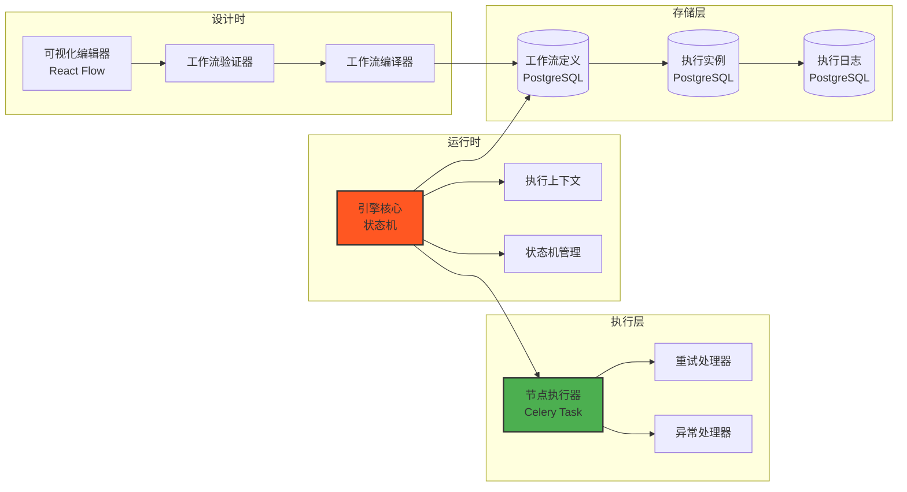
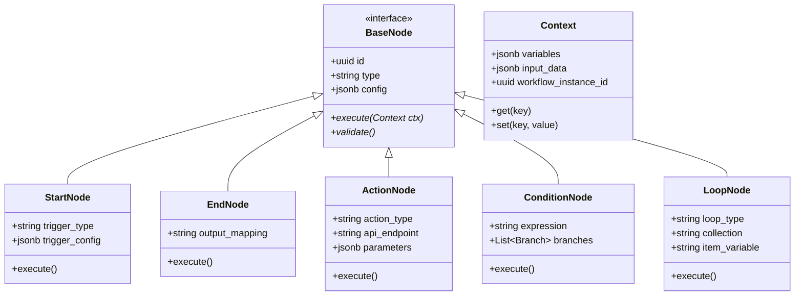
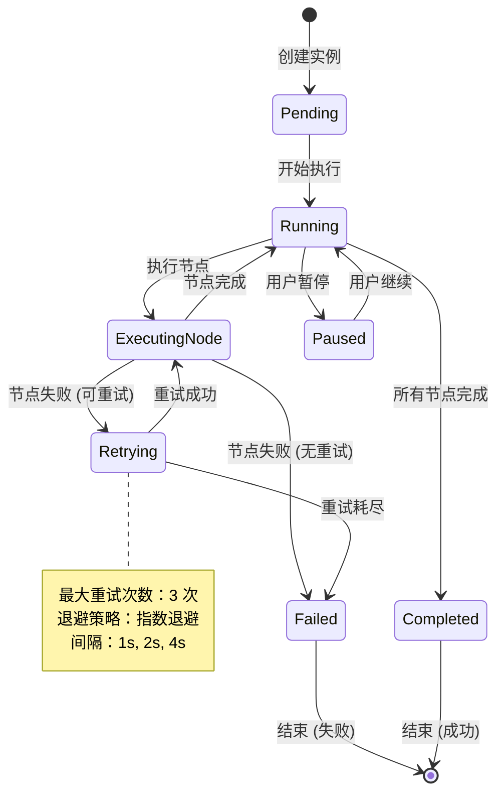
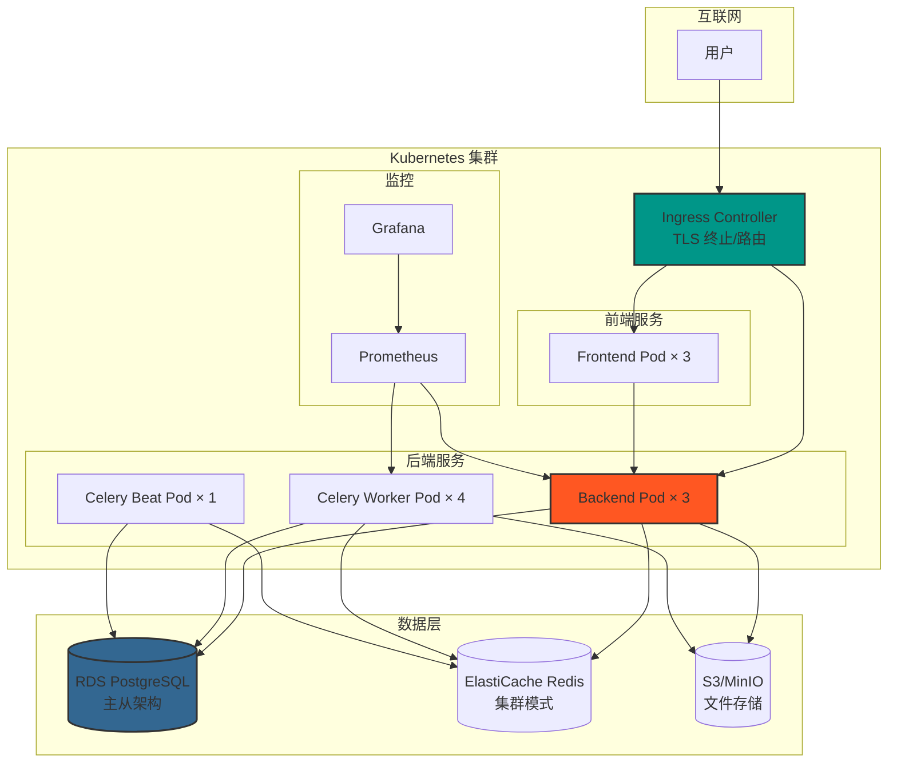

# Project Phoenix MVP 技术方案

**版本**: V1.0  
**编制日期**: 2026-03-11  
**负责人**: 架构师  
**状态**: 待评审  

---

## 一、技术架构总览

### 1.1 整体架构图

```mermaid
graph TB
    subgraph Client["客户端层"]
        Web[Web 应用<br/>React 18 + TypeScript<br/>React Flow 画布]
        Mobile[移动端<br/>React Native<br/>(V1.1 阶段)]
    end
    
    subgraph Gateway["API 网关层"]
        NGINX[NGINX<br/>负载均衡/SSL 终止]
        API[FastAPI 服务<br/>JWT 认证/限流/CORS]
    end
    
    subgraph Core["核心服务层"]
        WF[工作流引擎<br/>状态机驱动]
        Executor[节点执行器<br/>异步执行]
        Scheduler[任务调度器<br/>Celery Beat]
        EventBus[事件总线<br/>Redis Pub/Sub]
    end
    
    subgraph Data["数据层"]
        PG[(PostgreSQL 15<br/>主数据库)]
        Redis[(Redis 7<br/>缓存/队列)]
        MinIO[(MinIO<br/>文件存储)]
        Qdrant[(Qdrant<br/>向量数据库<br/>(V1.1 阶段))]
    end
    
    subgraph External["外部集成"]
        DingTalk[钉钉]
        WeCom[企业微信]
        Feishu[飞书]
        Email[邮件服务]
        LLM[大模型 API]
        SaaS[第三方 SaaS]
    end
    
    Web --> NGINX
    Mobile --> NGINX
    NGINX --> API
    API --> WF
    API --> Executor
    API --> Scheduler
    WF --> EventBus
    Executor --> EventBus
    Scheduler --> EventBus
    WF --> PG
    Executor --> Redis
    EventBus --> Redis
    Executor --> External
    WF --> MinIO
    Executor --> LLM
    
    style Web fill:#61dafb,stroke:#333,stroke-width:2px
    style API fill:#009688,stroke:#333,stroke-width:2px
    style WF fill:#ff5722,stroke:#333,stroke-width:2px
    style PG fill:#336791,stroke:#333,stroke-width:2px
```

### 1.2 技术栈选型

| 层级 | 技术选型 | 版本 | 选型理由 |
|------|----------|------|----------|
| **前端框架** | React 18 + TypeScript | 18.x | 生态成熟，React Flow 专业画布库支持 |
| **工作流编辑器** | React Flow + Tailwind CSS | 11.x | 专为流程图设计，支持 100+ 节点流畅渲染 |
| **后端框架** | FastAPI (Python) | 0.109.x | 异步高性能，类型安全，开发效率高 |
| **主数据库** | PostgreSQL | 15.x | ACID 事务，JSONB 灵活存储工作流定义 |
| **缓存/队列** | Redis | 7.x | 高性能，支持发布订阅，Celery 原生支持 |
| **异步任务** | Celery | 5.3.x | Python 生态成熟，支持定时任务和重试 |
| **向量数据库** | Qdrant | 1.7.x | Rust 实现性能高，支持自托管 + 托管，部署简单 |
| **文件存储** | MinIO | Latest | S3 兼容，支持自托管，私有化部署友好 |
| **部署** | Docker + K8s | Latest | 标准化，弹性伸缩，支持私有化部署 |

### 1.3 核心架构决策

| 决策点 | 选型 | 理由 | 备选方案 |
|--------|------|------|----------|
| 工作流引擎 | 自研轻量引擎 | 满足 MVP 需求，完全可控，避免过度工程化 | Temporal（过重） |
| 异步队列 | Celery + Redis | Python 生态成熟，团队熟悉，功能完善 | RabbitMQ（需额外运维） |
| 向量数据库 | Qdrant | 性能高，部署简单，支持平滑迁移至托管 | Pinecone（数据出境顾虑） |
| 部署方案 | Docker Compose（开发）+ K8s（生产） | 开发简单，生产可扩展 | 纯 K8s（开发复杂） |

---

## 二、工作流引擎架构

### 2.1 引擎核心架构



### 2.2 节点类型设计



### 2.3 执行引擎状态机



### 2.4 5 种核心节点类型

| 节点类型 | 功能描述 | 配置项 | 典型用途 |
|----------|----------|--------|----------|
| **Start（触发器）** | 工作流入口，定义触发条件 | trigger_type（定时/webhook/API）, trigger_config | 每日 18:00 触发、新订单 webhook |
| **Action（动作）** | 执行具体操作 | action_type（邮件/API/报表等）, api_endpoint, parameters | 发送邮件、调用 API、生成报表 |
| **Condition（条件）** | 分支判断 | expression（条件表达式）, branches（分支列表） | 库存>0 则发货，否则告警 |
| **Loop（循环）** | 批量处理 | loop_type（for_each/while）, collection, item_variable | 遍历订单列表逐个处理 |
| **End（结束）** | 工作流出口，定义输出 | output_mapping（输出映射） | 汇总结果，返回最终输出 |

---

## 三、核心模块接口定义

### 3.1 API 规范

- **风格**: RESTful
- **格式**: JSON
- **认证**: JWT (Bearer Token) + httpOnly Cookie (Refresh Token)
- **版本**: `/api/v1/`
- **文档**: OpenAPI 3.0 (Swagger) - `/docs`

### 3.2 核心接口列表

#### 3.2.1 认证接口

| 方法 | 路径 | 描述 | 认证 | 请求参数 | 响应 |
|------|------|------|------|----------|------|
| POST | `/api/v1/auth/register` | 用户注册 | ❌ | UserCreate (email, username, password, full_name) | UserResponse |
| POST | `/api/v1/auth/login` | 用户登录 | ❌ | OAuth2 表单 (username, password) | Token (access_token, refresh_token) |
| POST | `/api/v1/auth/refresh` | 刷新 Token | ✅ (Refresh Token) | TokenRefresh (refresh_token) | Token (新 access+refresh) |
| POST | `/api/v1/auth/logout` | 用户登出 | ✅ | - | {message} |
| GET | `/api/v1/auth/me` | 获取当前用户 | ✅ (Access Token) | - | UserResponse |

**Refresh Token 安全机制**:
- 存储：httpOnly cookie，防止 XSS 攻击
- Rotating 机制：每次刷新后旧 token 立即失效
- 绑定 IP：检测异常 IP 自动撤销
- 有效期：7 天，可配置

#### 3.2.2 工作流管理接口

| 方法 | 路径 | 描述 | 认证 | 请求参数 | 响应 |
|------|------|------|------|----------|------|
| POST | `/api/v1/workflows` | 创建工作流 | ✅ | WorkflowCreate (name, description, nodes[], edges[]) | WorkflowResponse |
| GET | `/api/v1/workflows` | 获取工作流列表 | ✅ | skip, limit, include_templates | WorkflowResponse[] |
| GET | `/api/v1/workflows/{id}` | 获取工作流详情 | ✅ | - | WorkflowResponse |
| PUT | `/api/v1/workflows/{id}` | 更新工作流 | ✅ | WorkflowUpdate | WorkflowResponse |
| DELETE | `/api/v1/workflows/{id}` | 删除工作流（软删除） | ✅ | - | {message} |
| POST | `/api/v1/workflows/{id}/run` | 运行工作流 | ✅ | WorkflowRunRequest (input_data, async) | WorkflowRunResponse |
| GET | `/api/v1/workflows/{id}/instances` | 获取执行实例列表 | ✅ | skip, limit, status_filter | WorkflowInstanceResponse[] |

#### 3.2.3 执行实例管理接口

| 方法 | 路径 | 描述 | 认证 | 请求参数 | 响应 |
|------|------|------|------|----------|------|
| GET | `/api/v1/instances/{id}` | 获取实例详情 | ✅ | - | WorkflowInstanceResponse |
| POST | `/api/v1/instances/{id}/pause` | 暂停实例 | ✅ | - | {message} |
| POST | `/api/v1/instances/{id}/resume` | 恢复实例 | ✅ | - | {message} |
| POST | `/api/v1/instances/{id}/cancel` | 取消实例 | ✅ | - | {message} |
| GET | `/api/v1/instances/{id}/logs` | 获取执行日志 | ✅ | skip, limit | ExecutionLogResponse[] |

#### 3.2.4 模板管理接口

| 方法 | 路径 | 描述 | 认证 | 请求参数 | 响应 |
|------|------|------|------|----------|------|
| GET | `/api/v1/templates` | 获取模板列表 | ❌ | industry, skip, limit | TemplateResponse[] |
| GET | `/api/v1/templates/{id}` | 获取模板详情 | ❌ | - | TemplateResponse |
| POST | `/api/v1/templates/{id}/instantiate` | 从模板创建工作流 | ✅ | {name, config_overrides} | WorkflowResponse |

#### 3.2.5 节点类型接口

| 方法 | 路径 | 描述 | 认证 | 请求参数 | 响应 |
|------|------|------|------|----------|------|
| GET | `/api/v1/node-types` | 获取可用节点类型 | ✅ | - | NodeTypeResponse[] |
| GET | `/api/v1/node-types/{type}/config` | 获取节点配置 Schema | ✅ | - | JSON Schema |
| POST | `/api/v1/nodes/validate` | 验证节点配置 | ✅ | NodeConfig | {valid, errors} |
| POST | `/api/v1/nodes/test` | 测试节点执行 | ✅ | NodeConfig, test_input | NodeExecutionResponse |

### 3.3 关键接口详细设计

#### 3.3.1 创建工作流

```yaml
POST /api/v1/workflows
Content-Type: application/json
Authorization: Bearer {access_token}

Request Body:
{
  "name": "订单自动处理工作流",
  "description": "新订单产生时自动验证库存并通知仓库",
  "industry": "ecommerce",
  "nodes": [
    {
      "id": "node_1",
      "type": "start",
      "position": { "x": 100, "y": 100 },
      "config": {
        "trigger_type": "webhook",
        "trigger_config": {
          "event": "order.created"
        }
      }
    },
    {
      "id": "node_2",
      "type": "action",
      "position": { "x": 300, "y": 100 },
      "config": {
        "action_type": "http_request",
        "api_endpoint": "https://api.example.com/inventory/check",
        "method": "POST",
        "parameters": {
          "product_id": "{{trigger.product_id}}",
          "quantity": "{{trigger.quantity}}"
        }
      }
    }
  ],
  "edges": [
    {
      "id": "edge_1",
      "source": "node_1",
      "target": "node_2"
    }
  ]
}

Response 201 Created:
{
  "id": "wf_abc123",
  "name": "订单自动处理工作流",
  "version": 1,
  "created_at": "2026-03-11T10:00:00Z",
  "status": "draft",
  "owner_id": "user_xyz"
}
```

#### 3.3.2 运行工作流（异步）

```yaml
POST /api/v1/workflows/{workflow_id}/run
Content-Type: application/json
Authorization: Bearer {access_token}

Request Body:
{
  "input_data": {
    "order_id": "ORD-20260311-001",
    "product_id": "PROD-123",
    "quantity": 5
  },
  "async": true  # true=异步返回实例 ID，false=同步等待结果
}

Response 202 Accepted (异步):
{
  "instance_id": "inst_xyz789",
  "status": "pending",
  "created_at": "2026-03-11T10:05:00Z",
  "message": "Workflow execution started"
}
```

#### 3.3.3 WebSocket 实时推送

```javascript
// 前端连接 WebSocket 监听执行状态
const ws = new WebSocket('wss://api.example.com/ws/instances/{instance_id}');

ws.onmessage = (event) => {
  const data = JSON.parse(event.data);
  switch (data.type) {
    case 'node_started':
      // 更新节点状态为执行中
      break;
    case 'node_completed':
      // 更新节点状态为完成，显示输出
      break;
    case 'node_failed':
      // 显示错误信息
      break;
    case 'workflow_completed':
      // 工作流完成，显示最终结果
      break;
  }
};
```

---

## 四、数据库设计

### 4.1 核心表结构

#### 4.1.1 users 表（用户表）

```sql
CREATE TABLE users (
    id UUID PRIMARY KEY DEFAULT gen_random_uuid(),
    email VARCHAR(255) UNIQUE NOT NULL,
    username VARCHAR(50) UNIQUE NOT NULL,
    full_name VARCHAR(100),
    hashed_password VARCHAR(255) NOT NULL,
    is_active BOOLEAN DEFAULT TRUE,
    is_superuser BOOLEAN DEFAULT FALSE,
    created_at TIMESTAMP WITH TIME ZONE DEFAULT CURRENT_TIMESTAMP,
    updated_at TIMESTAMP WITH TIME ZONE DEFAULT CURRENT_TIMESTAMP,
    last_login_at TIMESTAMP WITH TIME ZONE
);

CREATE INDEX idx_users_email ON users(email);
CREATE INDEX idx_users_username ON users(username);
```

#### 4.1.2 refresh_tokens 表（刷新令牌表）

```sql
CREATE TABLE refresh_tokens (
    id UUID PRIMARY KEY DEFAULT gen_random_uuid(),
    user_id UUID NOT NULL REFERENCES users(id) ON DELETE CASCADE,
    token VARCHAR(255) UNIQUE NOT NULL,
    expires_at TIMESTAMP WITH TIME ZONE NOT NULL,
    created_at TIMESTAMP WITH TIME ZONE DEFAULT CURRENT_TIMESTAMP,
    created_ip INET,
    is_revoked BOOLEAN DEFAULT FALSE,
    revoked_at TIMESTAMP WITH TIME ZONE,
    revoked_reason VARCHAR(50)  -- used, expired, revoked
);

CREATE INDEX idx_refresh_tokens_user ON refresh_tokens(user_id);
CREATE INDEX idx_refresh_tokens_token ON refresh_tokens(token);
CREATE INDEX idx_refresh_tokens_expires ON refresh_tokens(expires_at);
```

#### 4.1.3 workflows 表（工作流定义表）

```sql
CREATE TABLE workflows (
    id UUID PRIMARY KEY DEFAULT gen_random_uuid(),
    name VARCHAR(255) NOT NULL,
    description TEXT,
    owner_id UUID NOT NULL REFERENCES users(id),
    industry VARCHAR(50),  -- ecommerce, service, manufacturing, professional
    is_template BOOLEAN DEFAULT FALSE,
    is_active BOOLEAN DEFAULT TRUE,
    version INTEGER DEFAULT 1,
    created_at TIMESTAMP WITH TIME ZONE DEFAULT CURRENT_TIMESTAMP,
    updated_at TIMESTAMP WITH TIME ZONE DEFAULT CURRENT_TIMESTAMP,
    deleted_at TIMESTAMP WITH TIME ZONE
);

CREATE INDEX idx_workflows_owner ON workflows(owner_id);
CREATE INDEX idx_workflows_industry ON workflows(industry);
CREATE INDEX idx_workflows_is_template ON workflows(is_template);
```

#### 4.1.4 workflow_nodes 表（工作流节点表）

```sql
CREATE TABLE workflow_nodes (
    id UUID PRIMARY KEY DEFAULT gen_random_uuid(),
    workflow_id UUID NOT NULL REFERENCES workflows(id) ON DELETE CASCADE,
    node_type VARCHAR(50) NOT NULL,  -- start, end, action, condition, loop
    position_x INTEGER,
    position_y INTEGER,
    config JSONB NOT NULL,
    created_at TIMESTAMP WITH TIME ZONE DEFAULT CURRENT_TIMESTAMP
);

CREATE INDEX idx_workflow_nodes_workflow ON workflow_nodes(workflow_id);
CREATE INDEX idx_workflow_nodes_type ON workflow_nodes(node_type);
```

#### 4.1.5 workflow_edges 表（工作流边表）

```sql
CREATE TABLE workflow_edges (
    id UUID PRIMARY KEY DEFAULT gen_random_uuid(),
    workflow_id UUID NOT NULL REFERENCES workflows(id) ON DELETE CASCADE,
    source_node_id UUID NOT NULL,
    target_node_id UUID NOT NULL,
    source_handle VARCHAR(50),
    target_handle VARCHAR(50),
    condition JSONB,  -- 条件分支表达式
    created_at TIMESTAMP WITH TIME ZONE DEFAULT CURRENT_TIMESTAMP
);

CREATE INDEX idx_workflow_edges_workflow ON workflow_edges(workflow_id);
CREATE INDEX idx_workflow_edges_source ON workflow_edges(source_node_id);
CREATE INDEX idx_workflow_edges_target ON workflow_edges(target_node_id);
```

#### 4.1.6 workflow_instances 表（工作流执行实例表）

```sql
CREATE TABLE workflow_instances (
    id UUID PRIMARY KEY DEFAULT gen_random_uuid(),
    workflow_id UUID NOT NULL REFERENCES workflows(id),
    status VARCHAR(20) NOT NULL,  -- pending, running, paused, completed, failed, cancelled
    context JSONB DEFAULT '{}',
    input_data JSONB,
    output_data JSONB,
    error_message TEXT,
    started_at TIMESTAMP WITH TIME ZONE,
    completed_at TIMESTAMP WITH TIME ZONE,
    created_at TIMESTAMP WITH TIME ZONE DEFAULT CURRENT_TIMESTAMP
);

CREATE INDEX idx_workflow_instances_workflow ON workflow_instances(workflow_id);
CREATE INDEX idx_workflow_instances_status ON workflow_instances(status);
CREATE INDEX idx_workflow_instances_created ON workflow_instances(created_at);
```

#### 4.1.7 node_executions 表（节点执行记录表）

```sql
CREATE TABLE node_executions (
    id UUID PRIMARY KEY DEFAULT gen_random_uuid(),
    instance_id UUID NOT NULL REFERENCES workflow_instances(id) ON DELETE CASCADE,
    node_id UUID NOT NULL,
    node_type VARCHAR(50) NOT NULL,
    status VARCHAR(20) NOT NULL,  -- pending, running, completed, failed, skipped
    input_data JSONB,
    output_data JSONB,
    error_message TEXT,
    retry_count INTEGER DEFAULT 0,
    started_at TIMESTAMP WITH TIME ZONE,
    completed_at TIMESTAMP WITH TIME ZONE,
    execution_order INTEGER NOT NULL
);

CREATE INDEX idx_node_executions_instance ON node_executions(instance_id);
CREATE INDEX idx_node_executions_status ON node_executions(status);
```

#### 4.1.8 execution_logs 表（执行日志表）

```sql
CREATE TABLE execution_logs (
    id UUID PRIMARY KEY DEFAULT gen_random_uuid(),
    execution_id UUID NOT NULL REFERENCES node_executions(id) ON DELETE CASCADE,
    level VARCHAR(10) NOT NULL,  -- DEBUG, INFO, WARNING, ERROR
    message TEXT NOT NULL,
    metadata JSONB,
    created_at TIMESTAMP WITH TIME ZONE DEFAULT CURRENT_TIMESTAMP
);

CREATE INDEX idx_execution_logs_execution ON execution_logs(execution_id);
CREATE INDEX idx_execution_logs_level ON execution_logs(level);
CREATE INDEX idx_execution_logs_created ON execution_logs(created_at);

-- 按月分区（优化查询性能）
-- ALTER TABLE execution_logs PARTITION BY RANGE (created_at);
```

#### 4.1.9 audit_logs 表（审计日志表）

```sql
CREATE TABLE audit_logs (
    id UUID PRIMARY KEY DEFAULT gen_random_uuid(),
    user_id UUID REFERENCES users(id),
    action VARCHAR(50) NOT NULL,  -- CREATE, UPDATE, DELETE, RUN
    resource_type VARCHAR(50) NOT NULL,
    resource_id UUID NOT NULL,
    ip_address INET,
    user_agent TEXT,
    metadata JSONB,
    created_at TIMESTAMP WITH TIME ZONE DEFAULT CURRENT_TIMESTAMP
);

CREATE INDEX idx_audit_logs_user ON audit_logs(user_id);
CREATE INDEX idx_audit_logs_resource ON audit_logs(resource_type, resource_id);
CREATE INDEX idx_audit_logs_created ON audit_logs(created_at);
```

### 4.2 数据量估算与存储规划

| 表名 | 单条记录大小 | 日增长 | 年存储量 | 保留策略 |
|------|-------------|--------|----------|----------|
| users | ~500B | 100 条 | 18MB | 永久 |
| workflows | ~2KB | 100 条 | 73MB | 永久 |
| workflow_nodes/edges | ~1KB | 1000 条 | 365MB | 永久 |
| workflow_instances | ~5KB | 10,000 条 | 18GB | 保留 1 年 |
| node_executions | ~2KB | 50,000 条 | 36GB | 保留 1 年 |
| execution_logs | ~1KB | 200,000 条 | 73GB | 保留 6 个月 |

**总存储需求**: ~130GB/年（压缩后约 50GB）

### 4.3 数据库索引优化策略

| 表名 | 索引字段 | 索引类型 | 优化目标 |
|------|----------|----------|----------|
| workflows | owner_id, industry | B-Tree | 用户工作流列表查询 |
| workflow_instances | workflow_id, status, created_at | B-Tree | 实例列表过滤排序 |
| node_executions | instance_id, status | B-Tree | 执行详情查询 |
| execution_logs | execution_id, created_at | B-Tree + 分区 | 日志查询性能 |
| refresh_tokens | token, user_id, expires_at | B-Tree | Token 验证效率 |

---

## 五、部署架构方案

### 5.1 三环境规划

| 环境 | 用途 | 访问地址 | 数据隔离 | 更新频率 |
|------|------|----------|----------|----------|
| **开发环境** (dev) | 本地开发、功能测试 | localhost:3000/8000 | 独立数据库 | 随时 |
| **测试环境** (staging) | 集成测试、预发布验证 | staging.example.com | 独立数据库（脱敏数据） | 每日 |
| **生产环境** (prod) | 正式用户访问 | app.example.com | 独立数据库（生产数据） | 每周（灰度发布） |

### 5.2 开发环境部署（Docker Compose）

```yaml
version: '3.8'

services:
  # 前端服务
  frontend:
    build:
      context: ./frontend
      dockerfile: Dockerfile.dev
    ports:
      - "3000:3000"
    volumes:
      - ./frontend:/app
      - /app/node_modules
    environment:
      - VITE_API_URL=http://localhost:8000
      - VITE_WS_URL=ws://localhost:8000/ws
    depends_on:
      - backend

  # 后端服务
  backend:
    build:
      context: ./backend
      dockerfile: Dockerfile.dev
    ports:
      - "8000:8000"
    volumes:
      - ./backend:/app
    environment:
      - DATABASE_URL=postgresql://postgres:postgres@db:5432/workflow_dev
      - REDIS_URL=redis://redis:6379/0
      - CELERY_BROKER_URL=redis://redis:6379/1
      - CELERY_RESULT_BACKEND=redis://redis:6379/2
      - INIT_DB_ON_START=true
    depends_on:
      - db
      - redis

  # Celery Worker
  celery-worker:
    build:
      context: ./backend
      dockerfile: Dockerfile.dev
    command: celery -A mvp.backend.core.celery_app worker --loglevel=info
    volumes:
      - ./backend:/app
    environment:
      - DATABASE_URL=postgresql://postgres:postgres@db:5432/workflow_dev
      - REDIS_URL=redis://redis:6379/0
      - CELERY_BROKER_URL=redis://redis:6379/1
      - CELERY_RESULT_BACKEND=redis://redis:6379/2
    depends_on:
      - db
      - redis

  # Celery Beat（定时任务）
  celery-beat:
    build:
      context: ./backend
      dockerfile: Dockerfile.dev
    command: celery -A mvp.backend.core.celery_app beat --loglevel=info
    volumes:
      - ./backend:/app
    environment:
      - DATABASE_URL=postgresql://postgres:postgres@db:5432/workflow_dev
      - REDIS_URL=redis://redis:6379/0
      - CELERY_BROKER_URL=redis://redis:6379/1
    depends_on:
      - db
      - redis

  # PostgreSQL 数据库
  db:
    image: postgres:15
    environment:
      - POSTGRES_PASSWORD=postgres
      - POSTGRES_DB=workflow_dev
    volumes:
      - pgdata_dev:/var/lib/postgresql/data
    ports:
      - "5432:5432"

  # Redis 缓存/队列
  redis:
    image: redis:7
    volumes:
      - redisdata_dev:/data
    ports:
      - "6379:6379"

  # Qdrant 向量数据库（V1.1 阶段）
  qdrant:
    image: qdrant/qdrant:latest
    volumes:
      - qdrantdata_dev:/qdrant/storage
    ports:
      - "6333:6333"

volumes:
  pgdata_dev:
  redisdata_dev:
  qdrantdata_dev:
```

### 5.3 测试环境部署（Docker Compose + Nginx）

```yaml
version: '3.8'

services:
  nginx:
    image: nginx:alpine
    ports:
      - "80:80"
      - "443:443"
    volumes:
      - ./nginx/nginx.staging.conf:/etc/nginx/nginx.conf
      - ./ssl:/etc/nginx/ssl
    depends_on:
      - frontend
      - backend

  frontend:
    build:
      context: ./frontend
      dockerfile: Dockerfile.prod
    environment:
      - VITE_API_URL=https://staging.example.com/api
      - VITE_WS_URL=wss://staging.example.com/ws

  backend:
    build:
      context: ./backend
      dockerfile: Dockerfile.prod
    environment:
      - DATABASE_URL=postgresql://user:pass@db:5432/workflow_staging
      - REDIS_URL=redis://redis:6379/0
      - CELERY_BROKER_URL=redis://redis:6379/1
      - ENVIRONMENT=staging
    deploy:
      replicas: 2

  celery-worker:
    build:
      context: ./backend
      dockerfile: Dockerfile.prod
    command: celery -A mvp.backend.core.celery_app worker --loglevel=info --concurrency=4
    deploy:
      replicas: 2

  db:
    image: postgres:15
    environment:
      - POSTGRES_PASSWORD=${DB_PASSWORD}
      - POSTGRES_DB=workflow_staging
    volumes:
      - pgdata_staging:/var/lib/postgresql/data

  redis:
    image: redis:7
    volumes:
      - redisdata_staging:/data
```

### 5.4 生产环境部署（Kubernetes）



**生产环境资源配置**:

| 组件 | 配置 | 数量 | 说明 |
|------|------|------|------|
| Frontend Pod | 2 核 4G | 3 副本 | 前端静态资源服务 |
| Backend Pod | 4 核 8G | 3 副本 | API 服务，支持 100+ QPS |
| Celery Worker Pod | 4 核 8G | 4 副本 | 异步任务执行，支持 50+ 并发工作流 |
| Celery Beat Pod | 1 核 2G | 1 副本 | 定时任务调度 |
| RDS PostgreSQL | 4 核 16G, 500GB SSD | 主从 | 高可用数据库 |
| ElastiCache Redis | 2 核 4G, 集群模式 | 3 节点 | 缓存 + 消息队列 |
| S3/MinIO | - | - | 文件存储，1TB 起步 |

### 5.5 私有化部署方案（轻量版）

**目标**: 1 小时内完成部署，支持本地/私有云

**部署包内容**:
```
phoenix-deploy-v1.0/
├── docker-compose.yml          # 一键启动脚本
├── .env.example                # 环境变量模板
├── init-db.sh                  # 数据库初始化脚本
├── backup.sh                   # 备份脚本
├── restore.sh                  # 恢复脚本
└── docs/
    ├── deployment-guide.md     # 部署文档
    ├── configuration.md        # 配置说明
    └── troubleshooting.md      # 故障排查
```

**硬件要求**:
| 配置 | 最低要求 | 推荐配置 |
|------|----------|----------|
| CPU | 4 核 | 8 核 |
| 内存 | 8GB | 16GB |
| 磁盘 | 100GB SSD | 500## 六、技术风险清单与应对方案

### 6.1 技术风险矩阵

| 风险项 | 概率 | 影响 | 等级 | 预警信号 | 应对措施 | 负责人 |
|--------|------|------|------|----------|----------|--------|
| **工作流引擎性能瓶颈** | 中 | 高 | 🟡 | 画布响应>3 秒，100 节点下卡顿 | 1. 前端虚拟滚动优化 2. 节点懒加载 3. 简化复杂工作流 | CTO |
| **Celery 任务堆积** | 中 | 高 | 🟡 | 队列积压>1000 任务，执行延迟>5 分钟 | 1. 动态扩容 Worker 2. 任务优先级调度 3. 限流降级 | DevOps |
| **Qdrant 向量检索慢** | 低 | 中 | 🟢 | 检索延迟>100ms | 1. 索引优化 2. 缓存热点查询 3. 降级为关键词搜索 | 架构师 |
| **数据库连接池耗尽** | 中 | 高 | 🟡 | 连接等待>1 秒，错误率>1% | 1. 连接池扩容 2. 慢查询优化 3. 读写分离 | DevOps |
| **Redis 内存溢出** | 低 | 高 | 🟢 | 内存使用率>80% | 1. 设置 TTL 2. LRU 淘汰策略 3. 集群扩容 | DevOps |
| **API 响应超时** | 中 | 中 | 🟡 | P95 延迟>1 秒 | 1. 异步化改造 2. 缓存优化 3. 限流熔断 | CTO |
| **私有化部署失败** | 中 | 高 | 🟡 | 部署时间>2 小时，启动失败 | 1. 一键部署脚本 2. 健康检查 3. 回滚机制 | DevOps |
| **第三方 API 不稳定** | 高 | 中 | 🟡 | 外部 API 错误率>5% | 1. 重试机制 2. 降级方案 3. 多服务商备份 | 全栈工程师 A |
| **大模型 API 成本高** | 中 | 中 | 🟡 | 月度成本超预算 20% | 1. Token 优化 2. 缓存复用 3. 国产模型替代 | CTO |
| **数据安全问题** | 低 | 高 | 🟢 | 安全扫描发现漏洞 | 1. 定期安全审计 2. 字段加密 3. 访问控制 | CTO |

### 6.2 关键技术风险详解

#### 6.2.1 工作流引擎性能风险

**风险描述**: 随着工作流复杂度增加（节点数>100），前端画布渲染和后端执行可能出现性能瓶颈。

**应对方案**:
1. **前端优化**（Sprint 1-2）: 虚拟滚动、React.memo、节点分组折叠
2. **后端优化**（Sprint 3-4）: 执行计划预编译、结果缓存、并行分支并发执行
3. **监控告警**: 画布响应>2 秒、工作流执行>5 分钟告警

**验收标准**: 100 节点画布响应<2 秒，单工作流执行<5 分钟（P95），支持 100+ 并发

#### 6.2.2 Celery 任务堆积风险

**应对方案**:
1. **动态扩容**: K8s HPA（CPU>70% 或队列>100）
2. **任务优先级**: 高优先级（用户触发）优先，低优先级（定时）错峰
3. **限流降级**: 单用户并发限制 10 个，过载时拒绝非关键任务

**监控指标**: 队列长度<1000，任务平均执行<5 分钟，Worker 存活>2

#### 6.2.3 私有化部署风险

**应对方案**:
1. **一键部署脚本**: 预检查→安装→健康检查
2. **环境标准化**: Docker 容器化，仅需 Docker 20+
3. **远程运维**: 日志上报、远程诊断、一键回滚

**验收标准**: 1 小时内完成部署，健康检查 100%，支持一键回滚

#### 6.2.4 第三方 API 依赖风险

**应对方案**:
1. **重试机制**: 指数退避（1s,2s,4s,8s），最大 3 次，幂等性保证
2. **降级方案**: API 不可用时降级本地队列，大模型不可用降级规则引擎
3. **多服务商备份**（V1.1）: 大模型支持多模型切换

**监控指标**: 外部 API 成功率>98%，响应<1 秒，降级<10 次/小时

#### 6.2.5 数据安全风险

**应对方案**:
1. **认证安全**: JWT+httpOnly Cookie，Rotating 机制，登录失败锁定
2. **数据加密**: HTTPS 传输，敏感字段加密存储，备份加密
3. **访问控制**: RBAC 权限，工作流级别隔离，操作审计日志
4. **私有化部署**: 数据本地存储，支持离线

**安全合规**: OWASP Top 10 扫描，GDPR 支持，审计日志保留 6 个月

### 6.3 技术风险应对时间表

| Sprint | 时间 | 风险应对重点 | 交付物 |
|--------|------|--------------|--------|
| Sprint 1-2 | 03-12 ~ 03-25 | 认证安全、基础监控 | JWT 认证、日志系统 |
| Sprint 3-4 | 03-26 ~ 04-10 | 重试机制、数据加密 | 重试处理器、字段加密 |
| Sprint 5-6 | 04-11 ~ 04-20 | 限流降级、访问控制 | 限流中间件、RBAC |
| Sprint 7-8 | 04-21 ~ 05-01 | 性能优化、监控告警 | 性能优化报告、监控看板 |
| Sprint 9-10 | 05-02 ~ 05-20 | 私有化部署、备份恢复 | 部署脚本、备份工具 |
| Sprint 11-12 | 05-21 ~ 06-01 | 安全审计、压力测试 | 安全报告、压测报告 |

---

## 七、6 个月扩展性规划

### 7.1 MVP → V1.0 演进路线

- **MVP 阶段**（03-12 ~ 05-20）: 工作流引擎核心→预置模板→私有化部署
- **V1.0 阶段**（05-21 ~ 06-01）: 性能优化→安全加固→压力测试→正式上线

### 7.2 技术债务管理

| 技术债务项 | 产生阶段 | 影响 | 偿还计划 |
|------------|----------|------|----------|
| 自研工作流引擎（vs Temporal） | MVP | 功能不完善 | V1.1 评估迁移 |
| 单体架构（vs 微服务） | MVP | 扩展性受限 | V1.2 按模块拆分 |
| PostgreSQL 单实例 | MVP | 写性能瓶颈 | V1.0 升级主从 |
| 手动扩缩容 | MVP | 运维成本高 | V1.0 实现 K8s HPA |

### 7.3 性能扩展目标

| 指标 | MVP 目标 | V1.0 目标 | V2.0 目标 |
|------|----------|-----------|-----------|
| 并发工作流 | 100+ | 500+ | 2000+ |
| 画布节点数 | 100+ | 500+ | 1000+ |
| API QPS | 100+ | 500+ | 2000+ |
| 日活用户 | 100+ | 1000+ | 5000+ |

---

## 八、总结与建议

### 8.1 核心技术决策总结

| 决策点 | 选型 | 关键理由 |
|--------|------|----------|
| 工作流引擎 | 自研轻量引擎 | 满足 MVP，完全可控，避免过度工程化 |
| 异步队列 | Celery + Redis | Python 生态成熟，团队熟悉 |
| 向量数据库 | Qdrant | 性能高，部署简单，支持平滑迁移 |
| 部署方案 | Docker Compose → K8s | 开发简单，生产可扩展 |

### 8.2 技术风险总体评估

| 风险等级 | 数量 | 占比 | 应对状态 |
|----------|------|------|----------|
| 🔴 高风险 | 0 | 0% | - |
| 🟡 中风险 | 7 | 70% | 已有应对方案 |
| 🟢 低风险 | 3 | 30% | 持续监控 |

**总体评估**: 技术风险可控，所有中高风险均有明确应对方案。

### 8.3 下一步行动

| 时间 | 行动 | 负责人 | 交付物 |
|------|------|--------|--------|
| 03-12 | 技术方案评审 | CTO+CPO+ 架构师 | 评审报告 |
| 03-13 | 根据评审意见修改 | 架构师 | 技术方案 V1.1 |
| 03-15 | 启动 Sprint 1 开发 | CTO | Sprint 计划 |
| 03-25 | Sprint 1-2 验收 | CPO | 节点编辑器 Alpha |
| 04-10 | Sprint 3-4 验收 | CPO | 10 个模板可运行 |
| 05-01 | 小范围公测启动 | CPO | 10 家测试企业 |
| 06-01 | 正式上线 V1.0 | 全员 | 公开发布 |

---

**技术部承诺**:
- 2 周内完成技术方案评审并冻结
- 6 周内交付 MVP 可测试版本
- 12 周内正式上线 V1.0
- 系统可用性>99.5%，核心接口响应<500ms

**编制**: 架构师  
**审核**: CTO  
**状态**: ✅ 完成，待评审  
**标签**: [MVP, 技术方案，架构设计，06-01 上线]
