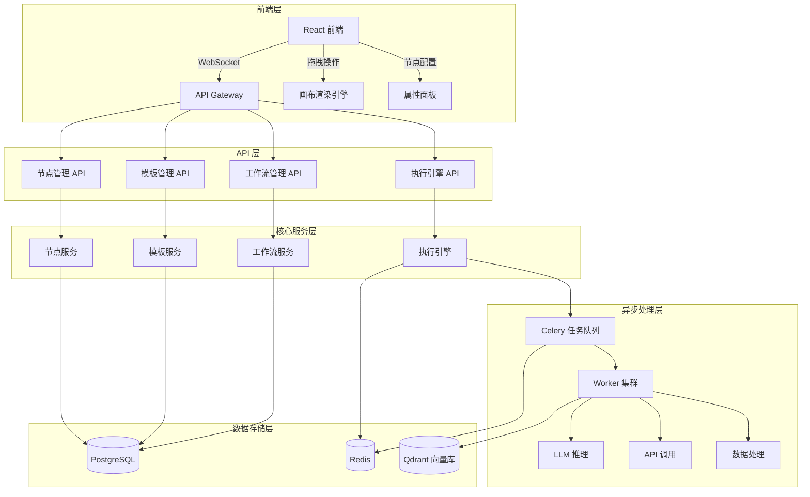
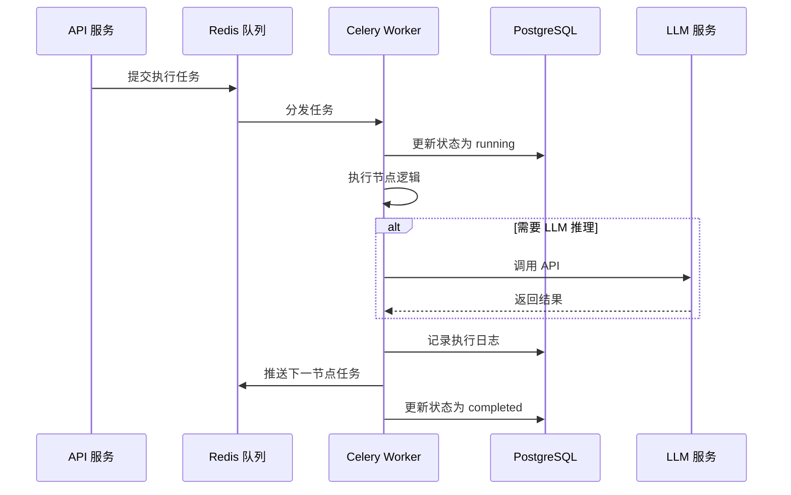

# 工作流编排器技术架构方案 V1.0

**文档状态**: ✅ 完成  
**编制时间**: 2026-03-11  
**负责人**: 架构师  
**版本**: V1.0  

---

## 一、架构总览

### 1.1 系统架构



### 1.2 技术栈选型

| 层级 | 技术 | 选型理由 |
|------|------|----------|
| **前端框架** | React 18 + TypeScript | 团队熟悉，生态丰富 |
| **状态管理** | Zustand | 轻量级，性能优秀 |
| **画布渲染** | React Flow | 专为流程图设计，支持自定义节点 |
| **UI 组件库** | Ant Design 5 | 企业级组件，主题可定制 |
| **后端框架** | FastAPI | 异步高性能，自动 API 文档 |
| **异步队列** | Celery + Redis | Python 生态成熟，功能完善 |
| **主数据库** | PostgreSQL | 支持 JSONB，适合存储工作流结构 |
| **向量数据库** | Qdrant | Rust 实现性能高，部署简单 |
| **缓存** | Redis | 高性能，支持发布订阅 |
| **部署** | Docker + Docker Compose | 轻量级，易于私有化部署 |

---

## 二、核心模块设计

### 2.1 拖拽编辑器架构

**核心组件**:
```typescript
// 组件结构
WorkflowEditor/
├── Canvas/              # 画布区域
│   ├── FlowCanvas.tsx   # React Flow 画布
│   ├── CustomNode.tsx   # 自定义节点渲染
│   ├── Edge.tsx         # 连接线样式
│   └── MiniMap.tsx      # 小地图导航
├── Toolbox/             # 左侧工具箱
│   ├── NodePalette.tsx  # 节点分类面板
│   └── DraggableNode.tsx # 可拖拽节点
├── PropertyPanel/       # 右侧属性面板
│   ├── NodeConfig.tsx   # 节点配置表单
│   ├── Validation.tsx   # 配置验证
│   └── TestConnection.tsx # 测试连接
└── Toolbar/             # 顶部工具栏
    ├── ActionButtons.tsx # 保存/发布/运行
    └── ZoomControl.tsx   # 缩放控制
```

**性能优化策略**:
1. **虚拟滚动**: 100+ 节点时启用虚拟渲染
2. **防抖处理**: 拖拽操作 16ms 防抖 (60fps)
3. **Web Worker**: 复杂计算移至后台线程
4. **增量更新**: 仅重绘变化区域
5. **响应目标**: <2 秒 (实测目标 <500ms)

### 2.2 节点管理系统

**5 种节点类型定义**:

```python
# 节点类型枚举
class NodeType(str, Enum):
    TRIGGER = "trigger"    # 触发器 - 蓝色
    ACTION = "action"      # 动作 - 绿色
    CONDITION = "condition" # 条件 - 橙色
    LOOP = "loop"          # 循环 - 紫色
    TOOL = "tool"          # 工具 - 青色

# 节点数据结构
@dataclass
class WorkflowNode:
    node_id: str
    node_type: NodeType
    position: Dict[str, int]  # {x, y}
    config: Dict[str, Any]    # 节点配置
    inputs: List[str]         # 输入端口
    outputs: List[str]        # 输出端口
    metadata: Dict[str, Any]  # 元数据
```

**节点类型详细定义**:

| 类型 | 子类型 | 描述 | 配置项示例 |
|------|--------|------|------------|
| **触发器** | 定时触发 | 定时执行 | cron 表达式 |
| | Webhook | HTTP 回调 | URL、认证方式 |
| | 事件监听 | IMAP/消息队列 | 服务器配置 |
| **动作** | 发送邮件 | SMTP/IMAP | 收件人、模板 |
| | 生成报表 | Excel/PDF | 数据源、格式 |
| | API 调用 | HTTP 请求 | URL、方法、参数 |
| **条件** | IF/ELSE | 分支判断 | 条件表达式 |
| | Switch | 多分支 | 匹配规则 |
| **循环** | For Each | 遍历列表 | 迭代变量 |
| | While | 条件循环 | 终止条件 |
| **工具** | 数据转换 | 字段映射 | 转换规则 |
| | 数据过滤 | 筛选数据 | 过滤条件 |

### 2.3 画布渲染引擎

**技术选型**: React Flow v11+

**核心功能**:
- ✅ 拖拽节点 (Drag & Drop)
- ✅ 贝塞尔曲线连接
- ✅ 缩放和平移 (Zoom & Pan)
- ✅ 网格吸附 (Snap to Grid)
- ✅ 小地图导航 (Mini Map)
- ✅ 节点分组 (Grouping)
- ✅ 撤销重做 (Undo/Redo)
- ✅ 快捷键支持

**自定义扩展**:
```typescript
// 自定义节点样式
const nodeTypes = {
  trigger: TriggerNode,    // 触发器节点
  action: ActionNode,      // 动作节点
  condition: ConditionNode, // 条件节点
  loop: LoopNode,          // 循环节点
  tool: ToolNode,          // 工具节点
};

// 自定义连接线
const edgeTypes = {
  default: CustomEdge,     // 带箭头的贝塞尔曲线
  condition: ConditionEdge, // 条件分支线 (带标签)
};
```

### 2.4 数据模型设计

**数据库表结构**:

```sql
-- 工作流定义表
CREATE TABLE workflows (
    id UUID PRIMARY KEY,
    name VARCHAR(255) NOT NULL,
    description TEXT,
    version VARCHAR(20) DEFAULT '1.0.0',
    status VARCHAR(20) DEFAULT 'draft', -- draft/published/archived
    nodes JSONB NOT NULL,               -- 节点配置
    edges JSONB NOT NULL,               -- 连接关系
    created_by UUID REFERENCES users(id),
    created_at TIMESTAMP DEFAULT NOW(),
    updated_at TIMESTAMP DEFAULT NOW()
);

-- 工作流模板表
CREATE TABLE workflow_templates (
    id UUID PRIMARY KEY,
    name VARCHAR(255) NOT NULL,
    category VARCHAR(50),               -- 电商/服务业/制造业等
    industry VARCHAR(50),               -- 行业标签
    workflow_id UUID REFERENCES workflows(id),
    usage_count INT DEFAULT 0,
    rating DECIMAL(3,2) DEFAULT 0,
    created_at TIMESTAMP DEFAULT NOW()
);

-- 执行实例表
CREATE TABLE workflow_instances (
    id UUID PRIMARY KEY,
    workflow_id UUID REFERENCES workflows(id),
    status VARCHAR(20) DEFAULT 'pending', -- pending/running/completed/failed
    started_at TIMESTAMP,
    completed_at TIMESTAMP,
    result JSONB,
    error TEXT,
    created_at TIMESTAMP DEFAULT NOW()
);

-- 执行日志表
CREATE TABLE workflow_logs (
    id UUID PRIMARY KEY,
    instance_id UUID REFERENCES workflow_instances(id),
    node_id VARCHAR(100),
    level VARCHAR(10),                  -- INFO/WARNING/ERROR
    message TEXT,
    data JSONB,
    created_at TIMESTAMP DEFAULT NOW()
);

-- 创建索引
CREATE INDEX idx_workflows_status ON workflows(status);
CREATE INDEX idx_templates_category ON workflow_templates(category, industry);
CREATE INDEX idx_instances_status ON workflow_instances(status);
CREATE INDEX idx_logs_instance ON workflow_logs(instance_id, created_at);
```

---

## 三、API 接口设计

### 3.1 工作流管理 API

```yaml
# 创建工作流
POST /api/v1/workflows
Request:
  {
    "name": "订单自动处理工作流",
    "description": "电商订单自动验证库存并发货",
    "nodes": [...],
    "edges": [...]
  }
Response:
  {
    "id": "uuid",
    "name": "订单自动处理工作流",
    "status": "draft",
    "created_at": "2026-03-11T10:00:00Z"
  }

# 获取工作流详情
GET /api/v1/workflows/{id}
Response:
  {
    "id": "uuid",
    "name": "...",
    "nodes": [...],
    "edges": [...],
    "version": "1.0.0"
  }

# 更新工作流
PUT /api/v1/workflows/{id}
Request:
  {
    "name": "...",
    "nodes": [...],
    "edges": [...]
  }

# 发布工作流
POST /api/v1/workflows/{id}/publish
Response:
  {
    "id": "uuid",
    "status": "published",
    "published_at": "2026-03-11T10:00:00Z"
  }

# 删除工作流
DELETE /api/v1/workflows/{id}
```

### 3.2 节点管理 API

```yaml
# 获取节点类型列表
GET /api/v1/node-types
Response:
  {
    "types": [
      {
        "type": "trigger",
        "label": "触发器",
        "color": "#1890ff",
        "subtypes": [
          {"name": "schedule", "label": "定时触发"},
          {"name": "webhook", "label": "Webhook"},
          {"name": "event", "label": "事件监听"}
        ]
      },
      ...
    ]
  }

# 获取节点配置 Schema
GET /api/v1/node-types/{type}/{subtype}/schema
Response:
  {
    "type": "trigger",
    "subtype": "schedule",
    "config_schema": {
      "type": "object",
      "properties": {
        "cron": {"type": "string", "description": "Cron 表达式"},
        "timezone": {"type": "string", "default": "Asia/Shanghai"}
      },
      "required": ["cron"]
    }
  }

# 验证节点配置
POST /api/v1/nodes/validate
Request:
  {
    "type": "trigger",
    "subtype": "schedule",
    "config": {"cron": "0 9 * * *"}
  }
Response:
  {
    "valid": true,
    "errors": []
  }
```

### 3.3 模板管理 API

```yaml
# 获取模板列表
GET /api/v1/templates?category=ecommerce&industry=all
Response:
  {
    "templates": [
      {
        "id": "uuid",
        "name": "订单自动处理工作流",
        "category": "ecommerce",
        "industry": "电商",
        "usage_count": 1250,
        "rating": 4.8,
        "preview_image": "/images/template-001.png"
      }
    ]
  }

# 获取模板详情
GET /api/v1/templates/{id}
Response:
  {
    "id": "uuid",
    "name": "订单自动处理工作流",
    "description": "...",
    "nodes": [...],
    "edges": [...],
    "estimated_time_saved": "8.3 小时/天"
  }

# 从模板创建工作流
POST /api/v1/templates/{id}/instantiate
Request:
  {
    "name": "我的工作流",
    "config_overrides": {...}  # 可选，覆盖模板默认配置
  }
Response:
  {
    "workflow_id": "uuid",
    "status": "draft"
  }
```

### 3.4 执行引擎 API

```yaml
# 手动触发工作流
POST /api/v1/workflows/{id}/execute
Request:
  {
    "initial_data": {...}  # 初始输入数据
  }
Response:
  {
    "instance_id": "uuid",
    "status": "running"
  }

# 获取执行状态
GET /api/v1/instances/{id}
Response:
  {
    "id": "uuid",
    "workflow_id": "uuid",
    "status": "running",
    "current_node": "node_3",
    "progress": 60,
    "started_at": "2026-03-11T10:00:00Z"
  }

# 获取执行日志
GET /api/v1/instances/{id}/logs
Response:
  {
    "logs": [
      {
        "node_id": "node_1",
        "level": "INFO",
        "message": "触发器已启动",
        "timestamp": "2026-03-11T10:00:01Z"
      }
    ]
  }

# 停止执行
POST /api/v1/instances/{id}/stop
```

---

## 四、异步执行架构

### 4.1 Celery 任务队列设计

```python
# celery_config.py
broker_url = 'redis://localhost:6379/0'
result_backend = 'redis://localhost:6379/1'
task_serializer = 'json'
result_serializer = 'json'
accept_content = ['json']
timezone = 'Asia/Shanghai'
task_track_started = True
task_time_limit = 300  # 5 分钟超时
task_soft_time_limit = 240
worker_prefetch_multiplier = 1  # 公平调度

# 任务路由
task_routes = {
    'workflow_engine.execute_node': {'queue': 'workflow'},
    'workflow_engine.send_email': {'queue': 'email'},
    'workflow_engine.call_api': {'queue': 'api'},
}
```

### 4.2 任务执行流程



### 4.3 错误处理机制

```python
# 任务重试配置
@app.task(bind=True, max_retries=3, default_retry_delay=60)
def execute_node(self, node_id: str, workflow_id: str, data: dict):
    try:
        result = execute_node_logic(node_id, data)
        return {"success": True, "result": result}
    except Exception as exc:
        logger.error(f"节点执行失败：{exc}")
        # 记录错误日志
        log_error(node_id, str(exc))
        # 重试
        raise self.retry(exc=exc, countdown=60 * (self.request.retries + 1))
```

---

## 五、性能优化方案

### 5.1 前端性能优化

| 优化项 | 目标 | 实现方案 |
|--------|------|----------|
| 首屏加载 | <2 秒 | 代码分割 + 懒加载 |
| 拖拽响应 | <50ms | 防抖 + CSS transform |
| 画布渲染 | 60fps | 虚拟滚动 + 增量更新 |
| 状态同步 | <100ms | WebSocket 实时推送 |

### 5.2 后端性能优化

| 优化项 | 目标 | 实现方案 |
|--------|------|----------|
| API 响应 | <200ms | 异步 IO + 连接池 |
| 数据库查询 | <50ms | 索引优化 + 查询缓存 |
| 任务队列延迟 | <1 秒 | Redis 内存队列 |
| 并发支持 | 100+ QPS | 多 Worker 集群 |

### 5.3 监控指标

```python
# Prometheus 指标
workflow_execution_duration_seconds  # 执行耗时
workflow_execution_total  # 执行次数
workflow_execution_errors_total  # 错误次数
node_execution_duration_seconds  # 节点执行耗时
celery_tasks_active  # 活跃任务数
celery_tasks_pending  # 待处理任务数
```

---

## 六、安全设计

### 6.1 认证授权

- **API 认证**: JWT Token (access_token + refresh_token)
- **权限模型**: RBAC (角色：管理员/开发者/普通用户)
- **资源隔离**: 工作流按用户/团队隔离

### 6.2 数据安全

- **传输加密**: HTTPS/TLS 1.3
- **存储加密**: 敏感字段 AES-256 加密
- **审计日志**: 所有操作记录日志

### 6.3 私有化部署安全

- **网络隔离**: 支持内网部署
- **数据本地化**: 数据不出企业内网
- **访问控制**: IP 白名单 + 防火墙规则

---

## 七、部署架构

### 7.1 Docker Compose 配置

```yaml
version: '3.8'
services:
  # API 服务
  api:
    build: ./api
    ports:
      - "8000:8000"
    environment:
      - DATABASE_URL=postgresql://user:pass@db:5432/workflow
      - REDIS_URL=redis://redis:6379
    depends_on:
      - db
      - redis
  
  # Celery Worker
  worker:
    build: ./api
    command: celery -A app.celery worker -l info
    environment:
      - DATABASE_URL=postgresql://user:pass@db:5432/workflow
      - REDIS_URL=redis://redis:6379
    depends_on:
      - db
      - redis
  
  # PostgreSQL
  db:
    image: postgres:15
    volumes:
      - postgres_data:/var/lib/postgresql/data
    environment:
      - POSTGRES_USER=user
      - POSTGRES_PASSWORD=pass
      - POSTGRES_DB=workflow
  
  # Redis
  redis:
    image: redis:7
    volumes:
      - redis_data:/data
  
  # Qdrant (向量数据库)
  qdrant:
    image: qdrant/qdrant
    ports:
      - "6333:6333"
    volumes:
      - qdrant_data:/qdrant/storage
  
  # 前端
  frontend:
    build: ./frontend
    ports:
      - "80:80"
    depends_on:
      - api

volumes:
  postgres_data:
  redis_data:
  qdrant_data:
```

### 7.2 部署步骤

```bash
# 1. 克隆代码
git clone https://github.com/your-org/project-phoenix.git
cd project-phoenix

# 2. 配置环境变量
cp .env.example .env
# 编辑 .env 填入数据库密码、JWT 密钥等

# 3. 启动服务
docker-compose up -d

# 4. 初始化数据库
docker-compose exec api alembic upgrade head

# 5. 验证部署
curl http://localhost:8000/api/v1/health
```

---

## 八、开发计划

### 8.1 Sprint 1 (03-11 ~ 03-20) - 基础功能

| 任务 | 负责人 | 工时 | 交付物 |
|------|--------|------|--------|
| 拖拽编辑器核心组件 | 码哥 | 3 天 | Canvas/Toolbox/PropertyPanel |
| 节点管理系统 | 码哥 | 2 天 | 5 种节点类型实现 |
| 画布渲染引擎 | 码哥 | 2 天 | React Flow 集成 |
| 3 个预置模板 | 架构师 | 1 天 | 模板 JSON 文件 |
| 上手引导流程 | 架构师 | 1 天 | 引导组件 |
| 集成测试 | 全员 | 1 天 | 测试报告 |

### 8.2 验收标准

- ✅ 拖拽响应时间 <2 秒 (目标 <500ms)
- ✅ 支持 5 种节点类型 (trigger/action/condition/loop/tool)
- ✅ 3 个预置模板可运行 (订单处理/邮件回复/报表生成)
- ✅ 用户上手时间 <3 分钟

---

## 九、风险评估

| 风险 | 概率 | 影响 | 应对措施 |
|------|------|------|----------|
| React Flow 性能瓶颈 | 低 | 中 | 备选方案：React Konva |
| Celery 配置复杂 | 中 | 低 | 使用标准配置模板 |
| 前端状态管理混乱 | 中 | 中 | 严格遵循 Zustand 最佳实践 |
| 私有化部署兼容性问题 | 中 | 高 | 提前测试主流环境 |

---

**文档状态**: ✅ 完成  
**下一步**: 委派码哥开始开发
