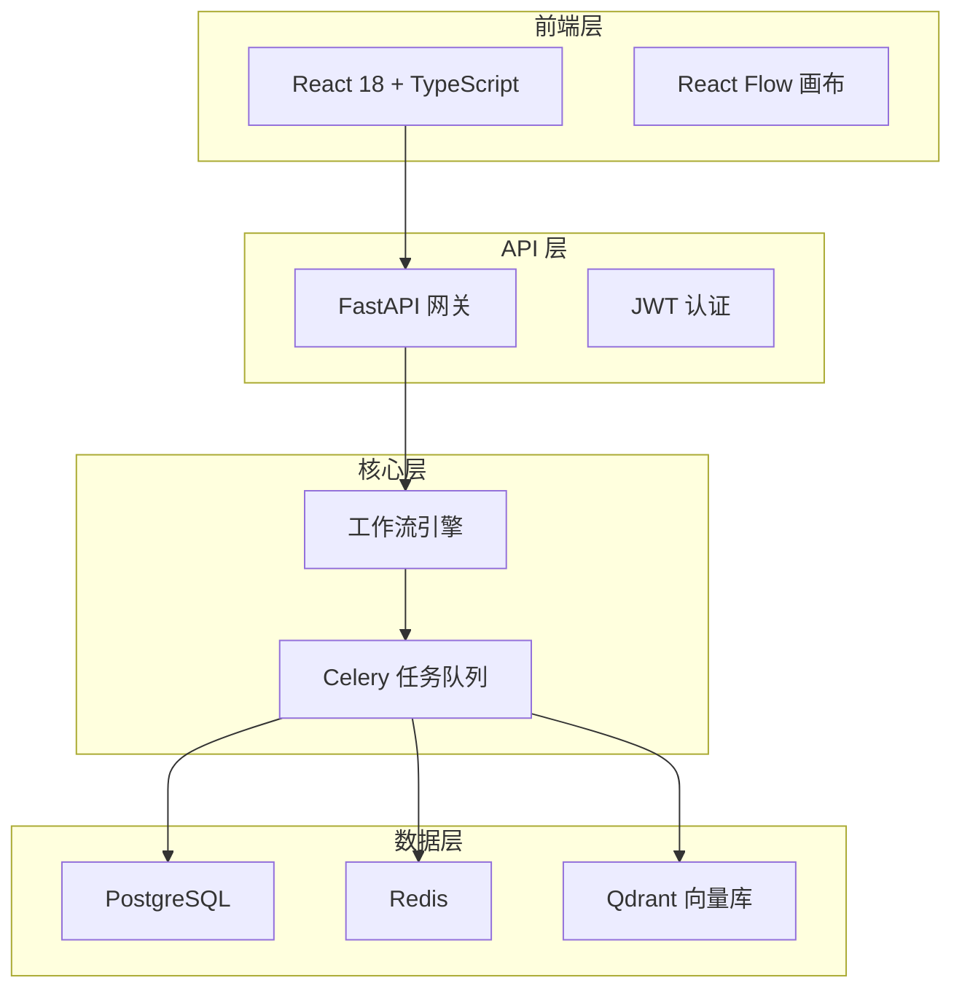

# 技术方案评审
## Project-Phoenix MVP - 工作流编排器

**汇报人**: CTO + 架构师  
**日期**: 2026-03-12  
**时长**: 15 分钟  

---

## 评审议程

1. **需求回顾** (3min) - CPO/产品经理
2. **技术架构方案** (7min) - 架构师
3. **API 选型验证** (3min) - CTO
4. **排期确认** (2min) - 全员

---

## 一、需求回顾

### MVP 产品定位

> "让 AI 真正帮你干活，而不只是聊天"

**目标用户**: 50-500 人中小企业  
**核心价值**: 可视化工作流编排 + 预置行业模板  
**关键指标**: 
- 减少 50% 重复性工作
- 3 分钟上手配置
- 支持私有化部署

---

## 功能范围（V1.0）

| 模块 | 核心功能 | 优先级 |
|------|----------|--------|
| 工作流编辑器 | 拖拽式画布、节点配置、流程验证 | P0 |
| 节点库 | 10 个预置节点（邮件/表格/CRM 等） | P0 |
| 执行引擎 | Celery 异步队列、任务调度 | P0 |
| 模板中心 | 5 个行业模板 | P1 |
| 监控看板 | 执行日志、性能指标 | P1 |

---

## 二、技术架构方案

### 整体架构

---

## 技术栈选型

| 层级 | 技术 | 选型理由 |
|------|------|----------|
| **前端** | React 18 + TS | 团队熟悉，React Flow 专业画布 |
| **后端** | FastAPI | 异步高性能，类型安全 |
| **队列** | Celery + Redis | Python 生态成熟，功能完善 |
| **主库** | PostgreSQL | ACID 事务，JSONB 灵活存储 |
| **向量库** | **Qdrant** | Rust 实现性能高，部署简单 |
| **部署** | Docker Compose | 轻量级，易私有化部署 |

---

## 核心架构决策

| 决策点 | 选型 | 理由 |
|--------|------|------|
| 向量数据库 | **Qdrant** | 性能/成本平衡最优，支持自托管 |
| 异步队列 | **Celery+Redis** | 生态成熟，监控完善 (Flower) |
| 工作流引擎 | **自研轻量** | 满足 MVP，可控可扩展 |
| 部署方案 | **Docker** | 符合私有化部署需求 |

**备选方案**: Pinecone(向量库)、RabbitMQ(队列)

---

## 性能指标设计

| 指标 | 目标值 | 验收方法 |
|------|--------|----------|
| 画布响应 | <2 秒 | 前端性能测试 |
| API 延迟 | P95 <500ms | 压测 1000 请求 |
| 任务吞吐量 | >100/s | Celery 并发测试 |
| 向量查询 | <50ms | 10 万向量数据集 |
| 系统可用性 | >99.5% | 7 天监控 |

---

## 三、API 选型验证

### 验证计划

| API 类别 | 候选 | 验证项 | 负责人 |
|----------|------|--------|--------|
| **大模型** | DeepSeek/Qwen | 延迟/成本/中文能力 | 全栈 A/B |
| **向量库** | Qdrant/Pinecone | 查询延迟/索引性能 | 全栈 A |
| **队列** | Redis/RabbitMQ | 吞吐量/重试机制 | DevOps |
| **对象存储** | 阿里云 OSS | 上传速度/CDN | DevOps |

**截止时间**: 03-17  
**已完成**: 1/10 (邮件发送 API)

---

## API 集成进度

| # | API 名称 | 状态 | 备注 |
|---|----------|------|------|
| 1 | ✅ 邮件发送 | 已完成 | BaseAPI+MailAPI |
| 2 | ⏳ 飞书表格 | 待开发 | 等待 HR 申请账号 |
| 3 | ⏳ CRM 系统 | 待开发 | 等待账号 |
| 4 | ⏳ PostgreSQL | 待开发 | 本地部署 |
| 5 | ⏳ 对象存储 | 待开发 | 等待账号 |
| 6-10 | ⏳ 其他 API | 待开发 | 企微/短信/日历等 |

**风险**: HR 账号申请可能延期 → 已每日跟进

---

## 四、排期确认

### 开发里程碑

| 时间 | 里程碑 | 交付物 |
|------|--------|--------|
| **03-12** | 技术评审通过 | 方案终稿 |
| **03-12~03-25** | Sprint 1 | 工作流编辑器 Alpha |
| **03-26~04-15** | Sprint 2 | 10 个 API 集成完成 |
| **04-16~05-10** | Sprint 3 | 模板中心 + 监控 |
| **05-11~05-31** | 内测 | Bug 修复 + 性能优化 |
| **06-01** | **正式上线 V1.0** | 公开发布 |

---

## 资源需求

| 资源类型 | 需求 | 来源 |
|----------|------|------|
| **人力** | 全栈×2 + DevOps×1 | 现有团队 |
| **服务器** | 18,500 元/月 | 云资源 (6 个月) |
| **API 预算** | 8,000 元/月 | 大模型调用 |
| **外包设计** | 20,000 元 | 一次性 (UI 组件库) |

**总预算**: 16 万 (6 个月 MVP 开发)

---

## 风险评估

| 风险 | 概率 | 影响 | 应对措施 |
|------|------|------|----------|
| HR 账号申请延期 | 中 | 高 | 每日跟进，优先 Mock 开发 |
| 性能指标不达标 | 低 | 中 | 预留 2 周优化时间 |
| 需求变更 | 中 | 高 | 需求冻结，变更需 CPO+CTO 双签 |
| 人员流动 | 低 | 中 | 文档沉淀，知识共享 |

---

## 关键决策请求

**请评审会确认**:

1. ✅ 技术架构方案（Qdrant+Celery/Redis+PostgreSQL）
2. ✅ API 选型方向（DeepSeek/Qwen 优先）
3. ✅ 开发排期（03-12 启动，06-01 上线）
4. ✅ 预算分配（16 万 MVP 开发）

---

# 总结

## 核心结论

- **技术方案可行**: 架构清晰，技术栈成熟，团队能力匹配
- **风险可控**: 主要风险为账号申请，已有应对措施
- **排期合理**: 6 个月 MVP，06-01 上线可达成
- **预算充足**: 16 万覆盖人力 + 资源 + 外包

**下一步**: 评审通过后立即启动 Sprint 1 开发

---

# Q&A

## 谢谢

**联系方式**: cto@project-phoenix.com  
**文档位置**: `mvp/architecture/tech-design.md`
