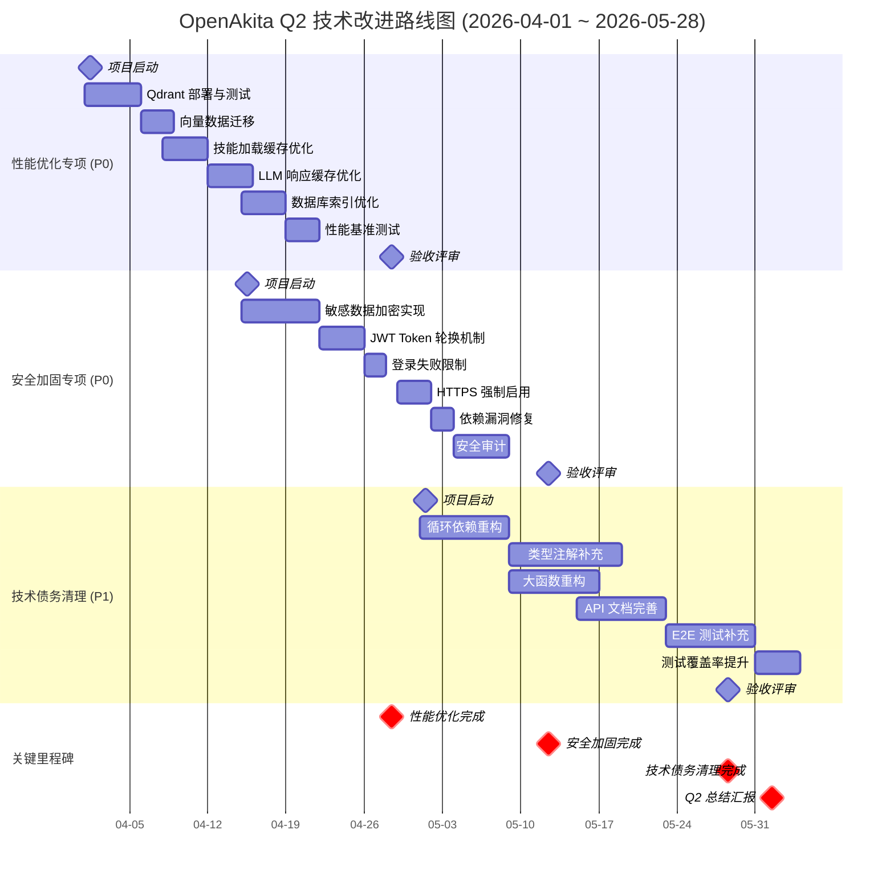
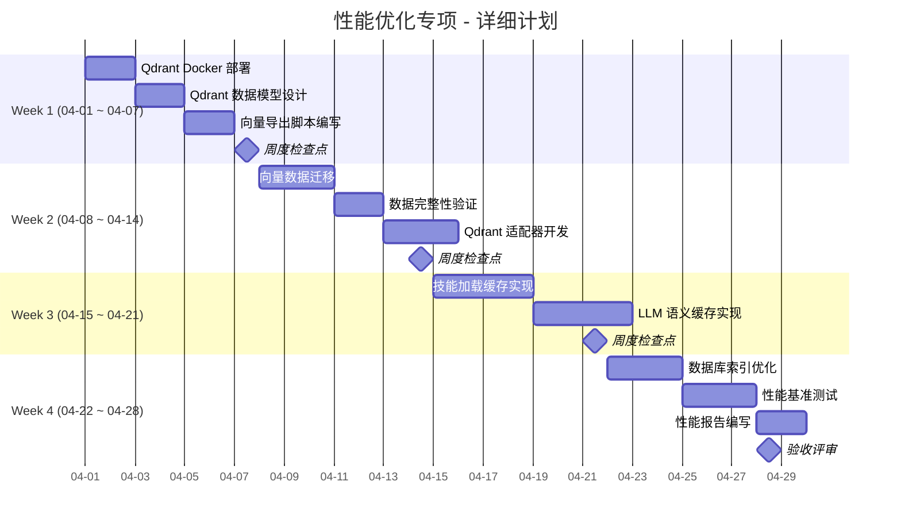
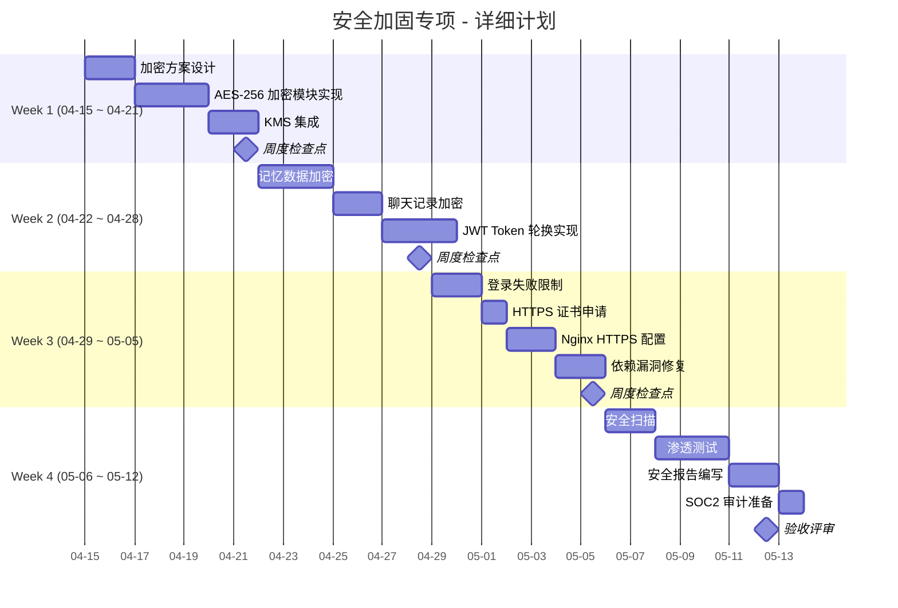
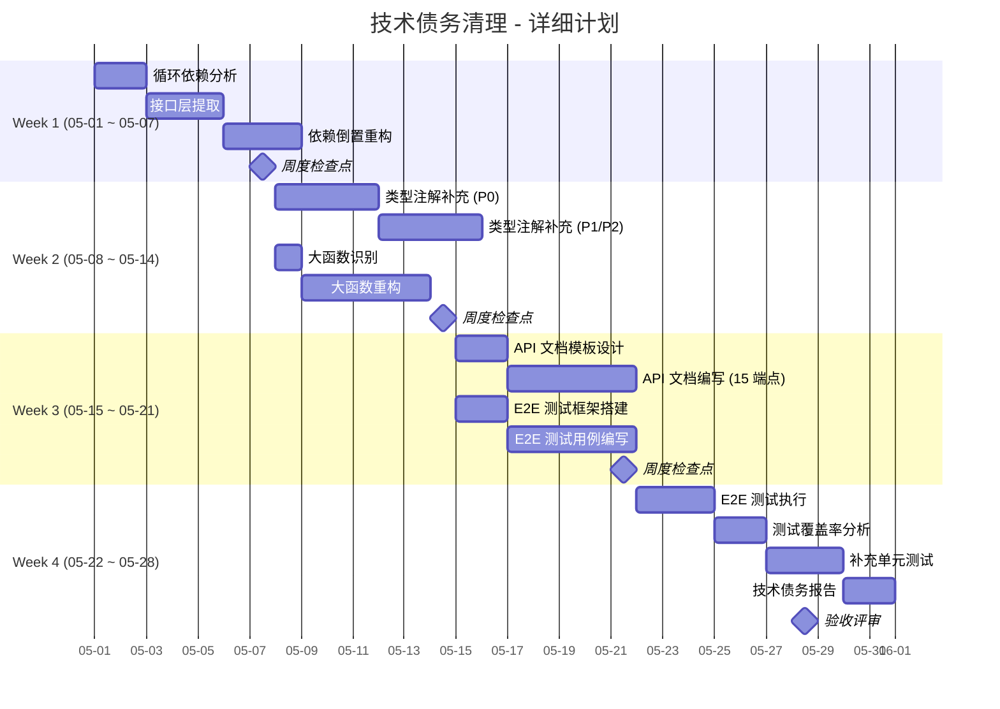
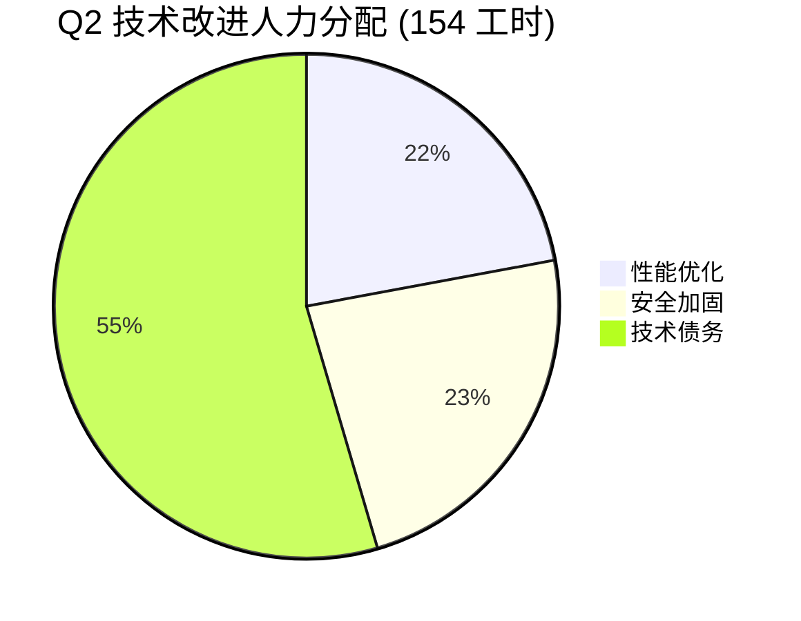
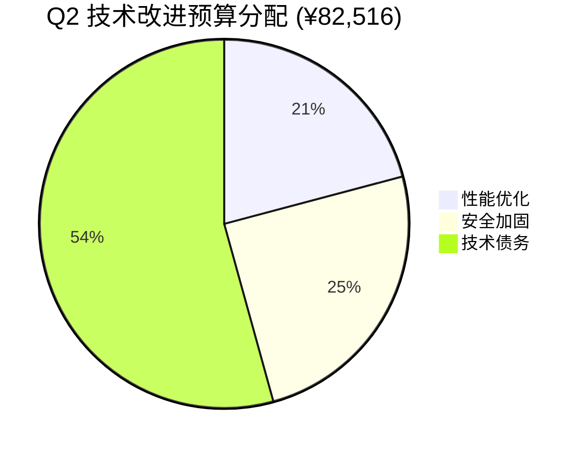

# OpenAkita Q2 技术改进实施路线图

**版本**: V1.0  
**更新日期**: 2026-03-11  
**负责人**: CTO / 技术总监  

---

## 甘特图总览



---

## 详细阶段计划

### 阶段一：性能优化专项 (04-01 ~ 04-28)



**关键交付物**:
- ✅ Qdrant 集群部署完成
- ✅ 向量数据迁移完成 (100% 完整性)
- ✅ 技能缓存命中率 >80%
- ✅ LLM 缓存命中率 >55%
- ✅ 性能基准测试报告

---

### 阶段二：安全加固专项 (04-15 ~ 05-12)



**关键交付物**:
- ✅ 敏感数据加密覆盖率 100%
- ✅ JWT Token 轮换机制上线
- ✅ HTTPS 强制启用
- ✅ 依赖漏洞 0 个
- ✅ 安全审计报告
- ✅ SOC2 Type I 审计通过

---

### 阶段三：技术债务清理 (05-01 ~ 05-28)



**关键交付物**:
- ✅ 循环依赖消除
- ✅ 类型注解覆盖率 >90%
- ✅ 最大函数行数 <80 行
- ✅ API 文档完整度 100%
- ✅ E2E 测试覆盖 8 个核心场景
- ✅ 测试覆盖率 >85%

---

## 里程碑总览

| 里程碑 | 日期 | 交付物 | 验收标准 |
|--------|------|--------|----------|
| M1 - 性能优化启动 | 04-01 | 项目计划书 | 董事会批准 |
| M2 - 性能优化完成 | 04-28 | 性能测试报告 | P95 <550ms |
| M3 - 安全加固启动 | 04-15 | 项目计划书 | CTO 批准 |
| M4 - 安全加固完成 | 05-12 | 安全审计报告 | SOC2 通过 |
| M5 - 技术债务启动 | 05-01 | 项目计划书 | 架构师批准 |
| M6 - 技术债务完成 | 05-28 | 技术债务报告 | 覆盖率>85% |
| M7 - Q2 总结汇报 | 06-01 | 综合报告 | 董事会验收 |

---

## 资源分配图





---

## 关键路径分析

**关键路径** (决定项目总工期的任务链):
```
性能优化 (04-01~04-28) → 安全加固 (04-15~05-12) → 技术债务 (05-01~05-28)
```

**关键路径说明**:
- 性能优化和安全加固有部分重叠 (04-15~04-28)
- 安全加固和技术债务有部分重叠 (05-01~05-12)
- 技术债务中的循环依赖重构是最高风险任务

**风险缓解**:
- 并行执行：性能优化的缓存优化与安全加固的数据加密可并行
- 缓冲时间：每个阶段预留 2-3 天缓冲
- 关键任务优先：循环依赖重构安排在技术债务阶段最早执行

---

## 进度追踪机制

### 周报机制

| 时间 | 内容 | 参与人 |
|------|------|--------|
| 每周一 09:00 | 周计划确认 | CTO + 执行团队 |
| 每周五 17:00 | 周度总结 | CTO + 执行团队 |
| 每月最后一个周五 | 月度汇报 | CTO → CEO |

### 检查点机制

| 检查点 | 时间 | 验收标准 |
|--------|------|----------|
| W1 检查点 | 04-07 | Qdrant 部署完成 |
| W2 检查点 | 04-14 | 向量迁移完成 |
| W3 检查点 | 04-21 | 缓存优化完成 |
| W4 检查点 | 04-28 | 性能优化验收 |
| ... | ... | ... |

### 风险升级机制

| 风险等级 | 触发条件 | 上报路径 | 响应时间 |
|----------|----------|----------|----------|
| 🟢 低风险 | 进度延迟 <2 天 | 团队内部 | 24 小时 |
| 🟡 中风险 | 进度延迟 2-5 天 | CTO | 12 小时 |
| 🔴 高风险 | 进度延迟 >5 天 | CEO + 董事会 | 4 小时 |

---

## 附录：任务分解清单

### 性能优化专项任务清单

| ID | 任务 | 负责人 | 工时 | 依赖 |
|----|------|--------|------|------|
| PERF-01 | Qdrant Docker 部署 | 全栈 A | 4h | - |
| PERF-02 | Qdrant 数据模型设计 | 架构师 | 4h | PERF-01 |
| PERF-03 | 向量导出脚本编写 | 全栈 A | 4h | PERF-02 |
| PERF-04 | 向量数据迁移 | 全栈 A | 8h | PERF-03 |
| PERF-05 | 数据完整性验证 | 全栈 A | 4h | PERF-04 |
| PERF-06 | Qdrant 适配器开发 | 全栈 A | 8h | PERF-05 |
| PERF-07 | 技能加载缓存实现 | 全栈 A | 8h | - |
| PERF-08 | LLM 语义缓存实现 | 全栈 A | 8h | PERF-07 |
| PERF-09 | 数据库索引优化 | 全栈 A | 8h | - |
| PERF-10 | 性能基准测试 | 全栈 A | 8h | PERF-06,08,09 |
| PERF-11 | 性能报告编写 | 全栈 A | 4h | PERF-10 |

### 安全加固专项任务清单

| ID | 任务 | 负责人 | 工时 | 依赖 |
|----|------|--------|------|------|
| SEC-01 | 加密方案设计 | 全栈 B | 4h | - |
| SEC-02 | AES-256 加密模块实现 | 全栈 B | 8h | SEC-01 |
| SEC-03 | KMS 集成 | DevOps | 4h | SEC-02 |
| SEC-04 | 记忆数据加密 | 全栈 B | 8h | SEC-03 |
| SEC-05 | 聊天记录加密 | 全栈 B | 4h | SEC-04 |
| SEC-06 | JWT Token 轮换实现 | 全栈 B | 8h | SEC-05 |
| SEC-07 | 登录失败限制 | 全栈 B | 4h | SEC-06 |
| SEC-08 | HTTPS 证书申请 | DevOps | 2h | - |
| SEC-09 | Nginx HTTPS 配置 | DevOps | 4h | SEC-08 |
| SEC-10 | 依赖漏洞修复 | DevOps | 4h | SEC-09 |
| SEC-11 | 安全扫描 | DevOps | 4h | SEC-10 |
| SEC-12 | 渗透测试 | 外部 | 8h | SEC-11 |
| SEC-13 | 安全报告编写 | DevOps | 4h | SEC-12 |

### 技术债务清理任务清单

| ID | 任务 | 负责人 | 工时 | 依赖 |
|----|------|--------|------|------|
| TECH-01 | 循环依赖分析 | 架构师 | 4h | - |
| TECH-02 | 接口层提取 | 架构师 | 8h | TECH-01 |
| TECH-03 | 依赖倒置重构 | 架构师 | 8h | TECH-02 |
| TECH-04 | 类型注解补充 (P0) | 全栈 A | 8h | - |
| TECH-05 | 类型注解补充 (P1/P2) | 全栈 B | 16h | TECH-04 |
| TECH-06 | 大函数识别 | 全栈 A | 2h | - |
| TECH-07 | 大函数重构 | 全栈 B | 10h | TECH-06 |
| TECH-08 | API 文档模板设计 | 全栈 A | 4h | - |
| TECH-09 | API 文档编写 | 全栈 A | 8h | TECH-08 |
| TECH-10 | E2E 测试框架搭建 | 全栈 B | 4h | - |
| TECH-11 | E2E 测试用例编写 | 全栈 B | 12h | TECH-10 |
| TECH-12 | E2E 测试执行 | 全栈 B | 6h | TECH-11 |
| TECH-13 | 测试覆盖率分析 | 全栈 A | 4h | TECH-12 |
| TECH-14 | 补充单元测试 | 全栈 A/B | 8h | TECH-13 |
| TECH-15 | 技术债务报告 | 架构师 | 8h | TECH-14 |

---

**文档状态**: ✅ 完成  
**提交人**: CTO / 技术总监  
**提交时间**: 2026-03-11 15:50  

[实施路线图，甘特图，Q2 改进，项目计划]
