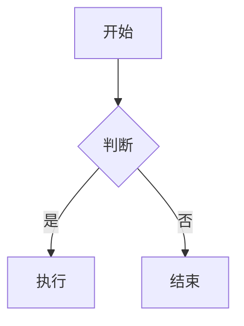

# Obsidian Note Management Skill

Help users create, organize, and manage notes in their Obsidian knowledge vault, following Obsidian Flavored Markdown (OFM) standards and knowledge management best practices.

---

## Core Principles

1. **Always ask where to save before creating notes** — Never assume paths; confirm the user's vault structure and target folder first.
2. **Follow Obsidian Flavored Markdown** — Use wikilinks, embeds, callouts, and other OFM-specific syntax.
3. **Atomic notes** — Each note focuses on one concept, building a knowledge network through links.
4. **Metadata-driven** — Use YAML frontmatter properties to ensure notes are searchable and queryable.

---

## Obsidian Flavored Markdown 语法参考

### Wikilinks (Internal Links)

Obsidian uses `[[]]` syntax for internal links, which is the most important distinction from standard Markdown.

```markdown
[[笔记名称]]                    # 链接到同名笔记
[[笔记名称|显示文本]]            # 自定义显示文本
[[笔记名称#标题]]               # 链接到特定标题
[[笔记名称#^block-id]]          # 链接到特定块
[[笔记名称#标题|显示文本]]       # 标题链接 + 自定义文本
```

**Best practices:**
- Note names should be descriptive and unique, avoid special characters `[ ] # ^ | \`

### Embeds

Use `![[]]` syntax to embed other notes or resources directly into the current note.

```markdown
![[笔记名称]]                   # 嵌入整篇笔记
![[笔记名称#标题]]              # 嵌入特定章节
![[笔记名称#^block-id]]         # 嵌入特定块
![[图片.png]]                   # 嵌入图片
![[图片.png|300]]               # 指定宽度
![[音频.mp3]]                   # 嵌入音频
![[视频.mp4]]                   # 嵌入视频
![[文档.pdf]]                   # 嵌入 PDF
![[文档.pdf#page=3]]            # 嵌入 PDF 特定页
```

### Callouts

Based on Markdown blockquote syntax extension, used to highlight important information.

```markdown
> [!note] 标题
> 笔记内容

> [!tip] 提示
> 有用的建议

> [!warning] 警告
> 需要注意的事项

> [!important] 重要
> 关键信息

> [!info] 信息
> 补充说明

> [!question] 问题
> 需要进一步探讨的问题

> [!example] 示例
> 具体的例子

> [!abstract] 摘要
> 概述或总结

> [!todo] 待办
> 需要完成的任务

> [!quote] 引用
> 引用来源文字
```

**折叠 Callout：**
```markdown
> [!tip]- 点击展开       # 默认折叠
> 隐藏内容

> [!tip]+ 点击折叠       # 默认展开
> 可折叠内容
```

**嵌套 Callout：**
```markdown
> [!note] 外层
> 外层内容
>> [!tip] 内层
>> 内层内容
```

### Tags

```markdown
#标签名                         # 行内标签
#父标签/子标签                   # 嵌套标签
```

Declare tags in frontmatter:
```yaml
tags:
  - 项目管理
  - 知识管理/PKM
```

### Comments

```markdown
%%这是 Obsidian 注释，不会在预览模式中显示%%

%%
多行注释
也是可以的
%%
```

### Math Formulas

```markdown
Inline formula:$E = mc^2$

Block formula:
$$
\int_0^\infty e^{-x^2} dx = \frac{\sqrt{\pi}}{2}
$$
```

### Mermaid Diagrams

````markdown

````

---

## YAML Frontmatter Properties

每条笔记应以 YAML frontmatter 开头，定义结构化元数据。

### Standard Properties

```yaml
---
title: 笔记标题
aliases:
  - 别名1
  - 别名2
tags:
  - 标签1
  - 父标签/子标签
date: 2026-03-01
created: 2026-03-01T10:30:00
modified: 2026-03-01T14:20:00
author: 作者名
status: draft | in-progress | reviewed | published
type: note | moc | reference | project | daily
cssclasses:
  - custom-class
publish: true
---
```

### Custom Properties (for Dataview)

Add custom fields based on note type for Dataview queries:

```yaml
---
# 读书笔记
book_title: "深度工作"
book_author: "Cal Newport"
rating: 4
started: 2026-01-15
finished: 2026-02-20
category: 生产力
---
```

```yaml
---
# 项目笔记
project: OpenAkita
priority: high
deadline: 2026-06-30
stakeholders:
  - Alice
  - Bob
---
```

```yaml
---
# 会议笔记
meeting_type: standup | review | planning
participants:
  - 张三
  - 李四
decisions:
  - 决策内容
action_items:
  - "[ ] 待办事项"
---
```

### Property Types

Obsidian supports the following property types:
- **Text**: plain text
- **List**: array values
- **Number**: numeric values
- **Checkbox**: `true`/`false`
- **Date**: `YYYY-MM-DD`
- **Date & time**: `YYYY-MM-DDTHH:mm:ss`
- **Aliases**: alias list (built-in)
- **Tags**: tag list (built-in)

---

## Folder Structure and Naming Conventions

### Recommended Vault Structure

```
MyVault/
├── 00 - Inbox/              # Quick capture, to be organized
├── 01 - Projects/           # Active projects
│   ├── ProjectA/
│   └── ProjectB/
├── 02 - Areas/              # Ongoing areas of focus
│   ├── 健康/
│   ├── 财务/
│   └── 职业发展/
├── 03 - Resources/          # Reference materials
│   ├── Reading Notes/
│   ├── Article Clippings/
│   └── Course Notes/
├── 04 - Archive/            # Completed/inactive
├── 05 - Templates/          # Templates
├── 06 - Daily Notes/        # Daily notes
├── 07 - MOCs/               # Maps of Content
├── Attachments/             # Attachments (images, PDFs, etc.)
└── Canvas/                  # Canvas files
```

### File Naming Conventions

| Type | Format | Example |
|------|---------|------|
| Regular note | Descriptive name | `Atomic Note Methodology.md` |
| Daily note | `YYYY-MM-DD` | `2026-03-01.md` |
| Meeting note | `YYYY-MM-DD Topic` | `2026-03-01 Product Review.md` |
| MOC | `MOC - 主题` | `MOC - 知识管理.md` |
| Template | `Template - 类型` | `Template - 读书笔记.md` |
| Project home | `项目名 - Home` | `OpenAkita - Home.md` |

**命名原则：**
- 避免特殊字符：`/ \ : * ? " < > |`
- 使用空格而非下划线（Obsidian 对空格友好）
- Names should be self-describing, understandable without folder paths

---

## MOC (Maps of Content)

MOCs are navigation hubs that connect related notes, serving as a "table of contents" and "mind map".

### MOC Template

```markdown
---
title: MOC - 知识管理
type: moc
tags:
  - MOC
  - 知识管理
date: 2026-03-01
---

# 知识管理

> [!abstract] 概述
> 关于个人知识管理（PKM）的核心概念、方法论和工具。

## 核心概念

- [[卡片盒笔记法]]
- [[原子笔记]]
- [[渐进式总结]]
- [[常青笔记]]

## 方法论

- [[PARA 方法]]
- [[Zettelkasten 方法]]
- [[Building a Second Brain]]
- [[CODE 方法]]

## 工具与实践

- [[Obsidian 使用技巧]]
- [[Dataview 查询食谱]]
- [[模板系统设计]]

## 相关 MOC

- [[MOC - 生产力]]
- [[MOC - 学习方法]]
- [[MOC - 写作]]
```

### MOC 最佳实践

1. **层级结构** — MOC 可以嵌套，顶层 MOC 链接子主题 MOC
2. **动态更新** — 新建笔记后检查是否需要加入相关 MOC
3. **分类灵活** — 同一笔记可出现在多个 MOC 中
4. **简要注释** — 每个链接可附加一行说明，解释与当前主题的关系

---

## Dataview 兼容性

确保笔记的 frontmatter 属性与 Dataview 查询兼容。

### 常用 Dataview 查询模式

**表格查询：**
````markdown
```dataview
TABLE rating, book_author, finished
FROM "03 - Resources/读书笔记"
WHERE rating >= 4
SORT finished DESC
```
````

**列表查询：**
````markdown
```dataview
LIST
FROM #项目管理 AND -"04 - Archive"
WHERE status = "in-progress"
SORT priority ASC
```
````

**任务查询：**
````markdown
```dataview
TASK
FROM "01 - Projects"
WHERE !completed
GROUP BY file.link
```
````

**行内查询：**
```markdown
今天是 `= date(today)`，本库共有 `= length(file.lists)` 条列表项。
```

### Dataview 友好的属性设计

- 使用英文属性名（中文属性名在某些查询中可能出问题）
- 日期使用 `YYYY-MM-DD` 格式
- 布尔值使用 `true`/`false`
- 列表属性使用 YAML 数组语法

---

## Canvas 支持

Obsidian Canvas 是可视化组织笔记关系的画布工具。

### Canvas files格式

Canvas files为 `.canvas` 后缀的 JSON 文件，包含节点（nodes）和边（edges）。

```json
{
  "nodes": [
    {
      "id": "node1",
      "type": "text",
      "text": "核心概念",
      "x": 0, "y": 0,
      "width": 250, "height": 60
    },
    {
      "id": "node2",
      "type": "file",
      "file": "03 - Resources/原子笔记.md",
      "x": 300, "y": 0,
      "width": 250, "height": 60
    }
  ],
  "edges": [
    {
      "id": "edge1",
      "fromNode": "node1",
      "toNode": "node2",
      "label": "包含"
    }
  ]
}
```

### Canvas 节点类型

| 类型 | 说明 | 关键属性 |
|------|------|---------|
| `text` | 纯文本卡片 | `text` |
| `file` | 链接到 Vault 中的文件 | `file` |
| `link` | 嵌入网页 | `url` |
| `group` | 分组容器 | `label` |

### 创建 Canvas 时的注意事项

- 节点坐标以画布中心为原点
- 建议节点宽度 200–400px
- 使用 `group` 节点对相关卡片分组
- 边可以包含 `label` 描述关系

---

## Bases 支持

Obsidian Bases 是 Obsidian 1.8+ 引入的内置数据库视图功能。

### Bases 概述

- Bases 文件以 `.base` 为后缀，存储在 Vault 中
- 自动从笔记的 frontmatter properties 提取结构化数据
- 支持表格视图、筛选、排序、分组
- 无需 Dataview 插件即可实现结构化查询

### 创建 Bases 时的建议

1. **统一属性** — 同一类型的笔记使用相同的 frontmatter 属性集
2. **属性类型** — 在 Obsidian 设置中预定义属性类型，确保数据一致性
3. **筛选条件** — 使用文件夹或标签限定数据来源
4. **视图配置** — 选择合适的列、排序和分组方式

---

## 笔记模板

### 日记模板

```markdown
---
title: "{{date:YYYY-MM-DD}}"
type: daily
date: {{date:YYYY-MM-DD}}
tags:
  - daily
---

# {{date:YYYY-MM-DD dddd}}

## 今日计划
- [ ] 

## 笔记与想法


## 今日回顾

### 完成了什么


### 明天的重点

```

### 读书笔记模板

```markdown
---
title: "{{title}}"
type: reference
book_title: ""
book_author: ""
category: ""
rating: 
started: {{date:YYYY-MM-DD}}
finished: 
status: in-progress
tags:
  - 读书笔记
---

# {{title}}

> [!info] 书籍信息
> - **作者**: 
> - **出版年份**: 
> - **ISBN**: 

## 核心观点


## 章节笔记

### 第一章


## 关键引用

> 

## 我的思考


## 行动项
- [ ] 

## 相关笔记
- [[]]
```

### 项目笔记模板

```markdown
---
title: "{{title}}"
type: project
project: ""
status: active
priority: medium
deadline: 
stakeholders: []
tags:
  - 项目
---

# {{title}}

> [!abstract] 项目概述
> 

## 目标


## 里程碑

| 里程碑 | 截止日期 | 状态 |
|--------|---------|------|
|  |  | 🔴 |

## 任务
- [ ] 

## 会议记录
- [[]]

## 参考资料
- [[]]

## 复盘笔记

```

---

## Workflow

### 创建笔记的标准流程

1. **询问保存位置** — 始终先确认用户期望的文件夹路径
2. **选择或创建模板** — 根据笔记类型使用对应模板
3. **填写 frontmatter** — 确保所有必需属性完整
4. **编写内容** — 使用 OFM 语法
5. **建立链接** — 添加 wikilinks 连接相关笔记
6. **更新 MOC** — 如有对应 MOC，将新笔记加入其中

### 整理 Inbox 的流程

1. 浏览 `00 - Inbox/` 中的笔记
2. 为每条笔记添加或完善 frontmatter
3. 移动到合适的文件夹
4. 建立与现有笔记的链接
5. 更新相关 MOC

### 重构知识库

1. 识别孤立笔记（无入链和出链）
2. 合并重复概念
3. 拆分过长的笔记为原子笔记
4. 更新失效链接
5. 归档不活跃内容到 `04 - Archive/`

---

## Notes

- **不要自行决定保存路径** — 永远先问用户
- **保持笔记原子性** — 一条笔记一个核心概念
- **优先使用 wikilinks** — 而非标准 Markdown 链接
- **YAML frontmatter 必须是文件第一行** — 前面不能有空行
- **属性名使用英文** — 确保 Dataview 和 Bases 兼容
- **图片等附件放在专用文件夹** — 如 `Attachments/`
- **定期维护链接** — 重命名笔记后检查链接是否自动更新
- **备份 Vault** — 建议使用 Git 或 Obsidian Sync
