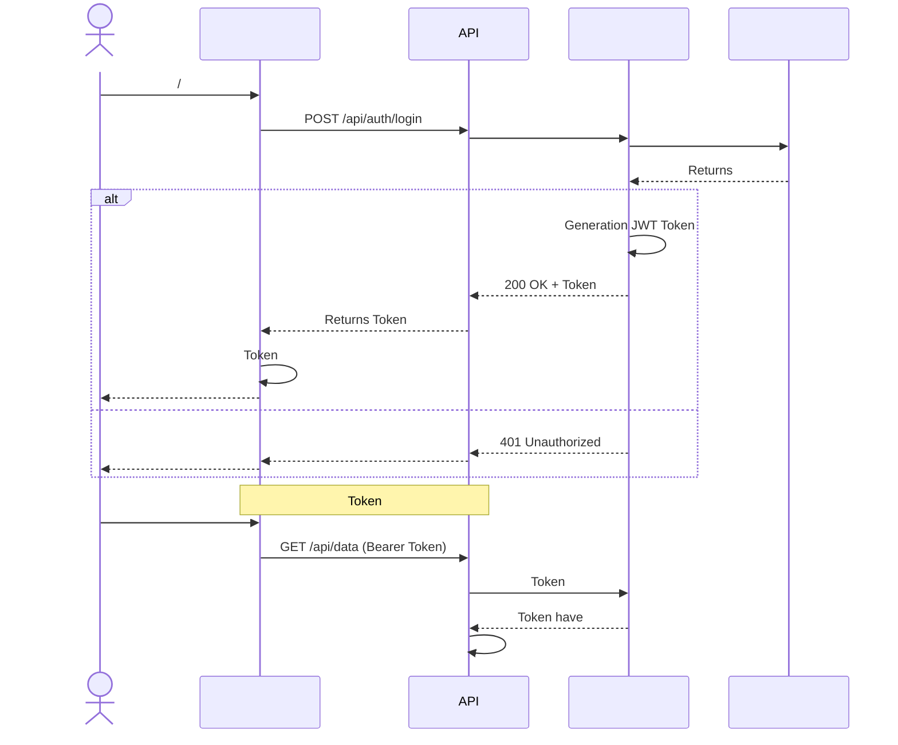
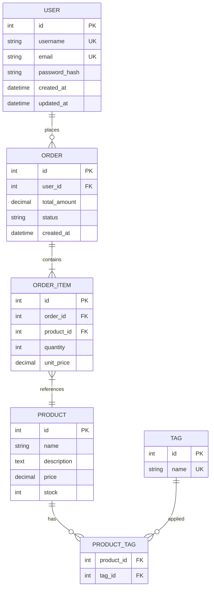

# Pretty Mermaid — Mermaid Generation

## When to Use

- needCreate,,,,, ER, C4 or
- need SVG or ASCII
- needGeneration
- needUseor
- need

---

## Prerequisites

###

| | | |
|------|------|---------|
| Node.js ≥ 18 | Run Mermaid CLI | or `nvm install 18` |
| `@mermaid-js/mermaid-cli` | SVG/PNG | `npm install -g @mermaid-js/mermaid-cli` |

### Optional

| | | |
|------|------|---------|
| `monodraw` (macOS) | ASCII Edit | App Store |
| `graph-easy` | ASCII | `cpan Graph::Easy` |

### Validate

```bash
mmdc --version
```

`mmdc` not, Mermaid, inSupports Mermaid Editor. 

---

## Instructions

### Core

1. **** —,, 
2. **** — Mermaid
3. **** — Use
4. ** Mermaid ** —
5. **** — SVG, PNG or ASCII
6. **and** —,, 

###

| | Recommendations | Mermaid |
|------|---------|---------------|
|, | | `flowchart TD/LR` |
| API Call, | | `sequenceDiagram` |
|, OOP | | `classDiagram` |
|, | | `stateDiagram-v2` |
| | ER | `erDiagram` |
|, | C4 | `C4Context/C4Container/C4Component` |
|, | | `gantt` |
| Git | Git | `gitGraph` |
|, | | `mindmap` |
| Timeline | Timeline | `timeline` |

---

## Workflows

### Workflow 1: Generation

** 1 — **

 (ProvidesUseDefault): 

| Parameter | Default | |
|------|--------|-------|
| | flowchart | |
| | TD () | TD, LR, RL, BT |
| | default | default, dark, forest, neutral, base |
| | Mermaid | svg, png, ascii, mermaid |
| | Tokyo Night | Tokyo Night, Dracula, GitHub Light, Nord, Solarized |

** 2 — Mermaid **

: 

```
%%{init: {'theme': 'dark', 'themeVariables': { 'primaryColor': '#1a1b26', 'primaryTextColor': '#a9b1d6', 'primaryBorderColor': '#7aa2f7', 'lineColor': '#565f89', 'secondaryColor': '#24283b', 'tertiaryColor': '#1a1b26' }}}%%
flowchart TD
A[] --> B{}
B -->|Yes| C[Execute]
B -->|No| D[]
C --> E[]
 D --> E
```

** 3 — ( SVG/PNG) **

Mermaid Write `.mmd`, Call: 

```bash
mmdc -i diagram.mmd -o diagram.svg -t dark -b transparent
mmdc -i diagram.mmd -o diagram.png -t dark -b white -w 1200
```

** 4 — **

Returns File path, orin Mermaid. 

---

### Workflow 2: Generation

Used forGeneration (). 

** 1** — have

** 2** — Create: 

```json
{
 "theme": "tokyo-night",
 "outputDir": "./diagrams",
 "outputFormat": "svg",
 "diagrams": [
 {
 "name": "system-overview",
 "type": "C4Context",
"title": ""
 },
 {
 "name": "api-sequence",
 "type": "sequenceDiagram",
"title": "API Call"
 },
 {
 "name": "data-model",
 "type": "erDiagram",
"title": ""
 }
 ]
}
```

** 3** — Generation Mermaid

** 4** — Returnshave and

---

### Workflow 3: ASCII

need (Used for CLI,, README ): 

** A — Manual ASCII **

, Use: 

```
┌─────────┐ ┌─────────┐ ┌─────────┐
│ Client │────▶│ Server │────▶│Database │
└─────────┘ └─────────┘ └─────────┘
 │
 ▼
 ┌─────────┐
 │ Cache │
 └─────────┘
```

** B — Use graph-easy **

```bash
echo "[ Client ] -> [ Server ] -> [ Database ]" | graph-easy --as=ascii
```

---

## Theme

### Tokyo Night (Default) 

```
%%{init: {'theme': 'base', 'themeVariables': {
 'primaryColor': '#1a1b26',
 'primaryTextColor': '#a9b1d6',
 'primaryBorderColor': '#7aa2f7',
 'lineColor': '#565f89',
 'secondaryColor': '#24283b',
 'tertiaryColor': '#414868',
 'noteBkgColor': '#1a1b26',
 'noteTextColor': '#c0caf5',
 'noteBorderColor': '#7aa2f7'
}}}%%
```

### Dracula

```
%%{init: {'theme': 'base', 'themeVariables': {
 'primaryColor': '#282a36',
 'primaryTextColor': '#f8f8f2',
 'primaryBorderColor': '#bd93f9',
 'lineColor': '#6272a4',
 'secondaryColor': '#44475a',
 'tertiaryColor': '#383a59',
 'noteBkgColor': '#282a36',
 'noteTextColor': '#f8f8f2',
 'noteBorderColor': '#ff79c6'
}}}%%
```

### GitHub Light

```
%%{init: {'theme': 'base', 'themeVariables': {
 'primaryColor': '#ffffff',
 'primaryTextColor': '#24292f',
 'primaryBorderColor': '#d0d7de',
 'lineColor': '#656d76',
 'secondaryColor': '#f6f8fa',
 'tertiaryColor': '#eaeef2',
 'noteBkgColor': '#ddf4ff',
 'noteTextColor': '#24292f',
 'noteBorderColor': '#54aeff'
}}}%%
```

### Nord

```
%%{init: {'theme': 'base', 'themeVariables': {
 'primaryColor': '#2e3440',
 'primaryTextColor': '#eceff4',
 'primaryBorderColor': '#88c0d0',
 'lineColor': '#4c566a',
 'secondaryColor': '#3b4252',
 'tertiaryColor': '#434c5e',
 'noteBkgColor': '#2e3440',
 'noteTextColor': '#eceff4',
 'noteBorderColor': '#81a1c1'
}}}%%
```

### Solarized

```
%%{init: {'theme': 'base', 'themeVariables': {
 'primaryColor': '#002b36',
 'primaryTextColor': '#839496',
 'primaryBorderColor': '#268bd2',
 'lineColor': '#586e75',
 'secondaryColor': '#073642',
 'tertiaryColor': '#073642',
 'noteBkgColor': '#002b36',
 'noteTextColor': '#93a1a1',
 'noteBorderColor': '#2aa198'
}}}%%
```

---

## Templates

### Templates 1: (C4 Container) 

```mermaid
C4Container
title

Person(user, "", "Viaor")

System_Boundary(system, "") {
Container(web, "Web ", "React", "")
Container(gateway, "API ", "Kong/Nginx", ",, ")
Container(auth, "", "Go", "JWT and")
Container(biz, "", "Python", "")
Container(notify, "", "Node.js", "//")
ContainerDb(db, "", "PostgreSQL", "")
ContainerDb(cache, "", "Redis", "willand")
ContainerQueue(mq, "", "RabbitMQ", "")
 }

 Rel(user, web, "Use", "HTTPS")
 Rel(web, gateway, "API Call", "HTTPS")
Rel(gateway, auth, "", "gRPC")
Rel(gateway, biz, "", "gRPC")
Rel(biz, db, "", "TCP")
Rel(biz, cache, "", "TCP")
Rel(biz, mq, "", "AMQP")
Rel(mq, notify, "", "AMQP")
```

### Templates 2: CI/CD (Flowchart) 

```mermaid
flowchart LR
A[] --> B[ CI]
B --> C{}
C -->|Via| D[]
C -->|| Z[]
D -->|Via| E[]
D -->|| Z
E --> F[]
F --> G{}
G -->|Staging| H[ Staging]
G -->|Production| I[]
I -->|| J[]
I -->|| Z
H --> K[]
K -->|Via| L[✅ Staging ]
K -->|| M[Automatic]
J --> N[]
N -->|Via| O[✅ ]
N -->|| P[Automatic]
```

### Templates 3: (Sequence) 



### Templates 4: ER



### Templates 5:

```mermaid
gantt
title
 dateFormat YYYY-MM-DD
 axisFormat %m/%d

section
:done, req1, 2025-01-01, 7d
:done, req2, after req1, 3d
PRD:done, req3, after req2, 2d

section
:active, des1, after req3, 5d
UI/UX: des2, after req3, 7d
: des3, after des2, 2d

section
: dev1, after des1, 15d
: dev2, after des3, 15d
: dev3, after dev1, 5d

section
UAT: rel1, after dev3, 5d
Bug: rel2, after rel1, 3d
:milestone, rel3, after rel2, 0d
```

---

## Output Format

### Default

inUse Mermaid: 

````

````

### SVG

```bash
mmdc -i input.mmd -o output.svg -t dark -b transparent --cssFile custom.css
```

### PNG

```bash
mmdc -i input.mmd -o output.png -t dark -b white -w 1920 -H 1080 -s 2
```

: 
- `-t`: default, dark, forest, neutral
- `-b`: transparent, white, #hex
- `-w` () 
- `-H` () 
- `-s`

### ASCII

Use,,,. 

---

## Common Pitfalls

### 1. ID

****: inUse ID

```mermaid
flowchart TD
A[] --> B[]
A[] --> B[]
```

****: Use ID

```mermaid
flowchart TD
login[] --> validate[]
register[] --> check[]
```

### 2.

****: Includes, 

```
A[(name)]
```

****: Use

```
A["(name)"]
```

### 3.

20,: 

```mermaid
flowchart TD
subgraph
 A --> B --> C
 end
subgraph
 D --> E --> F
 end
 C --> D
```

### 4. not

- (, ) → **TD** () 
- / → **LR** () 
- Timeline/ → **LR**
- - → **TD** or **LR**

### 5.

SVG/PNG, Use `--cssFile`: 

```css
* {
 font-family: "Microsoft YaHei", "PingFang SC", "Noto Sans CJK SC", sans-serif;
}
```

### 6. Mermaid CLI

,: 

```bash
mmdc -i large-diagram.mmd -o output.svg --puppeteerConfigFile puppeteer.json
```

`puppeteer.json`:
```json
{
 "timeout": 60000
}
```

### 7.

Mermaid Supports, ( 3 ).. 

---

## Best Practices

1. **** — ID Usehave, DisplayUse
2. **** — `subgraph`, 
3. **** —,, 
4. **** — Use `Note`
5. **** —, C4 Context → Container → Component
6. **** — Mermaid Yes, Git Manage
7. **** — haveUse

---

## EXTEND.md

inCreate `EXTEND.md` and, Agent willAutomaticUse.