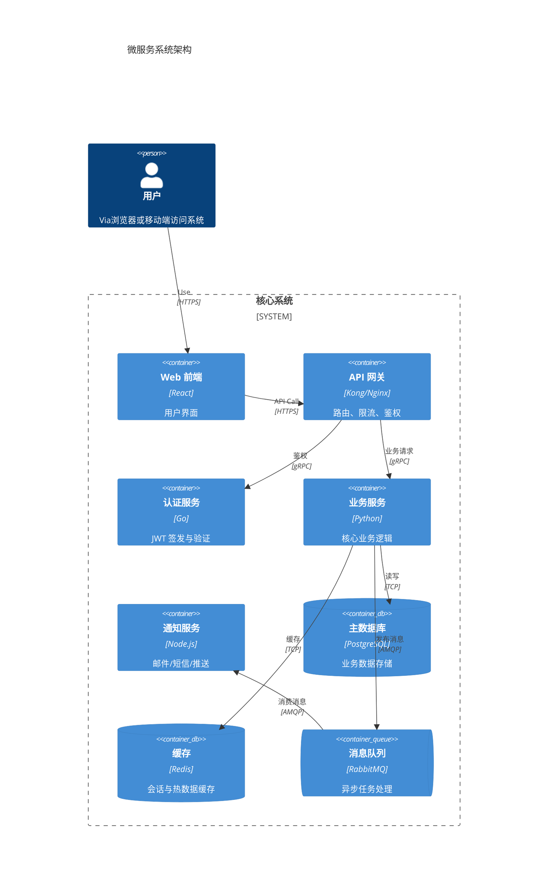
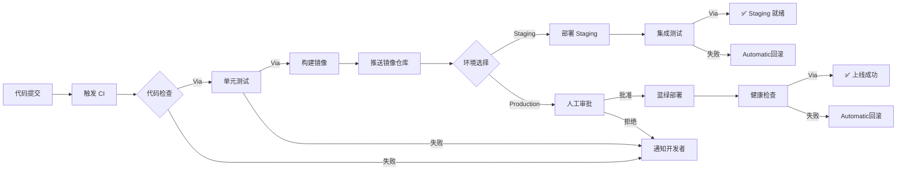
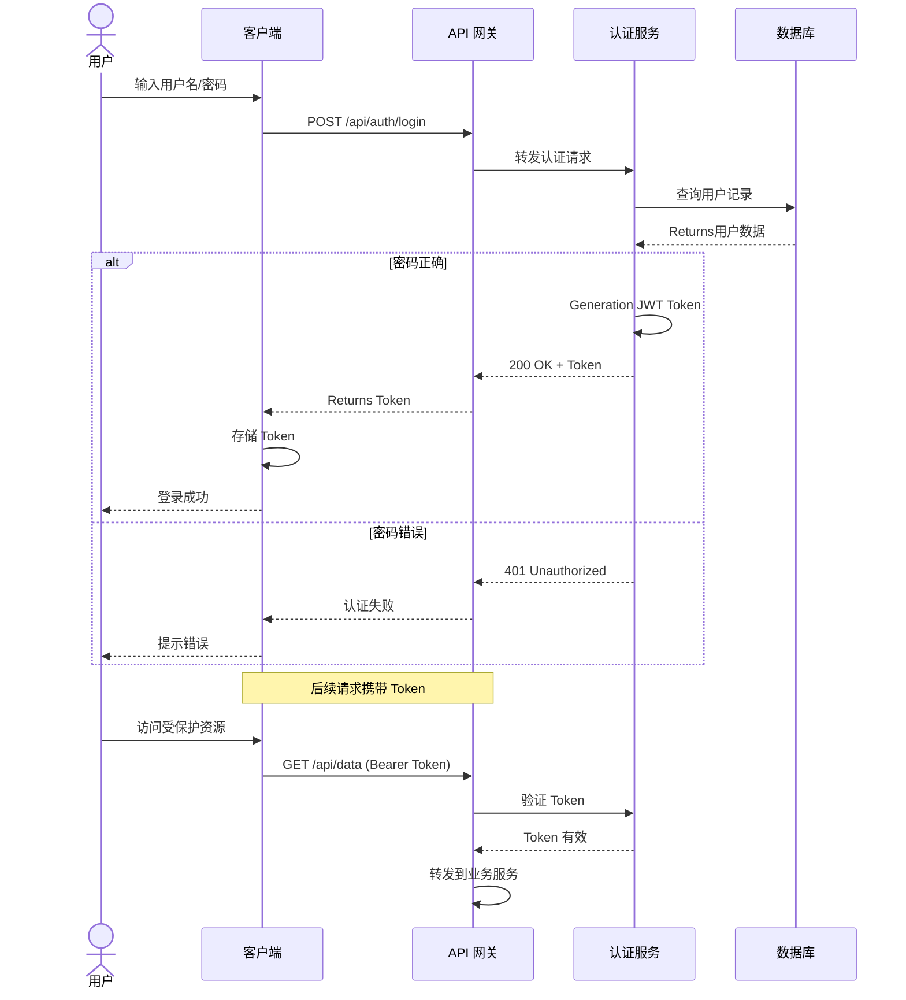
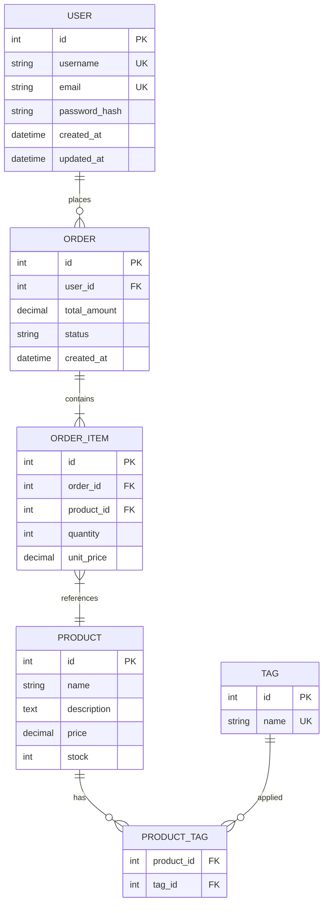
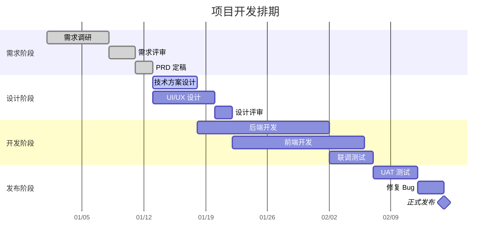
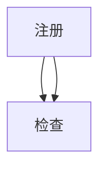
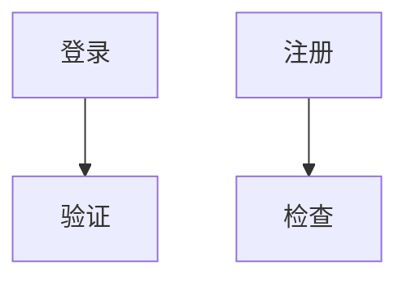
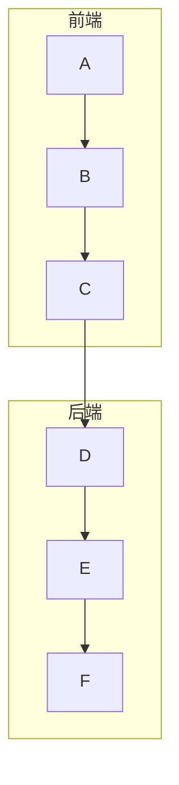

# Pretty Mermaid — 专业 Mermaid 图表Generation

## When to Use

- 用户要求Create流程图、架构图、时序图、类图、状态图、ER 图、C4 架构图或甘特图
- 需要将图表渲染为 SVG 或 ASCII 文本输出
- 需要批量Generation多张图表
- 用户要求Use特定主题或配色方案
- 需要可复用的图表模板

---

## Prerequisites

### 必需工具

| 工具 | 用途 | 安装方式 |
|------|------|---------|
| Node.js ≥ 18 | Run Mermaid CLI | 系统预装或 `nvm install 18` |
| `@mermaid-js/mermaid-cli` | 渲染 SVG/PNG | `npm install -g @mermaid-js/mermaid-cli` |

### 可选工具

| 工具 | 用途 | 安装方式 |
|------|------|---------|
| `monodraw` (macOS) | ASCII 图表Edit | App Store |
| `graph-easy` | ASCII 渲染 | `cpan Graph::Easy` |

### 验证安装

```bash
mmdc --version
```

如果 `mmdc` 不可用，回退到纯 Mermaid 代码块输出，让用户在Supports Mermaid 的Edit器或浏览器中预览。

---

## Instructions

### 核心工作流

1. **理解需求** — 明确图表类型、数据来源、目标受众
2. **选择图表类型** — 根据场景匹配最合适的 Mermaid 图表
3. **选择主题** — 根据Use场景选择配色方案
4. **编写 Mermaid 代码** — 遵循可读性最佳实践
5. **渲染输出** — 按指定格式输出 SVG、PNG 或 ASCII
6. **校验与优化** — 检查语法、布局、可读性

### 图表类型选择指南

| 场景 | Recommendations图表 | Mermaid 关键字 |
|------|---------|---------------|
| 业务流程、审批流 | 流程图 | `flowchart TD/LR` |
| API Call、服务交互 | 时序图 | `sequenceDiagram` |
| 代码结构、OOP 设计 | 类图 | `classDiagram` |
| 生命周期、状态机 | 状态图 | `stateDiagram-v2` |
| 数据库设计 | ER 图 | `erDiagram` |
| 系统架构、微服务 | C4 架构图 | `C4Context/C4Container/C4Component` |
| 项目排期、里程碑 | 甘特图 | `gantt` |
| Git 分支策略 | Git 图 | `gitGraph` |
| 思维导图、脑暴 | 思维导图 | `mindmap` |
| Timeline | Timeline | `timeline` |

---

## Workflows

### Workflow 1: 单张图表Generation

**步骤 1 — 收集信息**

向用户确认以下内容（如未Provides则UseDefault值）：

| Parameter | Default | 可选值 |
|------|--------|-------|
| 图表类型 | flowchart | 见上方选择指南 |
| 方向 | TD（上到下） | TD, LR, RL, BT |
| 主题 | default | default, dark, forest, neutral, base |
| 输出格式 | Mermaid 代码块 | svg, png, ascii, mermaid |
| 主题方案 | Tokyo Night | Tokyo Night, Dracula, GitHub Light, Nord, Solarized |

**步骤 2 — 编写 Mermaid 代码**

遵循以下规范：

```
%%{init: {'theme': 'dark', 'themeVariables': { 'primaryColor': '#1a1b26', 'primaryTextColor': '#a9b1d6', 'primaryBorderColor': '#7aa2f7', 'lineColor': '#565f89', 'secondaryColor': '#24283b', 'tertiaryColor': '#1a1b26' }}}%%
flowchart TD
    A[开始] --> B{条件判断}
    B -->|Yes| C[Execute操作]
    B -->|No| D[跳过]
    C --> E[结束]
    D --> E
```

**步骤 3 — 渲染（如需 SVG/PNG）**

将 Mermaid 代码Write临时 `.mmd` 文件，然后Call：

```bash
mmdc -i diagram.mmd -o diagram.svg -t dark -b transparent
mmdc -i diagram.mmd -o diagram.png -t dark -b white -w 1200
```

**步骤 4 — 输出**

Returns渲染后的File path，或直接在消息中嵌入 Mermaid 代码块。

---

### Workflow 2: 批量图表Generation

适Used for一次性Generation多张相关图表（如系统设计文档）。

**步骤 1** — 收集所有图表的需求列表

**步骤 2** — Create批处理配置：

```json
{
  "theme": "tokyo-night",
  "outputDir": "./diagrams",
  "outputFormat": "svg",
  "diagrams": [
    {
      "name": "system-overview",
      "type": "C4Context",
      "title": "系统总览"
    },
    {
      "name": "api-sequence",
      "type": "sequenceDiagram",
      "title": "API Call时序"
    },
    {
      "name": "data-model",
      "type": "erDiagram",
      "title": "数据模型"
    }
  ]
}
```

**步骤 3** — 逐一Generation Mermaid 代码并渲染

**步骤 4** — Returns所有图表的路径和预览

---

### Workflow 3: ASCII 图表输出

当用户需要纯文本图表（Used for CLI、日志、README 等场景）：

**方法 A — Manual ASCII 绘制**

对于简单图表，直接Use字符绘制：

```
┌─────────┐     ┌─────────┐     ┌─────────┐
│  Client  │────▶│  Server │────▶│Database │
└─────────┘     └─────────┘     └─────────┘
                     │
                     ▼
                ┌─────────┐
                │  Cache  │
                └─────────┘
```

**方法 B — Use graph-easy 转换**

```bash
echo "[ Client ] -> [ Server ] -> [ Database ]" | graph-easy --as=ascii
```

---

## 主题配置

### Tokyo Night（Default）

```
%%{init: {'theme': 'base', 'themeVariables': {
  'primaryColor': '#1a1b26',
  'primaryTextColor': '#a9b1d6',
  'primaryBorderColor': '#7aa2f7',
  'lineColor': '#565f89',
  'secondaryColor': '#24283b',
  'tertiaryColor': '#414868',
  'noteBkgColor': '#1a1b26',
  'noteTextColor': '#c0caf5',
  'noteBorderColor': '#7aa2f7'
}}}%%
```

### Dracula

```
%%{init: {'theme': 'base', 'themeVariables': {
  'primaryColor': '#282a36',
  'primaryTextColor': '#f8f8f2',
  'primaryBorderColor': '#bd93f9',
  'lineColor': '#6272a4',
  'secondaryColor': '#44475a',
  'tertiaryColor': '#383a59',
  'noteBkgColor': '#282a36',
  'noteTextColor': '#f8f8f2',
  'noteBorderColor': '#ff79c6'
}}}%%
```

### GitHub Light

```
%%{init: {'theme': 'base', 'themeVariables': {
  'primaryColor': '#ffffff',
  'primaryTextColor': '#24292f',
  'primaryBorderColor': '#d0d7de',
  'lineColor': '#656d76',
  'secondaryColor': '#f6f8fa',
  'tertiaryColor': '#eaeef2',
  'noteBkgColor': '#ddf4ff',
  'noteTextColor': '#24292f',
  'noteBorderColor': '#54aeff'
}}}%%
```

### Nord

```
%%{init: {'theme': 'base', 'themeVariables': {
  'primaryColor': '#2e3440',
  'primaryTextColor': '#eceff4',
  'primaryBorderColor': '#88c0d0',
  'lineColor': '#4c566a',
  'secondaryColor': '#3b4252',
  'tertiaryColor': '#434c5e',
  'noteBkgColor': '#2e3440',
  'noteTextColor': '#eceff4',
  'noteBorderColor': '#81a1c1'
}}}%%
```

### Solarized

```
%%{init: {'theme': 'base', 'themeVariables': {
  'primaryColor': '#002b36',
  'primaryTextColor': '#839496',
  'primaryBorderColor': '#268bd2',
  'lineColor': '#586e75',
  'secondaryColor': '#073642',
  'tertiaryColor': '#073642',
  'noteBkgColor': '#002b36',
  'noteTextColor': '#93a1a1',
  'noteBorderColor': '#2aa198'
}}}%%
```

---

## 模板库

### 模板 1: 微服务架构（C4 Container）



### 模板 2: CI/CD 流水线（Flowchart）



### 模板 3: 用户认证时序（Sequence）



### 模板 4: 数据库 ER 图



### 模板 5: 项目甘特图



---

## Output Format

### Default输出

直接在回复中Use Mermaid 代码块：

````

````

### SVG 文件

```bash
mmdc -i input.mmd -o output.svg -t dark -b transparent --cssFile custom.css
```

### PNG 文件

```bash
mmdc -i input.mmd -o output.png -t dark -b white -w 1920 -H 1080 -s 2
```

参数说明：
- `-t` 主题：default, dark, forest, neutral
- `-b` 背景色：transparent, white, #hex
- `-w` 宽度（像素）
- `-H` 高度（像素）
- `-s` 缩放倍数

### ASCII 文本

直接Use字符绘制，适合嵌入代码注释、终端输出、纯文本文档。

---

## Common Pitfalls

### 1. 节点 ID 冲突

**错误**：在同一图表中Use重复的节点 ID



**正确**：Use唯一 ID



### 2. 特殊字符未转义

**错误**：节点文本Includes括号、引号等

```
A[用户输入(name)]
```

**正确**：Use引号包裹

```
A["用户输入(name)"]
```

### 3. 图表过于复杂

单张图表超过 20 个节点时，考虑拆分为多张子图：



### 4. 方向选择不当

- 层级结构（组织架构、决策树）→ **TD**（上到下）
- 流程/管道 → **LR**（左到右）
- Timeline/历史 → **LR**
- 请求-响应 → **TD** 或 **LR**

### 5. 中文乱码

渲染 SVG/PNG 时如果出现中文乱码，Use `--cssFile` 指定字体：

```css
* {
    font-family: "Microsoft YaHei", "PingFang SC", "Noto Sans CJK SC", sans-serif;
}
```

### 6. Mermaid CLI 超时

大型图表可能渲染超时，增加超时参数：

```bash
mmdc -i large-diagram.mmd -o output.svg --puppeteerConfigFile puppeteer.json
```

`puppeteer.json`:
```json
{
  "timeout": 60000
}
```

### 7. 子图嵌套限制

Mermaid Supports子图嵌套，但过深的嵌套（超过 3 层）可能导致渲染异常。保持层级扁平化。

---

## Best Practices

1. **命名规范** — 节点 ID Use有意义的英文命名，Display文本Use中文
2. **布局控制** — 善用 `subgraph` 对节点分组，改善布局
3. **颜色语义** — 绿色表示成功、红色表示失败、蓝色表示进行中
4. **注释标注** — Use `Note` 添加关键说明
5. **渐进呈现** — 复杂系统先画总览再画细节，用 C4 的 Context → Container → Component 层级
6. **版本控制** — Mermaid 代码Yes纯文本，适合纳入 Git Manage
7. **一致性** — 同一文档中的所有图表Use相同主题配置

---

## EXTEND.md 扩展

用户可在技能同目录下Create `EXTEND.md` 添加自定义主题和模板，Agent 会Automatic合并Use。
