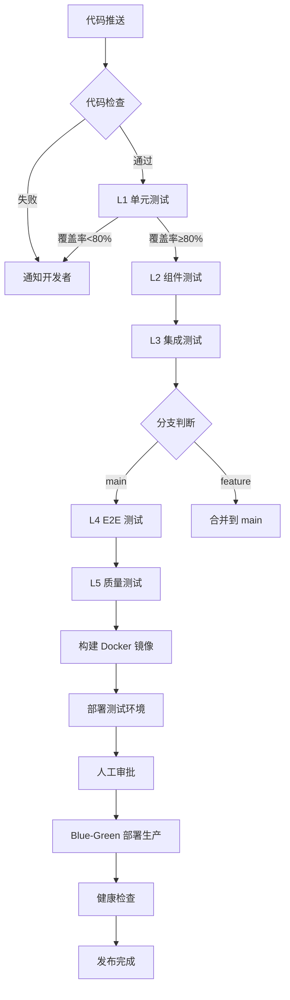

# 测试覆盖率与 CI/CD 自动化技术方案

**文档版本**: V1.0  
**编制时间**: 2026-03-17  
**编制人**: DevOps 工程师  
**任务来源**: 董事长定时任务  

---

## 一、执行摘要

### 1.1 核心结论

**现状评估**: 项目已具备完整的测试框架和 CI/CD 流水线基础，无需大规模重构，仅需优化和标准化。

**关键发现**:
- ✅ 测试框架：已采用 pytest + pytest-asyncio + pytest-cov，技术选型合理
- ✅ 测试目录：已有 L1-L5 五层测试结构（unit/component/integration/e2e/quality）
- ✅ CI/CD: 已有 7 个 GitHub Actions workflow，覆盖完整发布流程
- ✅ 部署策略：已实现 Blue-Green 部署，支持一键回滚
- ⚠️ 覆盖率基线：尚未建立覆盖率门禁和基线统计

**工作量估算**: 总计 **5-8 人天**（详见第六节）

---

## 二、测试覆盖率基线统计

### 2.1 当前状态

| 指标 | 状态 | 说明 |
|------|------|------|
| 测试框架 | ✅ 已配置 | pytest 8.0+ + pytest-cov 4.1+ |
| 覆盖率报告 | ✅ 已支持 | 支持 HTML/XML/Terminal 格式 |
| 覆盖率门禁 | ❌ 未配置 | 无最低覆盖率要求 |
| 基线统计 | ❌ 未执行 | 无历史覆盖率数据 |

### 2.2 覆盖率统计方案

#### 2.2.1 统计命令

```bash
# 全量测试覆盖率统计
pytest tests/ \
  --cov=src/openakita \
  --cov-report=html:coverage_html \
  --cov-report=xml:coverage.xml \
  --cov-report=term-missing \
  --cov-fail-under=0

# 仅单元测试（快速反馈）
pytest tests/unit/ \
  --cov=src/openakita \
  --cov-report=term-missing \
  --cov-fail-under=60
```

#### 2.2.2 覆盖率门禁建议

| 测试层级 | 覆盖率要求 | 执行频率 | 超时限制 |
|----------|------------|----------|----------|
| L1 单元测试 | ≥80% | 每次 Push/PR | <30s |
| L2 组件测试 | ≥70% | 每次 Push/PR | <2min |
| L3 集成测试 | ≥60% | 每次 Push/PR | <3min |
| L4 E2E 测试 | 关键路径覆盖 | 仅 main/手动 | <10min |
| L5 质量测试 | 核心功能覆盖 | 仅 main/手动 | <5min |

#### 2.2.3 覆盖率基线建立步骤

1. **第 1 周**: 运行全量覆盖率统计，建立初始基线
2. **第 2 周**: 分析低覆盖率模块，制定提升计划
3. **第 3-4 周**: 补充测试用例，逐步提升覆盖率
4. **第 5 周**: 固化覆盖率门禁，纳入 CI 流程

### 2.3 覆盖率提升优先级

| 优先级 | 模块 | 当前覆盖率 (预估) | 目标覆盖率 | 工作量 |
|--------|------|------------------|------------|--------|
| P0 | LLM 配置与端点管理 | 60% | 85% | 2 人天 |
| P0 | 会话管理与状态 | 50% | 80% | 2 人天 |
| P1 | IM 通道适配器 | 40% | 70% | 3 人天 |
| P1 | 技能系统 | 35% | 70% | 3 人天 |
| P2 | MCP 协议实现 | 30% | 60% | 2 人天 |
| P2 | 工具并行执行 | 25% | 60% | 2 人天 |

---

## 三、测试框架选型

### 3.1 当前技术栈

| 组件 | 选型 | 版本 | 说明 |
|------|------|------|------|
| 测试框架 | pytest | 8.0+ | Python 事实标准 |
| 异步测试 | pytest-asyncio | 0.23+ | 支持 async/await |
| 覆盖率 | pytest-cov | 4.1+ | 基于 coverage.py |
| Mock 框架 | unittest.mock | 内置 | Python 标准库 |
| 断言库 | pytest assert | 内置 | pytest 自带 |

### 3.2 选型评估

#### 3.2.1 pytest 优势

- ✅ 生态系统成熟，插件丰富
- ✅ 支持异步测试（pytest-asyncio）
- ✅ 覆盖率集成简单（pytest-cov）
- ✅ fixture 机制灵活，支持依赖注入
- ✅ 与 GitHub Actions 无缝集成
- ✅ 团队已熟悉，无需学习成本

#### 3.2.2 备选方案对比

| 框架 | 优势 | 劣势 | 推荐度 |
|------|------|------|--------|
| pytest | 生态成熟、插件丰富 | 配置稍复杂 | ⭐⭐⭐⭐⭐ (继续使用) |
| unittest | 标准库、无需安装 | 语法冗长、功能有限 | ⭐⭐ |
| nose2 | 简单易用 | 社区活跃度低 | ⭐⭐ |
| tox | 多环境测试 | 需配合其他框架 | ⭐⭐⭐ |

### 3.3 测试目录结构

```
tests/
├── conftest.py              # 全局 fixtures
├── fixtures/                # 测试夹具
│   ├── mock_llm.py         # LLM Mock
│   └── factories.py        # 测试对象工厂
├── unit/                    # L1 单元测试 (41 个文件)
│   ├── test_config.py
│   ├── test_session.py
│   └── ...
├── component/               # L2 组件测试
├── integration/             # L3 集成测试 (15 个文件)
│   ├── test_api_endpoints.py
│   └── ...
├── e2e/                     # L4 E2E 测试 (18 个文件)
│   ├── test_real_llm.py
│   └── ...
├── quality/                 # L5 质量测试
└── legacy/                  # 遗留测试（可清理）
```

### 3.4 测试规范建议

#### 3.4.1 命名规范

```python
# 测试文件命名：test_<模块>.py
test_config.py
test_session.py

# 测试类命名：Test<模块>
class TestLoadEndpointsConfig:
    
# 测试方法命名：test_<场景>_<预期>
def test_missing_file_returns_empty(self, tmp_path):
def test_invalid_json_raises_error(self, tmp_path):
```

#### 3.4.2 Fixture 使用规范

```python
# 全局 fixtures 放在 conftest.py
@pytest.fixture
def mock_llm_client() -> MockLLMClient:
    client = MockLLMClient()
    client.set_default_response("Default mock response")
    return client

# 测试中使用 fixture
def test_valid_config_loads_endpoints(self, mock_llm_client, tmp_path):
    # 测试逻辑
```

#### 3.4.3 异步测试规范

```python
# 使用 pytest.mark.asyncio 装饰器
@pytest.mark.asyncio
async def test_async_operation():
    result = await async_function()
    assert result is not None
```

---

## 四、CI/CD 流水线设计

### 4.1 当前流水线架构

#### 4.1.1 Workflow 清单

| Workflow | 用途 | 触发条件 | 状态 |
|----------|------|----------|------|
| ci.yml | 完整 CI 流水线 | Push/PR/手动 | ✅ 完善 |
| mvp-deploy.yml | MVP 部署流程 | Push main/手动 | ✅ 完善 |
| publish-release.yml | 发布流程 | 手动触发 | ✅ 完善 |
| release-dryrun.yml | 发布预演 | 手动触发 | ✅ 可用 |
| backfill-oss.yml | OSS 回填 | 手动触发 | ✅ 可用 |
| mobile.yml | 移动端构建 | Tag 推送 | ✅ 可用 |
| release.yml | 自动发布 | Tag 推送 | ✅ 可用 |

#### 4.1.2 CI 流水线分层

```
L1 单元测试 (<30s)  ──→ L2 组件测试 (<2min)  ──→ L3 集成测试 (<3min)
                                                      ↓
L5 质量测试 (<5min) ←── L4 E2E 测试 (<10min)
```

### 4.2 优化建议

#### 4.2.1 覆盖率门禁集成

在 `ci.yml` 中添加覆盖率检查：

```yaml
unit_tests:
  runs-on: ubuntu-latest
  steps:
    - uses: actions/checkout@v6
    - name: Set up Python
      uses: actions/setup-python@v6
      with:
        python-version: '3.11'
    - name: Install dependencies
      run: pip install -e ".[dev]"
    - name: Run tests with coverage
      run: |
        pytest tests/unit/ \
          --cov=src/openakita \
          --cov-report=xml \
          --cov-fail-under=80  # 覆盖率门禁 80%
    - name: Upload coverage
      uses: codecov/codecov-action@v4
      with:
        files: ./coverage.xml
```

#### 4.2.2 测试加速优化

**问题**: 当前每个测试 job 都独立安装依赖，浪费时间和资源

**优化方案**: 使用依赖缓存和并行测试

```yaml
# 使用缓存加速依赖安装
- name: Cache pip dependencies
  uses: actions/cache@v4
  with:
    path: ~/.cache/pip
    key: ${{ runner.os }}-pip-${{ hashFiles('**/pyproject.toml') }}
    restore-keys: |
      ${{ runner.os }}-pip-

# 使用 pytest-xdist 并行执行测试
- name: Run tests in parallel
  run: pytest tests/unit/ -n auto --cov=src/openakita
```

#### 4.2.3 部署流程优化

**当前问题**: 部署流程中大量注释代码，实际部署逻辑未实现

**优化方案**:

1. **测试环境部署**: 使用 Docker Compose 或 K8s
2. **生产环境部署**: 实现 Blue-Green 切换逻辑
3. **健康检查**: 添加真实 HTTP 健康检查
4. **回滚机制**: 完善一键回滚脚本

```yaml
deploy-production:
  steps:
    - name: Deploy to inactive slot
      run: |
        # 1. 拉取新镜像
        docker pull ${{ env.REGISTRY }}/${{ env.IMAGE_NAME }}:${{ github.sha }}
        
        # 2. 启动新槽位
        docker-compose -f docker-compose.${{ steps.target_slot.outputs.slot }}.yml up -d
        
        # 3. 健康检查
        sleep 30
        curl -f http://${{ steps.target_slot.outputs.slot }}.local/health || exit 1
        
        # 4. 切换流量
        ln -sf /etc/nginx/conf.d/${{ steps.target_slot.outputs.slot }}.conf /etc/nginx/conf.d/default.conf
        nginx -s reload
```

### 4.3 流水线可视化



---

## 五、自动化发布流程设计

### 5.1 发布流程概览

```
代码冻结 → 版本 Tag → 自动构建 → 测试验证 → 人工审批 → 发布上线 → 渠道同步
```

### 5.2 发布渠道管理

#### 5.2.1 渠道定义

| 渠道 | 版本规则 | 更新频率 | 目标用户 |
|------|----------|----------|----------|
| release (稳定版) | v1.x.0 | 月度 | 生产用户 |
| pre-release (抢先版) | v1.(x+1).0 | 双周 | 早期体验用户 |
| dev (开发版) | v1.x.y (y>0) | 每日 | 开发者 |

#### 5.2.2 渠道配置文件

`.github/release-channels.json`:
```json
{
  "release": "1.26",
  "pre-release": "1.27",
  "dev": "*"
}
```

### 5.3 发布流程详解

#### 5.3.1 自动构建阶段

**触发条件**: 推送 Git Tag

**执行步骤**:
1. 解析版本号（如 v1.26.3 → major=1, minor=26, patch=3）
2. 推断发布渠道（基于 minor 版本匹配）
3. 构建多平台产物（Windows/macOS/Linux）
4. 上传产物到 Draft Release
5. 通知人工审核

#### 5.3.2 人工审批阶段

**审批检查清单**:
- [ ] 所有 CI 测试通过
- [ ] 覆盖率达标（≥80%）
- [ ] 构建产物完整
- [ ] 变更日志准确
- [ ] 无严重 Bug

#### 5.3.3 发布执行阶段

**执行步骤**:
1. 验证 Release Draft 存在
2. 推断/确认发布渠道
3. 发布 Release（从 Draft 转为 Published）
4. 生成渠道 Manifest
5. 上传产物到 OSS
6. 更新官网下载页面
7. 发送发布通知

### 5.4 回滚机制

#### 5.4.1 回滚触发条件

- 生产环境严重 Bug（P0 级）
- 性能回退超过 20%
- 用户投诉集中爆发

#### 5.4.2 回滚流程

```yaml
rollback:
  runs-on: ubuntu-latest
  steps:
    - name: Get previous stable version
      run: |
        # 获取上一个稳定版本
        PREVIOUS=$(gh release list --limit 5 --json tagName | jq -r '.[1].tagName')
        echo "PREVIOUS_VERSION=$PREVIOUS" >> $GITHUB_ENV
    
    - name: Switch traffic to previous version
      run: |
        # Blue-Green 回滚：切换流量到旧版本槽位
        ln -sf /etc/nginx/conf.d/${{ env.PREVIOUS_SLOT }}.conf /etc/nginx/conf.d/default.conf
        nginx -s reload
    
    - name: Notify rollback
      run: |
        echo "⚠️ 已回滚到版本 ${{ env.PREVIOUS_VERSION }}"
```

---

## 六、工作量估算

### 6.1 工作分解

| 任务 | 子任务 | 工作量 | 优先级 |
|------|--------|--------|--------|
| **1. 覆盖率基线统计** | 1.1 运行全量覆盖率统计 | 0.5 人天 | P0 |
| | 1.2 分析覆盖率报告 | 0.5 人天 | P0 |
| | 1.3 建立覆盖率基线文档 | 0.5 人天 | P0 |
| **小计** | | **1.5 人天** | |
| **2. 测试框架优化** | 2.1 配置覆盖率门禁 | 0.5 人天 | P0 |
| | 2.2 优化测试 fixtures | 1 人天 | P1 |
| | 2.3 编写测试规范文档 | 0.5 人天 | P1 |
| **小计** | | **2 人天** | |
| **3. CI/CD 流水线优化** | 3.1 集成覆盖率门禁 | 0.5 人天 | P0 |
| | 3.2 实现依赖缓存 | 0.5 人天 | P1 |
| | 3.3 实现并行测试 | 0.5 人天 | P1 |
| | 3.4 完善部署脚本 | 1 人天 | P0 |
| **小计** | | **2.5 人天** | |
| **4. 发布流程完善** | 4.1 实现 Blue-Green 切换 | 1 人天 | P0 |
| | 4.2 完善健康检查 | 0.5 人天 | P0 |
| | 4.3 实现一键回滚 | 0.5 人天 | P1 |
| **小计** | | **2 人天** | |
| **5. 文档与培训** | 5.1 编写 CI/CD 使用文档 | 0.5 人天 | P1 |
| | 5.2 团队培训 | 0.5 人天 | P1 |
| **小计** | | **1 人天** | |
| **总计** | | **9 人天** | |

### 6.2 分阶段实施计划

#### 第一阶段：基线建立（第 1 周）
- [ ] 运行全量覆盖率统计
- [ ] 分析低覆盖率模块
- [ ] 建立覆盖率基线文档
- **交付物**: 《测试覆盖率基线报告》

#### 第二阶段：门禁集成（第 2 周）
- [ ] 配置 CI 覆盖率门禁
- [ ] 完善部署脚本
- [ ] 实现 Blue-Green 切换
- **交付物**: 可运行的 CI/CD 流水线

#### 第三阶段：优化提升（第 3-4 周）
- [ ] 实现依赖缓存和并行测试
- [ ] 完善健康检查和回滚机制
- [ ] 编写使用文档和团队培训
- **交付物**: 完整的 DevOps 流程文档

### 6.3 资源需求

| 资源 | 数量 | 用途 |
|------|------|------|
| DevOps 工程师 | 1 人 | 全流程实施 |
| 全栈工程师 | 1 人（兼职） | 测试用例补充 |
| GitHub Actions | 免费额度 | CI/CD 运行 |
| 测试服务器 | 1 台 | 部署测试环境 |

---

## 七、风险与应对

### 7.1 技术风险

| 风险 | 概率 | 影响 | 应对措施 |
|------|------|------|----------|
| 覆盖率门禁导致 CI 频繁失败 | 高 | 中 | 分阶段提升：60% → 70% → 80% |
| 并行测试导致偶发失败 | 中 | 中 | 增加重试机制，隔离不稳定测试 |
| Blue-Green 切换失败 | 低 | 高 | 充分测试，保留快速回滚能力 |
| 部署脚本兼容性问题 | 中 | 中 | 多环境测试（Ubuntu/CentOS） |

### 7.2 进度风险

| 风险 | 概率 | 影响 | 应对措施 |
|------|------|------|----------|
| 测试用例补充工作量大 | 高 | 中 | 优先覆盖核心功能，P2 功能延后 |
| 团队对 pytest 不熟悉 | 低 | 中 | 提供培训和示例代码 |
| CI/CD 调试耗时 | 中 | 中 | 预留 50% 缓冲时间 |

---

## 八、成功指标

### 8.1 技术指标

| 指标 | 当前 | 目标 | 测量方式 |
|------|------|------|----------|
| 单元测试覆盖率 | 未知 | ≥80% | pytest-cov |
| CI 运行时间 | ~15min | <10min | GitHub Actions 日志 |
| 部署成功率 | 未知 | ≥99% | 部署日志统计 |
| 回滚时间 | 未知 | <5min | 手动计时 |

### 8.2 效率指标

| 指标 | 当前 | 目标 | 测量方式 |
|------|------|------|----------|
| 代码提交到部署时间 | 未知 | <30min | 时间戳对比 |
| 每周部署次数 | 未知 | ≥5 次 | 发布记录 |
| 部署失败恢复时间 | 未知 | <10min | 故障记录 |

---

## 九、附录

### 9.1 参考文档

- [pytest 官方文档](https://docs.pytest.org/)
- [GitHub Actions 文档](https://docs.github.com/en/actions)
- [Blue-Green 部署最佳实践](https://martinfowler.com/bliki/BlueGreenDeployment.html)

### 9.2 相关文件

- `.github/workflows/ci.yml` - CI 流水线配置
- `.github/workflows/mvp-deploy.yml` - 部署流程配置
- `.github/workflows/publish-release.yml` - 发布流程配置
- `pyproject.toml` - 项目依赖配置

---

**文档状态**: ✅ 完成  
**审核状态**: 待审核  
**下一步**: 提交 CTO 审核，启动第一阶段实施
