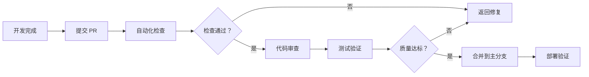

# 技术部架构优化方案

> 文档版本：v1.0  
> 创建日期：2026-03-07  
> 负责人：Zacon

---

## 📌 目录

1. [背景与目标](#背景与目标)
2. [人员分工优化方案](#人员分工优化方案)
3. [测试工程师技术栈要求](#测试工程师技术栈要求)
4. [代码审查流程优化](#代码审查流程优化)
5. [实施计划](#实施计划)

---

## 背景与目标

### 当前状况

- **团队规模**：2 名全栈工程师
- **工作模式**：前后端一肩挑，职责边界模糊
- **痛点**：
  - 技术深度不足，难以在特定领域形成专业优势
  - 代码质量依赖个人自觉，缺乏系统性保障
  - 测试工作分散，无专职人员负责

### 优化目标

1. **专业化分工**：明确前后端职责，提升技术深度
2. **质量保障**：引入专职测试工程师，建立系统化测试体系
3. **流程规范**：优化代码审查流程，降低生产风险

---

## 人员分工优化方案

### 方案 A：明确前后端分工（推荐）

```
技术部架构
├── 后端组（2 人）
│   ├── 高级后端工程师（Team Lead）
│   │   ├── 系统架构设计
│   │   ├── 核心模块开发
│   │   ├── 数据库优化
│   │   └── API 规范制定
│   │
│   └── 后端工程师
│       ├── 业务逻辑开发
│       ├── 接口实现
│       ├── 性能优化
│       └── 运维支持
│
├── 前端组（1 人）
│   ├── 前端工程师
│   │   ├── UI/UX 实现
│   │   ├── 前端架构优化
│   │   ├── 性能调优
│   │   └── 跨端适配
│
└── 测试组（1-2 人）
    ├── 测试工程师（新增）
    │   ├── 自动化测试框架搭建
    │   ├── CI/CD 集成
    │   ├── 质量监控
    │   └── 测试文档维护
```

**职责划分表**：

| 职责领域 | 后端组 | 前端组 | 测试组 |
|---------|-------|-------|-------|
| API 设计 | ✅ 主导 | ✅ 参与评审 | ✅ 验收测试 |
| 数据库设计 | ✅ 全权负责 | ❌ | ✅ 数据验证 |
| UI/UX 实现 | ❌ | ✅ 全权负责 | ✅ 视觉回归测试 |
| 性能优化 | ✅ 后端性能 | ✅ 前端性能 | ✅ 性能测试 |
| 部署运维 | ✅ 主导 | ✅ 配合 | ✅ 验证部署 |
| 单元测试 | ✅ 后端单元 | ✅ 前端单元 | ✅ 框架 + 评审 |
| 集成测试 | ✅ 配合 | ✅ 配合 | ✅ 主导执行 |
| E2E 测试 | ✅ 配合 | ✅ 配合 | ✅ 主导执行 |

### 方案 B：增加高级后端工程师

```
技术部架构
├── 后端组（3 人）
│   ├── 高级后端工程师（新增，Team Lead）
│   ├── 全栈工程师 A
│   └── 全栈工程师 B
│
├── 前端工作
│   └── 由全栈工程师兼任（各 50% 精力）
│
└── 测试组（1-2 人）
    └── 测试工程师（新增）
```

**适用场景**：
- 后端业务复杂度高，需要专人架构设计
- 前端工作量相对较少，可兼任
- 预算有限，无法扩充前端编制

### 推荐方案

**优先选择方案 A**，理由：
1. 职责清晰，避免推诿
2. 技术深度更容易积累
3. 便于后续团队扩展
4. 符合行业主流架构

---

## 测试工程师技术栈要求

### 核心技能要求

#### 1. 测试框架（必选其一）

| 技术栈 | 要求等级 | 应用场景 |
|-------|---------|---------|
| **Pytest** (Python) | ⭐⭐⭐⭐⭐ | 后端 API 测试、自动化测试脚本 |
| **Go test** (Golang) | ⭐⭐⭐⭐ | 高性能服务测试、并发测试 |
| Jest/Vitest | ⭐⭐⭐ | 前端单元测试（可选） |
| Playwright/Cypress | ⭐⭐⭐⭐ | E2E 端到端测试 |

**推荐配置**：
- 主技术栈：**Pytest**（与现有 Python 技术栈一致）
- 备选：**Go test**（如核心服务使用 Go）

#### 2. CI/CD 集成经验（必需）

| 平台 | 要求等级 | 具体能力 |
|-----|---------|---------|
| **GitHub Actions** | ⭐⭐⭐⭐⭐ | 编写 workflow、配置测试流水线 |
| GitLab CI | ⭐⭐⭐ | .gitlab-ci.yml 配置 |
| Jenkins | ⭐⭐ | Pipeline 脚本（可选） |

**必备能力**：
```yaml
# 示例：GitHub Actions 测试流水线
name: Test Pipeline
on: [push, pull_request]
jobs:
  test:
    runs-on: ubuntu-latest
    steps:
      - uses: actions/checkout@v4
      - name: Run Tests
        run: pytest tests/ --cov=src --cov-report=xml
      - name: Upload Coverage
        uses: codecov/codecov-action@v3
```

#### 3. 测试类型覆盖

| 测试类型 | 工具建议 | 负责人 |
|---------|---------|-------|
| 单元测试 | Pytest + pytest-cov | 开发 + 测试评审 |
| 集成测试 | Pytest + Docker | 测试主导 |
| API 测试 | Pytest + requests/httpx | 测试主导 |
| E2E 测试 | Playwright | 测试主导 |
| 性能测试 | Locust/k6 | 测试主导 |
| 安全测试 | OWASP ZAP/SonarQube | 测试 + 后端配合 |

#### 4. 其他技术要求

- **容器化**：Docker 基础（测试环境搭建）
- **数据库**：SQL/NoSQL 基础查询（数据验证）
- **日志分析**：ELK/Grafana 基础（问题定位）
- **版本控制**：Git 熟练（分支管理、PR 流程）

### 岗位职责描述（JD 参考）

```markdown
## 测试工程师（1-2 名）

### 岗位职责
1. 负责自动化测试框架的搭建与维护
2. 编写单元测试、集成测试、E2E 测试用例
3. 集成 CI/CD 流水线，实现测试自动化
4. 参与代码审查，把控代码质量
5. 建立质量监控体系，输出质量报告

### 任职要求
1. 计算机相关专业，2 年以上测试开发经验
2. 精通 Pytest 或 Go test 测试框架
3. 熟悉 GitHub Actions/GitLab CI 等 CI/CD 工具
4. 具备 Python 或 Go 编程能力
5. 了解 Docker 容器化技术
6. 良好的沟通能力和团队协作精神

### 加分项
- 有 OpenAkita 或类似 AI 项目测试经验
- 熟悉性能测试工具（Locust/k6）
- 了解安全测试（OWASP Top 10）
```

---

## 代码审查流程优化

### 当前流程（假设）

```
开发完成 → 提交代码 → (可选自查) → Merge 到主分支
```

**问题**：
- 缺乏系统性审查
- 测试依赖开发自觉
- 质量问题流入生产

### 优化后流程



### 详细流程说明

#### 阶段 1：PR 提交（开发负责）

**提交清单**：
- [ ] 代码通过本地测试（`pytest tests/`）
- [ ] 新增功能附带测试用例
- [ ] 更新相关文档
- [ ] 通过代码格式化检查（`ruff format`）
- [ ] 通过静态检查（`ruff check` + `mypy`）

**PR 模板**：
```markdown
## 变更描述
<!-- 简要说明本次修改的目的 -->

## 测试覆盖
- [ ] 单元测试已添加/更新
- [ ] 集成测试已验证
- [ ] 手动测试步骤：...

## 影响范围
- [ ] 数据库变更
- [ ] API 变更
- [ ] 配置变更

## 审查人
- 代码审查：@后端 Lead / @前端 Lead
- 测试审查：@测试工程师
```

#### 阶段 2：自动化检查（CI 自动执行）

**GitHub Actions 配置**：
```yaml
name: PR Checks
on: [pull_request]
jobs:
  lint:
    runs-on: ubuntu-latest
    steps:
      - uses: actions/checkout@v4
      - name: Run Linter
        run: ruff check src/
      - name: Type Check
        run: mypy src/openakita/
  
  test:
    runs-on: ubuntu-latest
    steps:
      - uses: actions/checkout@v4
      - name: Run Tests
        run: pytest tests/ --cov=src --cov-report=xml
      - name: Coverage Check
        run: |
          coverage report --fail-under=80
```

**通过标准**：
- ✅ Lint 检查无 Error
- ✅ 类型检查通过
- ✅ 所有测试用例通过
- ✅ 代码覆盖率 ≥ 80%（核心模块）

#### 阶段 3：代码审查（技术 Lead 负责）

**审查清单**：

| 审查维度 | 检查项 | 负责人 |
|---------|-------|-------|
| **代码规范** | 命名规范、注释完整、格式化 | 同组工程师 |
| **架构设计** | 模块解耦、接口设计、扩展性 | Tech Lead |
| **性能影响** | 时间复杂度、数据库查询、缓存策略 | 后端 Lead |
| **安全风险** | 输入验证、权限检查、敏感信息 | 后端 Lead |
| **测试覆盖** | 测试用例充分性、边界条件 | 测试工程师 |

**审查时限**：
- 小型 PR（<200 行）：24 小时内
- 中型 PR（200-500 行）：48 小时内
- 大型 PR（>500 行）：拆分或 72 小时内

#### 阶段 4：测试验证（测试工程师负责）

**测试工程师职责**：
1. 审查测试用例的充分性
2. 补充集成测试/E2E 测试
3. 验证边界条件和异常场景
4. 性能回归测试（如适用）
5. 签署测试通过意见

**测试报告模板**：
```markdown
## 测试报告

### 测试范围
- 单元测试：✅ 通过 (覆盖率 85%)
- 集成测试：✅ 通过
- E2E 测试：✅ 通过

### 发现的问题
| 编号 | 问题描述 | 严重程度 | 状态 |
|-----|---------|---------|-----|
| 1 | ... | 高/中/低 | 已修复 |

### 测试结论
- [ ] 建议合并
- [ ] 需要修复后重新测试
- [ ] 建议拒绝

测试工程师：@xxx  日期：2026-03-07
```

#### 阶段 5：合并与部署

**合并条件**（全部满足）：
- ✅ 自动化检查通过
- ✅ 至少 1 名技术 Lead 批准
- ✅ 测试工程师签署通过
- ✅ 无未解决的 Comment

**部署验证**：
1. 自动部署到测试环境
2. 运行冒烟测试（Smoke Test）
3. 验证核心功能正常
4. 监控告警无异常

### 角色职责总结

| 角色 | 职责 | 工具 |
|-----|------|-----|
| **开发工程师** | 代码开发、单元测试、PR 提交 | Git、Pytest、Ruff |
| **技术 Lead** | 架构审查、代码质量把控 | GitHub PR Review |
| **测试工程师** | 测试框架、集成测试、质量签署 | Pytest、Playwright、CI/CD |
| **DevOps** | 流水线维护、部署验证 | GitHub Actions、Docker |

---

## 实施计划

### 阶段 1：招聘与准备（第 1-4 周）

| 周次 | 任务 | 负责人 |
|-----|------|-------|
| 第 1 周 | 发布测试工程师招聘 JD | HR + 技术 Lead |
| 第 2-3 周 | 面试筛选 | 技术 Lead + Zacon |
| 第 4 周 | Offer 发放 + 入职准备 | HR |

### 阶段 2：框架搭建（第 5-8 周）

| 周次 | 任务 | 负责人 |
|-----|------|-------|
| 第 5 周 | 测试工程师入职 + 环境熟悉 | 测试工程师 |
| 第 6 周 | 搭建 Pytest 测试框架 | 测试工程师 + 后端 |
| 第 7 周 | 集成 GitHub Actions 流水线 | 测试工程师 + DevOps |
| 第 8 周 | 编写核心模块测试用例 | 测试工程师 |

### 阶段 3：流程落地（第 9-12 周）

| 周次 | 任务 | 负责人 |
|-----|------|-------|
| 第 9 周 | 试行代码审查流程 | 全体技术部 |
| 第 10 周 | 收集反馈 + 流程优化 | 技术 Lead |
| 第 11 周 | 正式执行新流程 | 全体技术部 |
| 第 12 周 | 质量指标复盘 | Zacon + 技术 Lead |

### 成功指标

| 指标 | 当前 | 目标 | 测量方式 |
|-----|------|-----|---------|
| 代码覆盖率 | <50% | ≥80% | pytest-cov |
| Bug 逃逸率 | - | <5% | 生产问题统计 |
| PR 审查时长 | - | <48 小时 | GitHub Insights |
| 部署失败率 | - | <2% | CI/CD 统计 |

---

## 附录

### A. 推荐工具清单

| 类别 | 工具 | 用途 |
|-----|------|-----|
| 测试框架 | Pytest | Python 单元测试 |
| 覆盖率 | pytest-cov | 代码覆盖率统计 |
| Mock | pytest-mock | 模拟依赖 |
| E2E 测试 | Playwright | 端到端测试 |
| 性能测试 | Locust | 负载测试 |
| 代码质量 | SonarQube | 代码质量平台 |
| CI/CD | GitHub Actions | 自动化流水线 |
| 文档 | MkDocs | 技术文档生成 |

### B. 参考资源

- [Pytest 官方文档](https://docs.pytest.org/)
- [GitHub Actions 文档](https://docs.github.com/en/actions)
- [Playwright 官方文档](https://playwright.dev/)
- [Google 测试最佳实践](https://google.github.io/eng-practices/)

---

> **文档维护**：本方案由技术部负责维护，每季度复盘一次，根据实际情况调整优化。  
> **最后更新**：2026-03-07
